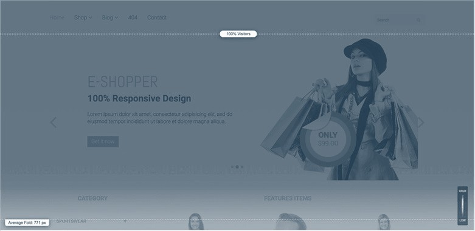

---
type: fuel
title: "Website Heat Mapping with Hotjar vs. Microsoft Clarity"
date: "2021-05-07"
coverImage: "hotjar-vs-ms-clarity.jpg"
tags: ["loginradius"]
featured: false
author: "Deependra Singh"
description: "A heatmap is a color-coded representation that shows you what elements on your website are getting the highest interaction (hot) and those that are getting the lowest (cold). There are two leading services, namely Hotjar and Clarity, that are competing to win this space. Read this blog to find out which is best for your business."
metadescription: "Website Heat Mapping with Hotjar vs. Microsoft Clarity. Learn what is a heatmap, why it is essential, and find out which is best for your business."
metatitle: "hotjar vs. microsoft clarity comparison-Which is better?"
---

Are you struggling to find out how visitors interact with your website — what they look at, where they click, what do they ignore, and how far do they scroll?

Then it would be best if you use a heatmap on critical business pages, such as product page, homepage, and checkout pages.

## What is a Heatmap

A heatmap is a color-coded representation that shows you what elements on your website are getting the highest interaction (hot) and those that are getting the lowest (cold).

You get a comprehensive understanding of what is holding visitors’ attention, what needs to be improved, and what needs to be removed.

Simply put, heatmap allows you to provide your users the experience they deserve.

There are two leading services, namely Hotjar and Clarity, that are competing to win this space.

Although Hotjar began its services in 2014, Clarity has emerged as a strong contender in less than a year since it rolled out its services in 2020.

But before comparing them, let’s understand why heatmaps are essential?

## Why are Heatmaps Essential

Most people use website tracking applications like Google Analytics to monitor website performance.

There is no doubt that such tools are essential, but unfortunately, they provide only trivial data such as [website clicks and traffic](https://www.loginradius.com/blog/fuel/2021/02/attract-consumers-to-your-website/).

Suppose one day you see a peripheral page getting an unusually high amount of traffic. You know that this page has links embedded in numerous posts.

So, how will you determine the source of this massive traffic? Wouldn’t you wonder how users are getting on this page?

Heatmap analytics plays an essential role in answering the following five questions for your business website:

1.  Are visitors clicking on [Call to Action (CTA)](https://www.loginradius.com/blog/fuel/2021/01/sign-up-tips-conversion-rate/) links?

2.  Are visitors seeing critical website elements like eBooks, guides, and solution briefs?

3.  Are visitors avoiding or disliking any element on your website?

4.  Are visitors experiencing problems or inconvenience while interacting with your website?

5.  Are visitors getting confused by non-clickable elements?

Several case studies reveal how heatmap tracking can help you improve your website. For example:

- Taskworld, a cloud-based collaboration platform, [increased its conversion rate by 40%.](https://www.hotjar.com/customers/taskworld/)

- Bannersnack, an online banner maker, [improved their sign-ups by 25%.](https://www.hotjar.com/customers/bannersnack/)

- Epiphany, a UK-based digital agency, [boosted its mobile conversion rate by 63%.](https://www.hotjar.com/blog/mobile-conversion-optimization/)

After understanding what heatmaps are and why they are essential, it’s time to compare Hotjar with Microsoft Clarity.

## Hotjar vs. Microsoft Clarity

### 1. Hotjar

More than 50 heatmap tools are available on the internet, and Hotjar often features at the top of the list.

According to statistics, more than [900,000 enterprises](https://techairgroup.com/hotjar-microsoft-clarity-heatmaps/#:~:text=MS%20Clarity%20offers%20heatmaps%20for,excessive%20scrolling%2C%20and%20JavaScript%20errors.) spread across 180 countries  use Hotjar to prepare heatmaps to track website visitors’ activity.

The main reasons behind these roof-breaking numbers are its user-friendliness and the convenience of the interface to track user activity.

Benefits of using Hotjar

Hotjar provides significant benefits like:

- Session recording with pauses and mouse trails

- Analytics and demographics data

- [GDPR compliant](https://www.loginradius.com/gdpr-and-privacy/)

- Collects user feedback through a user and form system

- The Hotjar business plan ensures hands-on training from specialists

- Identify API enables granular data segmenting

- Relevancy score on each recording session

- Allows the addition of comments to recordings

- Enables sharing the results with the team

Drawbacks of Hotjar

Along with several advantages, there are a few drawbacks of Hotjar, such as:

- It does not provide any error report

- The software doesn’t give an analytical overview of the dashboard

- Sometimes, it fails to load images in the recording

### 2. Microsoft Clarity

Microsoft Clarity entered the heatmap stage in October 2020. It allows recording individual sessions that examine user behavior.

It also creates detailed heatmaps that discover which parts of the page drive maximum user engagement and provides information about excessive scrolling, dead clicks, rage clicks, and JavaScript errors.

Microsoft Clarity is a relatively new entrant and is being constantly improved upon.

Benefits of Microsoft Clarity

Microsoft Clarity can be readily adapted for numerous benefits because of the following reasons:

- It is currently free to use

- It is GDPR compliant

- The software records user inactivity

- Unlike Hotjar, it displays images while recording

- The software provides an analytical overview of the dashboard

Drawbacks of Microsoft Clarity

Few disadvantages of Microsoft Clarity are:

- Doesn’t support custom tags

- Movement heatmaps are absent

- Lacks audience segmentation feature

- The software doesn’t support the sharing or exporting of reports

- No feature for getting user feedback or taking surveys

## Which of the two is better

### Hotjar

Hotjar has been leading the heatmap market for over half a decade. It has a free plan that offers basic features such as on-demand manual reports, creating and storing incoming feedback widgets, snapshot recordings, and much more. The free plan is suitable for your website if it receives low traffic.

But you should subscribe to the [business plan](https://www.loginradius.com/blog/start-with-identity/2020/03/loginradius-business-continuity-covid-19-outbreak/) to get deeper insights if you have an established website that receives a substantial amount of traffic.

The business plan will allow you to take unlimited surveys and feedback widgets, [identify APIs,](https://www.loginradius.com/identity-api/) remove Hotjar branding, and much more.

You should stick with this plan if you spend on display or digital advertising campaigns, as it will help you maximize ROIs.

### Microsoft Clarity

As discussed earlier, Clarity is a new player in the field of heat mapping. The platform lacks many features available on Hotjar, like collecting user feedback and creating movement heatmaps.

But it’s adding plenty of features at a fast pace. Putting all drawbacks aside, Clarity processes more than 1 petabyte of data over a consumer base of [100 million+ users per month](https://clarity.microsoft.com/). The best part is that Clarity is a free-to-use software.

## Our Verdict

Ideally, you must go with Hotjar if you are looking to access highly advanced [website tracking and Analytics features](https://www.loginradius.com/integrations/google-analytics/). But if you receive less traffic on your website and are looking for excellent free heat map software, then Clarity is your best bet.

