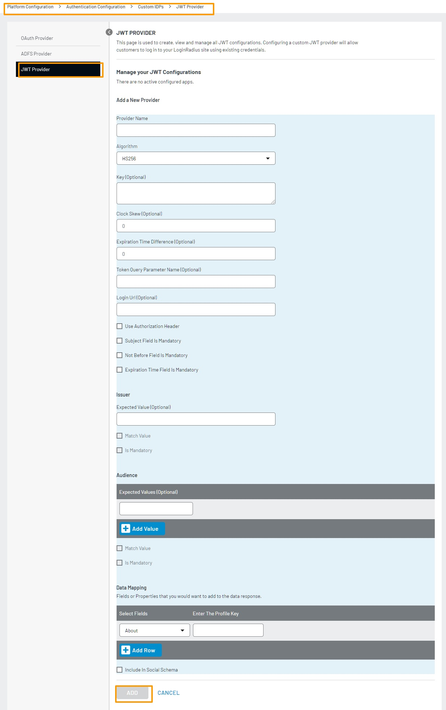

An electronic identity is an electronic card or device with a unique identity number issued by either a government agency or some banks. A consumer needs to go to the government agency or some banks and show valid identity documents. After the document verification, an Electronic Identity is issued to the consumer. Examples of e-IDs are Danish NemID, Swedish BankID, and Dutch DigiD.
 
Most service providers such as financial institutions and insurance firms provide services online and are recognizing an opportunity in implementing eID due to strict Know Your Customer (KYC) and Anti-Money Laundering (AML) requirements.
 
eIDs are used to authenticate consumers online across multiple platforms and services. eIDs also allow the consumers to sign documents online, and the companies can trust the signature as the electronic identity is issued by the government or banks based on physical identity documents. This is fast, convenient, and secure for the consumers as they are saved from completing registration forms for multiple services. Hence, this increases the conversion for the businesses. 
 
### Integrating eID authentication with LoginRadius
---
LoginRadius supports all the major industry federated SSO methods. Hence, you can integrate eID authentication with LoginRadius using some third application like Criipto, which supports the industry-standard SSO methods. Criipto allows the integration of an eID with the LoginRadius application using JWT SSO Login flow.  Jason Web Token ( JWT) is a signed token which transfers the information from one service to another securely. 
 
#### Prerequisite

- A Criipto account ( you can create a free trial account )
- A LoginRadius application 
- One of the desired electronic ID

### Register your LoginRadius app in your Criipto account
---
Please see the following steps to register your LoginRadius app in your Criipto account.

1.  Login in to your Criipto account (https://manage.criipto.id/login ).
2.  Click + sign to add an application under the Applications tab.
3.  Add the following information:
    
    - Name: Enter a name to identify your app in the Criipto.
    - Domain: choose an available domain
    - Callback URLs: Enter https://<LR appname>.hub.loginradius.com/access/jwt
    
    - Enable the desired eIDs
    - Enable the **Enable OAuth2 Code Flow** under **OpenID Connect**
    - Click the Re-generate client secret button to generate a client secret. 
    - Select **SignedJwt** under **User info response strategy** 
    - Select **compact** under **JWT property format**
    - Enter the desired token time in **Token lifetime** under **Advanced Options**.
4.  Click the **save** button.

### Configure the Criipto settings in the LoginRadius 

1. Login into the Admin Console (https://adminconsole.loginradius.com/ )
2.  Navigate to Platform Configuration>Authentication Configuration>Custom IDPs>JWT Provider

3. Click **+ Add A New Provider** button highlighted on the above screen, and the following JWT configuration form fields will appear:

4. Complete the following details in the JWT provider
    - Enter a unique name under the **Provider Name**. This name will be displayed under the social login forms in the LoginRadius IDX page and on the social login form rendered by LoginRadius V2.js library on your application if the Include In Social Schema is selected while configuring the JWT app.
    - Select RS256 under the JWT signing **Algorithm** used by your application ( the selected algorithm is used in encrypting your consumers' information in the JWT).
    - Enter the JWT secret or certificate (depending on the chosen algorithm) in the **Key** text box.
    - Clock Skew(Optional): Enter 0
    - Expiration Time Difference (Optional):Enter 0
    - Token Query Parameter Name (Optional): Enter id_token
    - Login Url (Optional): Enter https://YOUR_SUBDOMAIN.criipto.id/oauth2/authorize?response_type=id_token&client_id=<Criipto client_id>&redirect_uri=https%3A%2F%2F<LR App name>.hub.loginradius.com%2Faccess%2Fjwt&acr_values=<acr_value>&scope=openid where <acr_value> can be found for a particular eID here
    - Data Mapping:
       - Select Field(Dropdown): Select the LoginRadius field ID field
       - Profile Key: Enter the user identifier field name from the JWT ( please see https://docs.criipto.com/getting-started/token-contents/ for the JWT payload returned by an eID)
    - Enable Include In Social Schema
5. Click **Add** button 
 
 
 
 

