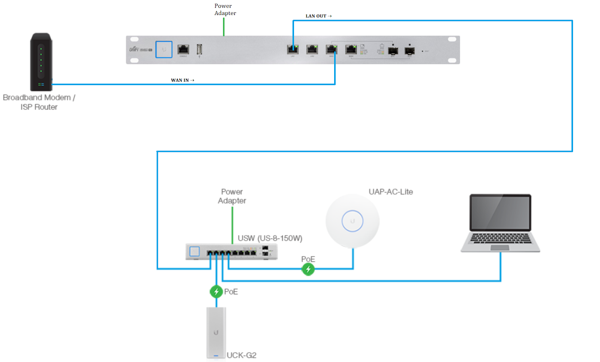

## Overview

UniFi is a community of wireless access points, switches, routers, controller devices, VoIP phones, and access control products. It can be used for the corporate network and also for the home network. An Unifi network controller manages all the equipment in the UNIFI network. The best part of the Unifi network is that its controller can be hosted online with a Ubiquiti account using an Unifi Cloud Key, giving online access to the network to manage the Unifi devices and the connected client so can handle most of the operations remotely.

## Common Network Architecture

## Benefits of Ubiquiti UniFi Network
 1. **Easy Deployment**

Having an UniFi Controller on the cloud allows us easy deployment of hardware. On any UniFi network where we have UniFi Security Gateway (USG) Installed, any UniFi equipment plugged into the network is immediately recognized by the Unifi Controller and is also ready for adoption. Whenever the controller adopts the device, the device receives the correct configuration and comes up in the network within a short period.

2. **Reduced Operating and Hardware Cost**

UniFi devices are ideal and helpful for most small and <a href="https://www.loginradius.com/startups/"><b>startups businesses</b></a> and even for some medium-sized businesses because they don't need the extra cost to buy high-priced products like cisco enterprise equipment. Businesses can achieve almost the same performance with Ubiquiti products. Many products have advanced enterprise hardware that is not even needed, so Ubiquiti is useful for smaller businesses that want enterprise-grade equipment.

3. **Simplified Length of Service**

UniFi products are built to be controlled remotely and its easy to <a href="https://www.loginradius.com/blog/fuel/2021/02/tips-managing-remote-team/"><b>leading and managing remote teams</b></a>. All the Unifi products are designed with upgrades in mind, and they keep getting updates over some time for the new feature upgradation and the bug fixes.

4. **Total Visibility**

In the UniFi network, the user can see everything going on in their network, from connected clients, total traffic to speed and throughput tests to information broken down into individual protocol using deep packet inspection available right in the UniFi Controller. UniFi Controller offers information about your network, how it is being used, and that insight can optimize the network for better efficiency. 

## Conclusion

Having an Unifi network at the office or home can be more satisfying in deploying the devices and monitoring the network.  An Unifi controller gives transparency to the network.
