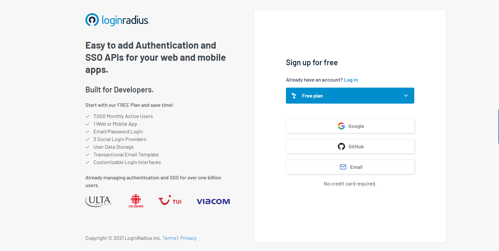
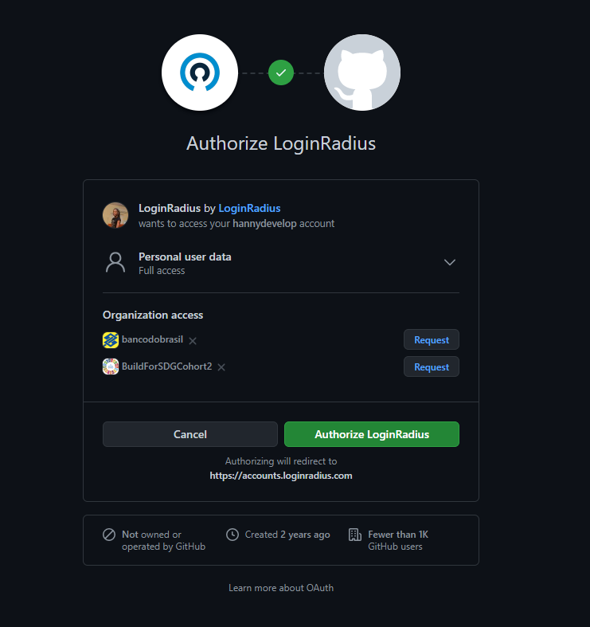
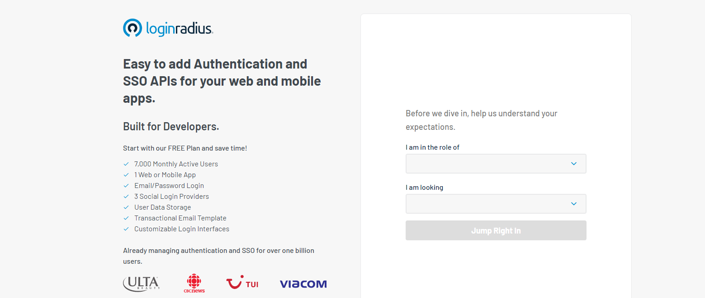
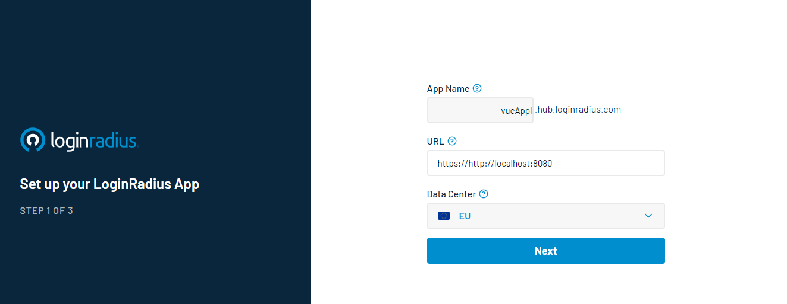
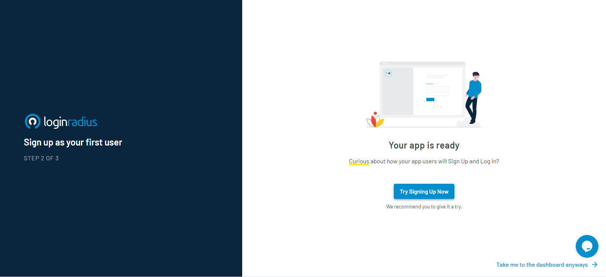
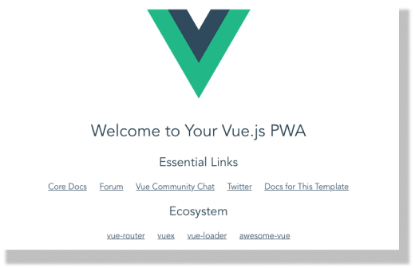
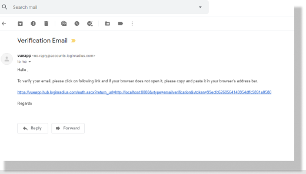
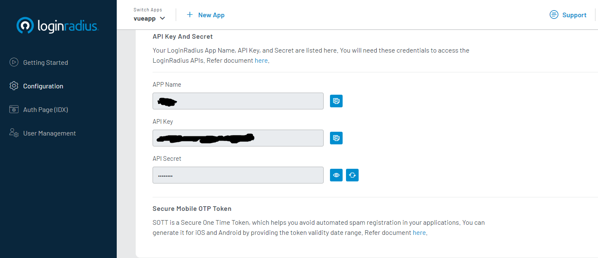
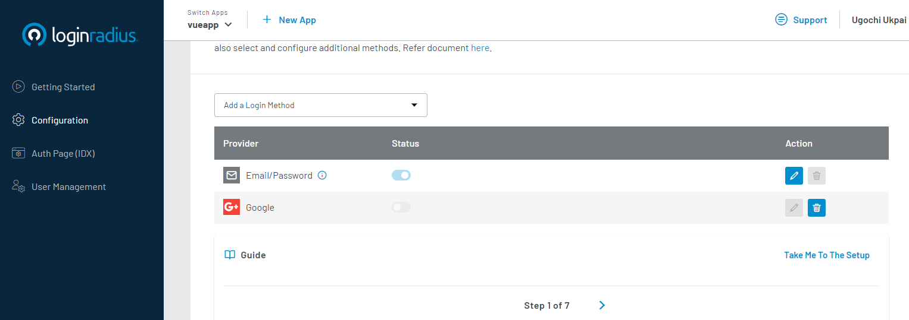

If you communicate over the internet in an insecure connection, cybercriminals can get hold of your personal information and conversations. For firms, they'll be fined by data compliance regulatory bodies like [GDPR](https://gdpr-info.eu/) if they don't secure user's personal information properly. This is why authentication is an important matter in the IT industry.
In authentication, the identity of a user is confirmed before allowing them access to their account. Authentication, although important, doesn't have to be a tedious and daunting task. LoginRadius is a cloud-based customer identity and access management platform, allowing developers to implement authentication easily in applications.
In this article, we'll explore how to perform web authentication in a single page application built with JavaScript's Vue.js framework.

## What Is Authentication

Authentication is the process of confirming the identity of a computer user. For example, users may need to provide credentials that will be compared to an initial credential provided. Authentication isn't the same as identification. In identification, we indicate the identity of a person. For instance, you may be asked to "confirm you're not a robot" while surfing the net. However, in authentication, we verify a person's identity.
In application authentication, developers can incorporate single-factor or multi-factor authentication with tokens or cryptographic functions. Let's look at how to perform single-factor authentication in our Vue.js application with LoginRadius.

**Prerequisites**

You need the following prerequisites to perform authentication with LoginRadius in your Vue.js application.
1. Node.js installed in your working environment. If you don't, click on this link to download it.
2. Basic knowledge of JavaScript and how the Vue.js framework works.

## LoginRadius Set-Up

The first step is to create an account with LoginRadius. This is necessary, as you'll need your credentials to access the LoginRadius API. Click on this link to create a [free account](https://accounts.loginradius.com/auth.aspx?return_url=https://dashboard.loginradius.com/login&action=register).
When you click on the link above, you'll be directed to a sign-up page. You can choose to sign up with your email or a service provider like GitHub or Google.



I chose the GitHub provider since I already have a GitHub account. You'll be redirected to authorize LoginRadius.



After clicking on the "Authorize LoginRadius" button to authorize LoginRadius, you'll be asked for a brief info on your expectations.



After filling in the form and clicking on the "Jump Right in button" you'll be directed to a new page to set up your LoginRadius application.



This is the first step in setting up your LoginRadius application. You'll be asked for an app name and URL. I choose vueApp as my app name since we're building a Vue.js application. I filled the URL with port 8080 which is where my Vue.js application will run. i.e. http://localhost:8080/. Leave the data center in the EU or choose any area that's closer to your location. Then click on the "Next" button.
You'll be directed to the page below. Ignore the "Try Signing Up Now" button. This is because we'll get an error since we've not set up our Vue.js application yet. Instead, click on "Take me to the dashboard anyways" so that you can access your API key.



You should be directed to your dashboard. We won't be configuring anything for now until we create our Vue.js application.

## Vue.js Set-Up

The first thing we'll do is install the Vue.js CLI and create our LoginRadius application. You can install Vue CLI with npm or yarn. To install Vue CLI, run the following command in your terminal.

```js
npm install -g @vue/cli
# OR
yarn global add @vue/cli
```

Next, we'll be creating our Vue.js project. To create our LoginRadius Vue project, run the command below in your terminal.

```js
vue create loginradius
```
In your terminal, you'll be asked to choose between Vue 2 and Vue 3. I highly recommend you choose Vue 2 since it's stable and Vue 3 is still in preview. Once your application is set, you'll be asked to navigate to the location of your project with `cd LoginRadius`.
To start your application, run the command below in your terminal.


```
npm run serve
```



Now that we've successfully installed Vue.js and set up our project, the next step is to configure our Vue.js application to use LoginRadius for authenticating users.

## Vue.js + LoginRadius Configuration

The first thing we'll be doing is to configure vue-router so that we can navigate to our different pages seamlessly.  Vue-router is the official router for Vue.js. Because Vue is a [single page application (SPA)](https://en.wikipedia.org/wiki/Single-page_application#:~:text=From%20Wikipedia%2C%20the%20free%20encyclopedia,browser%20loading%20entire%20new%20pages.), you need a router to sync URLs without necessarily reloading the entire page. To configure the router, create a folder in your "src" folder and name it "router". In your "router" folder, create a file and name it "index.js".

Paste the code below in your "index.js" file.

```js
import Vue from 'vue'
import Router from 'vue-router'
 
Vue.use(Router)
 
export default new Router({
  mode: 'history',
  routes: []
})
```


The reason for mode: 'history' is to avoid the Vue.js hash mode. In the hash mode, Vue.js uses the URL hash (#) to simulate a full URL. So, you'll get a hash as part of your URL. The history mode removes this hash.
Add the router file to your "main.js" file which is at the root of your Vue.js project.

```js 
import router from './router router
```

Your "main.js" file should be looking like this now:

```js
import Vue from 'vue'
import App from './App.vue'
import router from './router'
 
Vue.config.productionTip = false
 
new Vue({
  render: h => h(App),
  router,
}).$mount('#app')
 
```


Next, we'll be adding router to our "App.vue" file. This file is the entry point of any Vue.js application. Delete the original content in the "App.vue" file and replace it with the code below.

```js
<template>
  <div id="app">
    <router-view></router-view>
  </div>
</template>
 
<script>
export default {
  name: 'app'
}
</script>
```

Next, we'll start creating different pages for our application. Our "HelloWorld" component will be used as our home page after successfully authenticating our users.

```js
<template>
  <div class="container">
    <h1 class="topp">You've been successfully Authenticated</h1>
    <div>
      <h3 class="bottomm">Want to Log out? Click on the button below</h3>
    </div>
  </div>
</template>
 
<script>
export default {};
</script>
 
<style>
.container {
    max-width: 1100px;
    margin: 0 auto;
    overflow: hidden;
    padding: 0 40px;
    height: 100%;
}
 
.topp{
  text-align: center;
  margin: 100px 20px 0 0;
}
 
.bottomm{
  text-align: center;
  margin: 10px 20px 0 0;
}
 
.button {
  margin: 0;
  position: absolute;
  top: 50%;
  left: 50%;
  overflow: auto;
}
</style>
```

We'll create another Vue component which will be the first page an unauthenticated visitor sees. We'll name this Vue component "Auth.vue". Put the codes below in "Auth.vue".

```js
<template> 
<div class="container">
  <h1 class="topp">You've Not Been Authenticated</h1>
    <div class="arrange flex">
        <h3 class="bottomm">Don't have an Account? Click this button to register</h3>
        <b-button a href="https://vueapp.hub.loginradius.com/auth.aspx?action=register&return_url=http://localhost:8080/hello" 
        variant="success" class="login-button">Register</b-button>
    </div>
    <div class="arrange flex">
      <h3 class="bottomm">Already have an Account? Click this button to Sign-in</h3>
        <b-button type="submit" a href="https://vueapp.hub.loginradius.com/auth.aspx?action=login&return_url=http://localhost:8080/hello" 
        variant="success" class="login-button">Login</b-button>
    </div>
</div>
</template>
 
<script>
export default {
    data() {
    return {
    };
  },
};
</script>
 
<style>
.container {
    max-width: 1100px;
    margin: 0 auto;
    overflow: hidden;
    padding: 0 40px;
    height: 100%;
}
 
.topp{
  text-align: center;
  margin: 100px;
}
 
.bottomm{
  text-align: center;
  margin: 10px 20px 0 0;
}
 
.flex {
    display: flex;
    justify-content: center; 
    align-items: center;    /**Align to center vertically**/
}
</style>
```

Next, we'll be installing the bootstrap vue and bootstrap packages by running the command below in your terminal.

```js
npm install –save-dev bootstrap-vue bootstrap
```

We'll be using these packages to create buttons and add style to our application. Now that we've created the pages we need for our Vue application let's register them in router/index.js. Add the following codes in your router/index.js file.

```js
import Auth from '@/components/Auth'
import HelloWorld from '@/components/HelloWorld'
    {
        path: '/hello',
        name: 'HelloWorld',
        component: HelloWorld
      },
    {
      path: '/auth',
      name: 'Auth',
      component: Auth
    },
    {
    path: '*',
    name: '/Auth',
    component: Auth
  }
 
```


We've added our components "HelloWorld" and "Auth" and also specified the URL path for our components. We also created a path (*) with our "Auth" component. When you put * in a path, you're telling Vue that the component specified is a fallback component if a user provides an invalid URL. For most developers, they specify a 404 template as a fallback component if a user provides an invalid URL.
Now that all is set, let’s test our application. Your Vue application should reload on its own. However, if you've stopped it, run the command below to start it.

```js 
npm run serve
```


Provide your credentials and register. You'll need to verify your email address with the link sent to your email.



Now, our application is working as expected. You click on "Try your login page" in your LoginRadius page to see that it redirects you back to your application. Now, this is exactly what we want, to allow easy authentication with LoginRadius. Let's look at some configurations and other things we can do in our Vue.js application with LoginRadius.

## Sign Out

You must have noticed that since a user has been authenticated, they don't get directed to the login/registration page. To do this, we'll add a sign-out button to our application. In your "HelloWorld" component, add the following codes.

```js
      <div class="button">
      <b-button
        a
        href="https://vueapp.hub.loginradius.com/auth.aspx?action=logout"
        variant="success"
        class="login"
        >Logout</b-button

       >
      </div>    
 ```
      
      
Next, navigate to your application's URL in your browser. Click on the sign out button, and you'll be directed to the login/registration page. You can choose to log in or register a new user.


From the examples so far, we've just directed our user authentication to LoginRadius without consuming APIs. Developers mostly go for the developers or developer pro account for flexibility so that they can customize their LoginRadius account and consume APIs better. Let's look at some of the ways you can utilize the LoginRadius API.

## Consuming LoginRadius API

To utilize LoginRadius API, you'll need your credentials which are available in your [dashboard](https://dashboard.loginradius.com/configuration).



There are a bunch of things you can do with the LoginRadius API. In this section, we'll cover user account, phone authentication and authentication with providers.

**1. User Account**

Lots of developers love to customize their authentication forms. For instance, they'll want to add customer's names etc., to their registration form. To do this, you can use the LoginRadius API to make a POST request to this endpoint below:


```
https://api.loginradius.com/identity/v2/manage/account
```

This method will bypass the normal email verification process. You'll need to include your API key and secret key in your request. So, your button will have a method register method to the endpoint above.

Your form field can contain fields like First name, Last name, email address, etc. The password field is compulsory. With the LoginRadius API, you can send a forgotten password to a user's email, perform email verification, retrieve customer data from account profile, update and delete user data.

**2. Phone Authentication**

The phone authentication method will send a user token to their phone numbers like an OTP (one-time-password). This will enable LoginRadius to verify the user's phone number. To perform phone authentication, you'll send a POST request to the endpoint below.

```
https://api.loginradius.com/identity/v2/auth/phone/otp
```


Your request must contain a header with your access token. Your sott is required too. You can resend OTP, reset the password, update the phone number and remove the phone ID with the phone authentication API.

**3. Providers**

Just like I registered my LoginRadius account with GitHub, you can give users the option of logging into their application with providers like Google, Twitter, Facebook, GitHub etc. This is necessary because most users want their authentication details in one place rather than creating new accounts.

With LoginRadius, you can connect [numerous providers](https://www.loginradius.com/authenticate/vue/) to your application. You can implement this feature from your [dashboard](https://dashboard.loginradius.com/configuration) or follow the instructions on the social page to use the [social API](https://www.loginradius.com/docs/developer/references/api/social).



In the next section, we'll look at why you should consider outsourcing user authentication in your application to a SaaS company like LoginRadius.

## Benefits of Outsourcing Authentication, LoginRadius as a Case Study.

Outsourcing user authentication from a SaaS (Software as a Service) company like LoginRadius has tremendous advantages. For instance, you don't need to bother about data management and cybercriminals doing away with the personal information of your users. This is because LoginRadius takes data compliance and security seriously. With this, you're free from absorbing user personal data thus reducing the impact of a data breach.

Another advantage of using LoginRadius for user authentication is the ability to focus on your application's features only without needing to hire developers to implement authentication. This allows you to focus on your application alone. So that financial and logistical overhead from hiring developers to implement authentication in your product is reduced.

There are a bunch of other things that you can do with the LoginRadius API. With the [developer pro account](https://accounts.loginradius.com/auth.aspx?plan=business&action=register), you can add custom fields for authentication, perform team management, create registration forms, perform dark web monitoring etc.

In this article, we have discussed user authentication and how to implement it with LoginRadius in a Vue.js application. LoginRadius supports other JavaScript frameworks like React, Angular, etc., other languages and implementation in mobile devices. If you want to know more about LoginRadius, its SDKs, and what you can do with its API, this [documentation](https://www.loginradius.com/docs/developer/) is a great fit for you. Also, the full code for this article is on [GitHub](https://github.com/hannydevelop/Loginradius-vue). You can clone the repository and see how it works.
