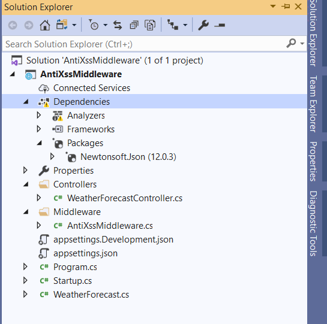

In this blog, we learn how to implement the **AntiXssMiddleware** in .NET Core. First, we will understand about the cross-site scripting.

## Cross-Site Scripting(XSS)

Cross-site scripting is a security vulnerability and a client-side code injection attack. In this attack, the malicious script is injected into legitimate websites.
Cross-site scripting allows an attacker to act like a victim user and to carry out the actions that the user can perform. The attacker can access the user's data as well.

## Implement AntiXssMiddleware in .NET Core

**Step 1:** Create Asp.NET Core Web Application project in Visual Studio.

**Step 2:** Select type as API in the next step and create the project. You will find a default controller which is created in the controller folder named as **WeatherForecastController.cs**

**Step 3:** Now create a new folder named Middleware in the root directory.

**Step 4 :** Create a new file **AntiXssMiddleware.cs** in that Middleware folder.

**Step 5:** Now add the Newtonsoft.json package into your solution

By doing the above steps you will have below structure in your solution.



**Step 6:** Now edit the AntiXssMiddlewars.cs file and paste below code.

```c#
using System;
using System.Collections.Generic;
using System.IO;
using System.Linq;
using System.Net;
using System.Text;
using System.Text.RegularExpressions;
using System.Threading.Tasks;
using Microsoft.AspNetCore.Builder;
using Microsoft.AspNetCore.Http;
using Newtonsoft.Json;

namespace AntiXssMiddleware.Middleware
{
    public class AntiXssMiddleware
    {
        private readonly RequestDelegate _next;
        private ErrorResponse _error;
        private readonly int _statusCode = (int)HttpStatusCode.BadRequest;

        public AntiXssMiddleware(RequestDelegate next)
        {
            _next = next ?? throw new ArgumentNullException(nameof(next));
        }

        public async Task Invoke(HttpContext context)
        {
            // Check XSS in URL
                if (!string.IsNullOrWhiteSpace(context.Request.Path.Value))
                {
                    var url = context.Request.Path.Value;

                    if (CrossSiteScriptingValidation.IsDangerousString(url, out _))
                    {
                        await RespondWithAnError(context).ConfigureAwait(false);
                        return;
                    }
                }

                // Check XSS in query string
                if (!string.IsNullOrWhiteSpace(context.Request.QueryString.Value))
                {
                    var queryString = WebUtility.UrlDecode(context.Request.QueryString.Value);

                    if (CrossSiteScriptingValidation.IsDangerousString(queryString, out _))
                    {
                        await RespondWithAnError(context).ConfigureAwait(false);
                        return;
                    }
                }

                // Check XSS in request content
                var originalBody = context.Request.Body;
                try
                {
                    var content = await ReadRequestBody(context);

                    if (CrossSiteScriptingValidation.IsDangerousString(content, out _))
                    {
                            await RespondWithAnError(context).ConfigureAwait(false);
                            return;
                    }
                    await _next(context).ConfigureAwait(false);
                }
                finally
                {
                    context.Request.Body = originalBody;
                }
        }

        private static async Task<string> ReadRequestBody(HttpContext context)
        {
            var buffer = new MemoryStream();
            await context.Request.Body.CopyToAsync(buffer);
            context.Request.Body = buffer;
            buffer.Position = 0;

            var encoding = Encoding.UTF8;

            var requestContent = await new StreamReader(buffer, encoding).ReadToEndAsync();
            context.Request.Body.Position = 0;

            return requestContent;
        }

        private async Task RespondWithAnError(HttpContext context)
        {
            context.Response.Clear();
            context.Response.Headers.AddHeaders();
            context.Response.ContentType = "application/json; charset=utf-8";
            context.Response.StatusCode = _statusCode;

            if (_error == null)
            {
                _error = new ErrorResponse
                {
                    Description = "Error from AntiXssMiddleware",
                    ErrorCode = 500
                };
            }

            await context.Response.WriteAsync(_error.ToJSON());
        }
    }

    public static class AntiXssMiddlewareExtension
    {
        public static IApplicationBuilder UseAntiXssMiddleware(this IApplicationBuilder builder)
        {
            return builder.UseMiddleware<AntiXssMiddleware>();
        }
    }


    /// <summary>
    /// Imported from System.Web.CrossSiteScriptingValidation Class
    /// </summary>
    public static class CrossSiteScriptingValidation
    {
        private static readonly char[] StartingChars = { '<', '&' };

        #region Public methods

        public static bool IsDangerousString(string s, out int matchIndex)
        {
            //bool inComment = false;
            matchIndex = 0;

            for (var i = 0; ;)
            {

                // Look for the start of one of our patterns
                var n = s.IndexOfAny(StartingChars, i);

                // If not found, the string is safe
                if (n < 0) return false;

                // If it's the last char, it's safe
                if (n == s.Length - 1) return false;

                matchIndex = n;

                switch (s[n])
                {
                    case '<':
                        // If the < is followed by a letter or '!', it's unsafe (looks like a tag or HTML comment)
                        if (IsAtoZ(s[n + 1]) || s[n + 1] == '!' || s[n + 1] == '/' || s[n + 1] == '?') return true;
                        break;
                    case '&':
                        // If the & is followed by a #, it's unsafe (e.g. S)
                        if (s[n + 1] == '#') return true;
                        break;

                }

                // Continue searching
                i = n + 1;
            }
        }

        #endregion

        #region Private methods

        private static bool IsAtoZ(char c)
        {
            return (c >= 'a' && c <= 'z') || (c >= 'A' && c <= 'Z');
        }

        #endregion

        public static void AddHeaders(this IHeaderDictionary headers)
        {
            if (headers["P3P"].IsNullOrEmpty())
            {
                headers.Add("P3P", "CP=\"IDC DSP COR ADM DEVi TAIi PSA PSD IVAi IVDi CONi HIS OUR IND CNT\"");
            }
        }

        public static bool IsNullOrEmpty<T>(this IEnumerable<T> source)
        {
            return source == null || !source.Any();
        }
        public static string ToJSON(this object value)
        {
            return JsonConvert.SerializeObject(value);
        }
    }

    public class ErrorResponse
    {
        public int ErrorCode { get; set; }
        public string Description { get; set; }
    }

}

```

In the above file we have created the method for checking the Xss in QueryParam, RequestUri and RequestBody.

Here we have different methods which are as follows:-

**ReadRequestBody** which is used for reading the RequestBody.

**RespondWithAnError** which is used for returning the error.

**IsDangerousString** which is checking if there is any dangerous string like any script in the given string.

**Step 7:** Edit the Startup.cs file and add below line in **Configure** method.

```c#
app.UseAntiXssMiddleware();
```

**Step 8 :** After editing the Startup.cs file will look like below

```c#
using System;
using System.Collections.Generic;
using System.Linq;
using System.Threading.Tasks;
using AntiXssMiddleware.Middleware;
using Microsoft.AspNetCore.Builder;
using Microsoft.AspNetCore.Hosting;
using Microsoft.AspNetCore.HttpsPolicy;
using Microsoft.AspNetCore.Mvc;
using Microsoft.Extensions.Configuration;
using Microsoft.Extensions.DependencyInjection;
using Microsoft.Extensions.Hosting;
using Microsoft.Extensions.Logging;

namespace AntiXssMiddleware
{
    public class Startup
    {
        public Startup(IConfiguration configuration)
        {
            Configuration = configuration;
        }

        public IConfiguration Configuration { get; }

        // This method gets called by the runtime. Use this method to add services to the container.
        public void ConfigureServices(IServiceCollection services)
        {
            services.AddControllers();
        }

        // This method gets called by the runtime. Use this method to configure the HTTP request pipeline.
        public void Configure(IApplicationBuilder app, IWebHostEnvironment env)
        {
            if (env.IsDevelopment())
            {
                app.UseDeveloperExceptionPage();
            }

            app.UseHttpsRedirection();
            app.UseAntiXssMiddleware();
            app.UseRouting();
            app.UseAuthorization();
            app.UseEndpoints(endpoints =>
            {
                endpoints.MapControllers();
            });
        }
    }
}

```

**Step 9:** Now build and run the solution.

As we run the default API which is https://localhost:44369/weatherforecast we will get the below response.

```json
[
  {
    "date": "2020-08-21T11:58:40.0289718+05:30",
    "temperatureC": 27,
    "temperatureF": 80,
    "summary": "Sweltering"
  },
  {
    "date": "2020-08-22T11:58:40.0289896+05:30",
    "temperatureC": 21,
    "temperatureF": 69,
    "summary": "Cool"
  },
  {
    "date": "2020-08-23T11:58:40.0289899+05:30",
    "temperatureC": -20,
    "temperatureF": -3,
    "summary": "Hot"
  },
  {
    "date": "2020-08-24T11:58:40.0289901+05:30",
    "temperatureC": 21,
    "temperatureF": 69,
    "summary": "Sweltering"
  },
  {
    "date": "2020-08-25T11:58:40.0289902+05:30",
    "temperatureC": 2,
    "temperatureF": 35,
    "summary": "Balmy"
  }
]
```

Now if we inject any script in the above url like `https://localhost:44369/weatherforecast<script></script>` we will get the response as

```json
{
  "ErrorCode": 500,
  "Description": "Error from AntiXssMiddleware"
}
```

**Note:**

1. The default port may be different when you run the project. So change the port accordingly.

2. You can customize the error message according to your need.

## Conclusion

In this blog, we learnt about how to implement AntiXssMiddlware in ASP.NET Core Web Application Project. We have implemented the AntiXssMiddleware in API's QueryParam, ReuqestUri and RequestBody. So if any script is injected in QueryParam, RequestUri or RequestBody then it will give the error.
