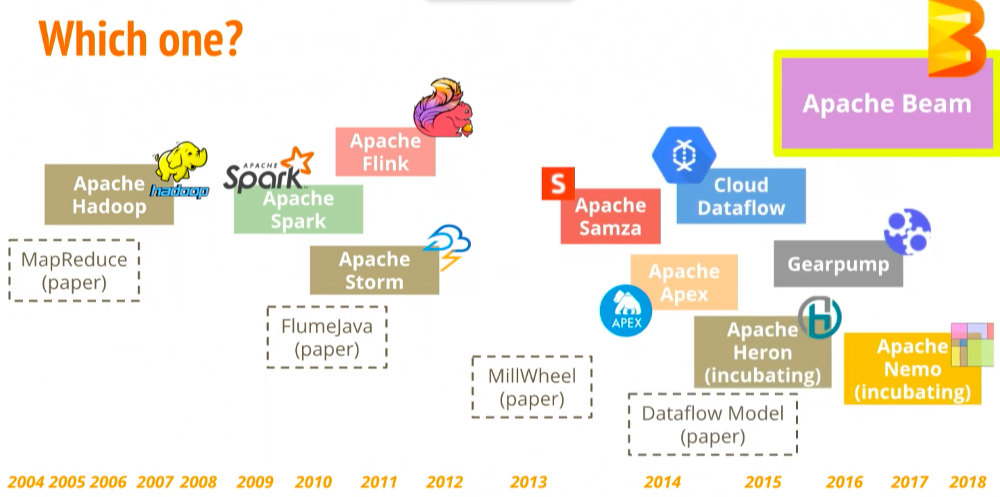

We'll talk about Apache Beam in this guide and discuss its fundamental concepts. We will begin by showing the features and advantages of using Apache Beam, and then we will cover basic concepts and terminologies.

Ever since the concept of big data got introduced to the programming world, a lot of different technologies, frameworks have emerged. The processing of data can be categorized into two different paradigms. One is Batch Processing, and the other is Stream Processing.

Different technologies came into existence for different paradigms, solving various big data world problems, for, e.g., Apache Spark, Apache Flink, Apache Storm, etc.

As a developer or a business, it's always challenging to maintain different tech stacks and technologies. Hence, Apache Beam to the rescue!



## What is Apache Beam?

Apache Beam is an open source, centralised model for describing parallel-processing pipelines for both batch and streaming data. The programming model of the Apache Beam simplifies large-scale data processing dynamics.

The Apache Beam model offers helpful abstractions that insulate you from distributed processing information at low levels, such as managing individual staff, exchanging databases, and other activities. These low-level information are handled entirely by Dataflow.


## Features of Apache Beam

The unique features of Apache beam are as follows:

1. Unified - Use a single programming model for both batch and streaming use cases.
2. Portable - Execute pipelines in multiple execution environments. Here, execution environments mean different runners. Ex. Spark Runner, Dataflow Runner, etc
3. Extensible - Write custom SDKs, IO connectors, and transformation libraries.

## Apache Beam SDKs and Runners

As of today, there are 3 Apache beam programming SDKs

1. Java
2. Python
3. Golang

Beam Runners translate the beam pipeline to the API compatible backend processing of your choice. Beam currently supports runners that work with the following backends.

1. Apache Spark
2. Apache Flink
3. Apache Samza
4. Google Cloud Dataflow
5. Hazelcast Jet
6. Twister2

Direct Runner to run on the host machine, which is used for testing purposes.

## Basic Concepts in Apache Beam

Apache Beam has three main abstractions. They are

1. Pipeline
2. PCollection
3. PTransform


### Pipeline:

A pipeline is the first abstraction to be created. It holds the complete data processing job from start to finish, including reading data, manipulating data, and writing data to a sink. Every pipeline takes in options/parameters that indicate where and how to run.

### PCollection:

A pcollection is an abstraction of distributed data. A pcollection can be bounded, i.e., finite data, or unbounded, i.e., infinite data. The initial pcollection is created by reading data from the source. From then on, pcollections are the source and sink of every step in the pipeline.

### Transform:

A transform is a data processing operation. A transform is applied on one or more pcollections. Complex transforms have other transform nested within them. Every transform has a generic `apply` method where the logic of the transform sits in.

## Example of Pipeline

Here, let's write a pipeline to output all the jsons where the name starts with a vowel.

Let's take a sample input. Name the file as `input.json`

```json
{"name":"abhi", "score":12}
{"name":"virat", "score":23}
{"name":"dhoni", "score":45}
{"name":"rahul", "score": 156}
{"name": "Edmund"}
{"name": "Ojha"}
```

The input should be a newline delimited JSON.

Include the following dependencies in your `pom.xml`

```
<dependency>
    <groupId>org.apache.beam</groupId>
    <artifactId>beam-sdks-java-core</artifactId>
    <version>2.24.0</version>
</dependency>

<dependency>
    <groupId>org.apache.beam</groupId>
    <artifactId>beam-runners-direct-java</artifactId>
    <version>2.24.0</version>
</dependency>
```

Let's code the beam pipeline. Follow the steps

1. Create a pipeline.

   ```java
    Pipeline pipeLine = Pipeline.create();
    // OR
    // Pipeline pipeLine = Pipeline.create(options);
   ```

   Create a pipeline which binds all the pcollections and transforms. Optionally you can pass the PipelineOptions `options` if needed.

2. Read the input file

   ```java
   PCollection<String> inputCollection = pipeLine.apply("Read My File", TextIO.read().from("input.json"));
   ```

   Use the `TextIO` transform to read the input files. Every line is a different json record.

3. Apply a transform to filter out the names starting from a vowel

   ```java
   PCollection filteredCollection = inputCollection.apply("Filter names starting with vowels", Filter.by(new SerializableFunction<String, Boolean>() {

           public Boolean apply(String input) {
               ObjectMapper jacksonObjMapper = new ObjectMapper();
               try {
                   JsonNode jsonNode = jacksonObjMapper.readTree(input);
                   String name = jsonNode.get("name").textValue();
                   return vowels.contains(name.substring(0,1).toLowerCase());
               } catch (JsonProcessingException e) {
                   e.printStackTrace();
               }
               return false;
           }
       }))
   ```

   The filter transform takes a SerializableFunction Object where the `apply` method is overridden. Every json-string record is converted to a JSON. The first character of the `name` is checked if it's a vowel. The transform is applied to each input JSON record. Based on the boolean value returned, the record is retained or discarded.

4. Write the results to a file

   ```java
   inputCollection.apply("write to file", TextIO.write().to("result").withSuffix(".txt").withoutSharding());
   ```

   The results of the `Filter` transform are stored in a text file using the write method of the `TextIO` transform. As PCollections are distributed across machines, the results are written to multiple files/shards. To avoid this, we use `withoutSharding` where all the output is written to a single file.

Output:

```json
{"name": "Edmund"}
{"name": "Ojha"}
{"name":"abhi", "score":12}
```

---

Complete Code:

```java
Pipeline pipeLine = Pipeline.create();

final Set<String> vowels = new HashSet<String>(Arrays.asList("a","e","i","o","u"));

pipeLine.apply("Read My File",
                TextIO.read().from("input.json"))
        .apply("Filter names starting with vowels", Filter.by(new SerializableFunction<String, Boolean>() {

            public Boolean apply(String input) {
                ObjectMapper jacksonObjMapper = new ObjectMapper();
                try {
                    JsonNode jsonNode = jacksonObjMapper.readTree(input);
                    String name = jsonNode.get("name").textValue();
                    return vowels.contains(name.substring(0,1).toLowerCase());
                } catch (JsonProcessingException e) {
                    e.printStackTrace();
                }
                return false;
            }
        }))
        .apply("write to file", TextIO.write().to("result").withSuffix(".txt").withoutSharding());

pipeLine.run().waitUntilFinish();
```

For more advanced concepts, refer to the official site - beam.apache.org
