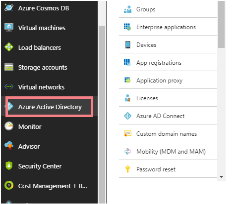

This blog post goes over how you can connect your SAAS/web application with the Azure AD world. Let’s take a look at how Azure AD works as an identity provider to provide your users with the ability to log in. e.g if anyone using Office 365, able to log on with their standard account or a federated one.

Windows Azure provides a number of identity-based technologies to support such kind of requirements. As a means of illustrating this, we’ll show an example using Azure AD as an Identity Provider (IdP), connecting up to the LoginRadius SAAS application using the LoginRadius Admin Console.

- Log in to the Azure Portal.
- On the Azure active directory tab, click on the App registrations tab.  From the top of the screen, create a new application by clicking on "New application registration".

- Give your SaaS/Web application a name (company name Demo).  Using the drop-down, select the type of application i.e Web Application / Web API.
- For Sign-On URL fill in the Assertion Consumer Service (ACS) URL for the Service Provider

- Go to the App setting at the top of the page and fill in the required fields
- Go to the endpoints at the top of the application registration page and use these app endpoints to set up the azure ad with your saas application.

Here are the meanings of the terms, we have used above: 

**Sign-On Url**: This is where you want to send users to when accessing the "application". 

**Reply URL**: It's the Reply URL which is the address to which Azure AD will send the SAML authentication response.

On the Service Provider side, the metadata from the tenant, Azure Identity Provider needs to be parsed and added to the configuration file. This is done by downloading the Azure IdP metadata file directly, e.g.

`https://login.microsoftonline.com/<AzureTenantID>/federationmetadata/2007-06/federationmetadata.xml`

This is all you need to know to go about creating a new application on the Azure portal and use Azure Ad as an Identity provider for login. With these and a number of services, Azure offers a solid convergence point for brokering connections with your web applications and workspaces.
