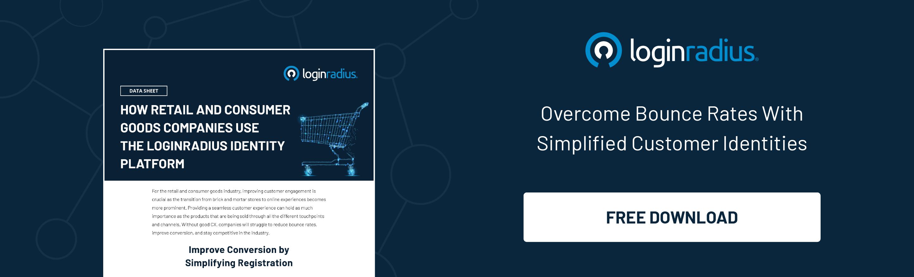

Being customer-centric has always been important in the retail business, but its definition has changed over time. Before, consumers had a sense of satisfaction from attentive sales associates and a broad choice of merchandise.

These days, the consumer wants a digital experience, too, regardless of whether they buy online. Consumers need to know they can trust retailers to protect their private information. Cybercriminals are targeting retailers' data stores as they gather customer data in unprecedented numbers. So, security [authentication for B2C](https://www.loginradius.com/b2c-identity/) is important.

A few brands made headlines last year due to failing to protect customer data, such as Kmart, Forever 21, and Saks. The majority of people said they would postpone shopping at a breached brand for three months.

Losing business means paying for remediation, business disruption, legal expenses, identity repair, regulatory penalties, and other clean-up costs. For each breach, this amount averages \$7 million.

## Challenges Associated With Authentication

Security for retail authentication should be cost-efficient and ensure that users have a frictionless experience. Although retail has some distinct differences from other industries regarding identity and authentication, it also faces many challenges. Some of these include:

### **Increased turnaround time to complete the checkout**

[Security for retail authentication](https://www.loginradius.com/blog/fuel/improve-ecommerce-store-security/) is a critical feature for users. However, that can't be used as an excuse for reducing the turnaround time of the complete process.

Organizations must ensure that they do not introduce time-taking steps. You need to maintain a delicate balance between the authentication features and the time taken to complete the process. For instance during a holiday or a festival sale, time taken for the checkout would be a critical component for the customers.

### **Higher chances of a data breach**

Along with providing authentication solutions, it is important to protect the digital identities of the employees as well as the customers. In today's world, maintaining data security is a challenge. Various information (credit card details and other customer details) might attract a lot of hackers which could potentially result in a data breach.

### **Multiple local government laws to comply with**

Cloud applications have made applications and data accessible from anywhere in the world. However, the local laws require several retailers to be tight over how and from where the employees can access the data. Additionally, various governments might have different regulations. Hence, complying with multiple rules at the same time might prove to be a challenge.

## Solving These Challenges

When retailers face these challenges, they should implement several strategies. To prevent the misuse of stolen credentials, eliminate inefficiencies, and provide a good user experience, it is highly recommended to implement a flexible access control platform. User management helps them in this regard.

Some of the approaches retailers have adopted are:

### **Fast authentication that does not slow users down**

A great combination of security and usability is provided when one uses adaptive authentication, which picks the best methods and factors based on the risk profile and usage history of each user and the devices used. A one-time passcode (OTP) is especially useful in this fast-paced world, as users cannot tolerate constant disruptions to access equipment.

To meet such unique use cases, retail companies must pick [authentication vendors](https://www.loginradius.com/industry-retail-and-ecommerce/) that offer flexibility. Many retailers, for example, close the POS before clearing the browser, making it difficult to distinguish the devices. Cookies and device recognition will be flexible enough to meet this requirement.

### **SSO simplifies the sign-in process for users**

Retailers who federate their legacy applications can use the same identity to access multiple applications and avoid providing credentials multiple times (SSO). The convenience of SSO, coupled with strong authentication, is unmatched.

Many vendors offer tools that allow organizations to function without refactoring their applications. Self-Service password resets are also essential for retailers. By providing this feature, retailers can further alleviate the difficulty of managing passwords.

### **A flexible platform that can be used by employees and consumers**

Typical business-to-employee scenarios, like e-commerce portals, require a much different set of capabilities. Strong authentication can be incorporated into apps in a very flexible manner by selecting a vendor who has a broad set of capabilities.

### **Implementing PCI compliance requirements**

[Two-factor authentication](https://www.loginradius.com/resource/loginradius-ciam-two-factor-authentication/+) is required for PCI compliance regardless of whether a user connects from a trusted network to PCI systems. Retailers must ensure they stay up-to-date on all of the latest requirements to protect their businesses and customers.

## The Bottom Line

The ability to authenticate customers in real time using multiple modalities is challenging. Understanding how solutions vary by use case, threat model and authentication technology used is crucial to choosing the right one for your unique requirements. [Contact us](https://www.loginradius.com/contact-sales) for better understanding.

