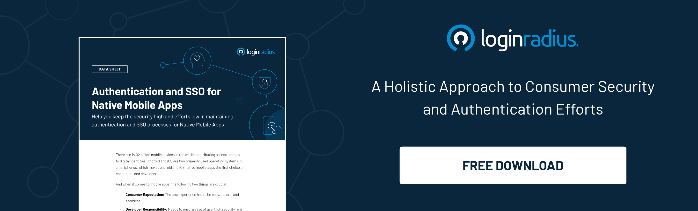

Modern consumers expect personalized, valuable, and secure experiences from any application they engage with. As a result, the responsibility falls upon developers to ensure ease of use and seamless access for consumers into their applications.

The recently launched LoginRadius Authentication and SSO for Native Mobile Apps provide ready-to-use, user-friendly, and [secure authentication methods for businesses](https://www.loginradius.com/multi-factor-authentication/) to choose and integrate with native mobile app(s).

## Intent Behind the Launch

[Developing mobile applications](https://www.loginradius.com/mobile/) have become a top priority for many businesses. We aim to help businesses with the following aspects of the LoginRadius Android and iOS SDKs.

- **Free and open-source**: Since LoginRadius SDKs are free and open source libraries, it helps you speed up the development and deployment processes during native mobile app implementations.
- **Robust performance**: The LoginRadius mobile SDKs have automatic data compressions to optimize your bandwidth usage when communicating with the APIs.
- **Enhanced security**: LoginRadius provides performance-optimized codes for all libraries and built-in security functions with HTTPS and API signing requests.
- **Built-in API flows**: The LoginRadius mobile SDK libraries have built-in flows for all APIs, saving you time from building the core registration and login workflows.
- **Built-in exception handling**: The LoginRadius mobile SDKs also provide error code logic for all error and automatic exception handling based on the API input.
- **Anti-spamming measures**: LoginRadius supports the additional token - SOTT (Secure One Time Token), along with an API key to avoid automated spam registrations in your mobile application.
- **Protection against decompilation**: LoginRadius SDKs and workflows protect against rogue apps by linking the callback URL to the application through universal apps links (iOS and Android).
- **Compliance ready**: LoginRadius SDKs follow Apple and Google guidelines to lower the risk of being banned from the respective app stores.

## Key Features Offered by LoginRadius Android and iOS SDKs

- **Standard Login**: Consumers can register and log in using their email and password.
- **Phone Login**: Consumers can register and log in using a phone number and password.
- **Social Login**: Consumers can log in using their existing social accounts. LoginRadius Android and iOS SDKs support 40+ social providers.
- **Single Sign-On**: Consumers can log in seamlessly across multiple Android apps with a single identity.
- **PIN Authentication**: Consumers can set a PIN while registering as an additional security. During login, the app will ask the consumer to enter both the password and PIN.
- **Passwordless Login with Magic Link or OTP**: Consumers can log in using the magic link received via email or OTP received via mobile number. It increases consumer engagement, as there is no need to [create passwords anymore](https://www.loginradius.com/blog/start-with-identity/2020/10/loginradius-launches-passwordless-login-with-magic-link-or-otp/).
- **Biometric**: Consumers can add additional fingerprint security to the authentication process. For example, it can be through the touch id and fingerprint in iOS and Android apps, respectively.

## A Final Word

LoginRadius Native Mobile SDKs benefit both businesses and their consumers. It helps in developing and deploying seamless authentication and [SSO features for businesses](https://www.loginradius.com/single-sign-on/), while for the later, secure, simple, and enhanced consumer experiences are on-the-go.

