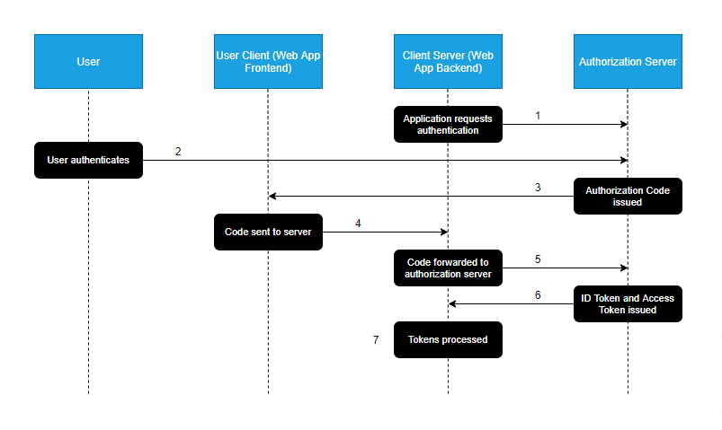

The Authorization Code Flow for OAuth 2.0 is targeted at web applications that have a server-side component, which allows the client secret for the authorization server to be kept secret (confidential client). Typically, authorization servers will require a secret to be used when making authentication requests if more sensitive data is wanted, such as personal data or refresh tokens. Without it, you would be restricted to following the Implicit flow for OAuth 2.0, which only returns an access token from the authorization server.

In the Authorization Code flow, the server-side component of the web application can freely manage the user's session upon authenticating with the authorization server without revealing anything about the authorization server's response (such as personal data or refresh token) to the end-user.

### Overview

The flow illustrated above aims to provide a rough overview of a typical Authorization Code workflow:

1. The Client-Server attempts to access a resource that requires authorization that it does not have. It redirects the user to the authorization server for authentication.

2. The Authorization Server authenticates the user by asking for their login credentials. The server determines if the user should be granted or denied their request.

3. If the User is determined to be authentic, an Authorization Code is issued and returned to the User Client. This code is used to retrieve an access token from the Authorization Server.

4. The retrieved Authorization Code is sent to the Client-Server. 

5. The Client-Server makes a POST request to the Authorization Server, containing its client key, secret, and Authorization Code.

6. The Authorization Server verifies the key, secret and code, and issues an ID Token and access token. The ID Token is a JWT that is typically used to store user data from the Authorization Server.

7. The Client-Server receives and processes the ID token and access token. The access token is then kept in the Client-Server, which can request resources on behalf of the User Client without exposing the token itself.

So you might ask yourself what the whole point of the Authorization Code is. At first glance, it would seem that the code is issued, only to be returned to exchange for an access token. The code is what allows us to keep the token hidden away from the User Client, which could be potentially exposed to malicious agents seeking to steal the token for nefarious means. 

In cases where you'd like the Authorization Server to return the access token immediately, you would use the Implicit flow for OAuth 2.0. Most authorization servers will limit the amount of data that can be returned using this flow; the OAuth 2.0 spec recommends limited scopes and short lifespans for tokens returned using this flow.

