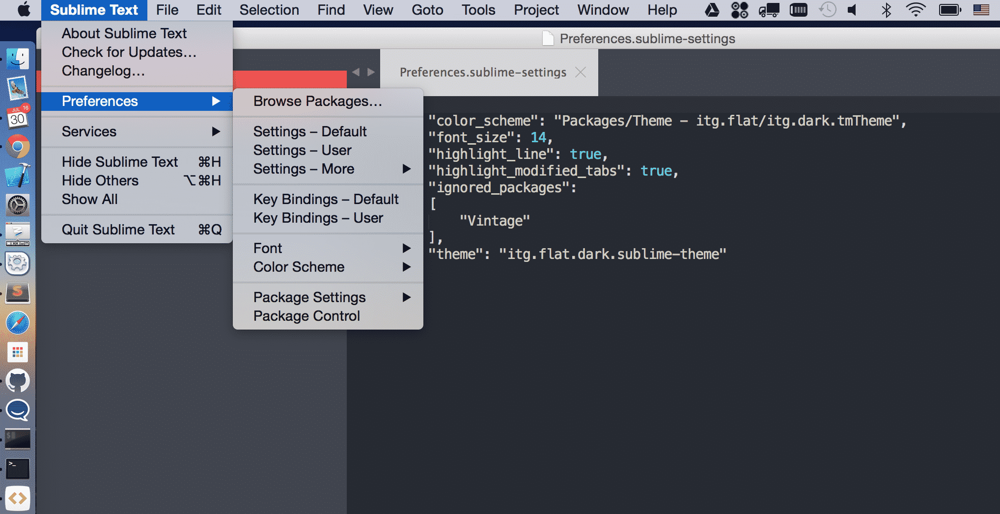

Sublime is no doubt the highly preferred light weight editor for developers, it doesn't require major installation space and working with it is just plain fun. The goal of this blog is to help you set-up the basic extensions that are required while working with Sublime: Package Control, a professional, sharp looking theme pack, and a core feature of Sublime, "Goto Everywhere". I am using a Mac, but the concept also works well in Windows, check the corresponding shortcut online, and it should be an easy and smooth process.

Before marching forward, make sure Sublime Text Editor 3 is properly installed, if you haven't installed it yet, you can download it [here](http://www.sublimetext.com/3).

### 1\. Package Control

Still with me? Awesome! Let's get started. First of all, the most amazing thing about Sublime is the diverse collection of packages you can install. The packages vary from big ones such as Git and SublimetoCodeIntel to small handy widgets like color picker and path auto fill. Keep checking and digging for the most useful packages for yourself is a very important part for your daily coding with Sublime. Therefore, first things first, let's install the Package Control.

[Installation Guide is here](https://packagecontrol.io/installation)

Press

```
ctrl + `(Normally the one under Esc)
```

Then paste the code from above link into your console, it could be confusing to paste a big graph of code into your sublime python console, but it does work, so Let's do it.

Now try pressing

```
Cmd + Shift + p
```

Then type "Install Package", you should see it now:


2\. Theme

Prior to installing any functional package, let's make sublime even prettier, let's search for a theme!

1. Install Package from above
2. Then type "Theme"

You should see a big list of themes right now, you can first search on the internet to have some previews of the themes, pick a good color scheme that you like and then search for it here. What I would suggest is the one I am using it, is called "Theme - itg.flat"

After installing your preferred theme, the font and color scheme for sublime may have already been updated. But it doesn't quiet look like what you have seen from elsewhere does it? It's because you also need to update the UI preferences for sublime, for itg.flat it will give you a more flat look after the update.

Navigate to:



What this file does is actually overwrite the settings in the default-setting JSON file, if you mess up with this user file, just delete them to recover back to the original settings. So feel free to play around with it, from here you can define the settings from your theme provider's guidance, here I will post mine as a sample

```json
{
  "color_scheme": "Packages/Theme - itg.flat/itg.dark.tmTheme",
  "font_size": 14,
  "highlight_line": true,
  "highlight_modified_tabs": true,
  "theme": "itg.flat.dark.sublime-theme"
}
```

Please note JSON format is significant to Sublime Settings, when you are not sure about it, check it with an online JSON validator. Now with this step done, you will have a delightful working environment to write your code in:


3\. Goto Everywhere

One of the most awesome features provided by sublime is called "Goto Everywhere", to me it is more like a "Find Everything". Once you get used to it, it will boost your productivity incredibly by saving enormous amount of time on finding stuff. Here is a brief list of its most common usage purpose:

- Quickly navigate to a file
- Quickly jump to a line
- Quickly locate an symbol

To trigger this feature, press key combination:

```
Cmd + p
```

Then for different purpose you just press different buttons to trigger the function,

- Goto file: directly type in the file name
- Goto line number: press `:` then input the number of line you want to jump into
- Goto symbol: press `@`, then you will see a list of options automatically show up. Navigate through or directly input the symbol you are looking for, this is most commonly used by search for HTML ids and classnames.

So far I have briefly covered the essential features sublime provides.In the next blog of this series I will explain how to make your work even easier by utilizing sublime Project, Snippet and Macro.
Until then, Adios!!!
