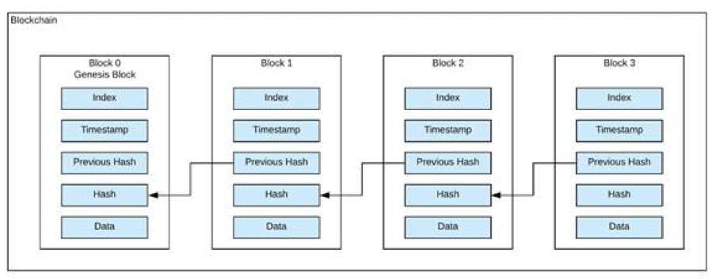

# BlockChain and How it works

## Blockchain

Blockchain is made up of two words - block and chain. So, blockchain is a chain of blocks containing some data, which are connected to each other by some link. Therefore, we can say that there are only two components of a blockchain: the block and the link.

## 1. Block

Each block is a structure which stores some information. It has block number, data, previous hash and hash.

**Block Number** is simply the index of the block that joins the chain.

**Data** contains the information about the transactions and values stored in the block.

**Previous Hash** is the hash of the previous block in the chain.

**Hash** is the hash of the current block.

Previous hash and hash are used for establishing the links between the blocks in the chain.

## 2. Link

Link is established by the connection between hash of the previous block and previous hash of the current block. They must be same for each block.

[Source](https://www.spheregen.com/wp-content/uploads/2019/04/blockchain.png)

There are some terms related to the blockchain which we will discuss now. They are 
- Genesis Block
- Hash
- Nonce
- Data

## Genesis Block
The first block in the chain is called the Genesis Block. Here, the problem arises. What would be the previous hash in case of this? Here, we predefined the previous hash, we may take it as a string of 0s.

## Hash
There are many algorithms available for hashing. Here, we are using SHA-256 algorithm.SHA stands for Secure Hash Algorithm. SHA is a family of cryptographic hash functions developed by the National Institute of Standards and Technology (NIST), along with the National Security Agency (NSA). 

SHA256 accepts input as string and returns a string of 64 letters which consists of 0-9 and A-F. It is 64 digit hexadecimal number. All hashing techniques should follow **Avlanche Effect** ie. even if there is a single change in the input string there will be drastic change in the output string. These algorithms should be one way ie one can not get the input string from the output string.

## How block is added

Here comes the work of miners. They are the one who adds the block. All the miners are connected to each other and they maintain the chain. It is not necessary that each miner should be connected to all the other miners directly.

A block can be added only if some predefined conditions are fulfilled. We already have block number, data and previous hash. We can keep condition like the resultant hash must have four 0s at start. So, to satisfy this condition we need another variable called **nonce**.

Now, Hash is found using Block number, Data, Previous Hash and nonce. 

## Nonce

We already knew three values. These three values can not alone satisfy the requirement. So, a new variable is used along with these three values to find the hash. 

The nonce can be any value, randomly chosen by miner. A nonce is valid only if the hash meets the requirements. If the nonce is valid, then block is added in the chain. After that, all other miners verify the nonce ie check if the block is valid or not. 

## When two miners want to add block at the same time 

Now, a case may arrive that two miners want to add the same block. There is a rule in the blockchain: **the longest valid chain of the blocks will be given priority.** 

Lets say two miners `A` and `B` both add the block at the same time. Here, each mine is not connected to every other miners directly. But all of them are connected indirectly or directly. Now, the chain will have two networks (first in which `A` added the block and second in which `B` added the block). Now, when the next block is added to the chain then the longest chain becomes valid. So, the group who added this block will win and his chain will become valid and all miners will have that chain.

## Difficulty

The difficulty is a number which denotes how much time miners took to find the nonce. For high value, it means miners took a large amount of time in adding the block whereas for less value it means it was easy to find the nonce.

## Wallet and Digital Signature 

In a transaction, there is no visible records. Each wallet is a string of numbers and letters. This address will be visible during the transaction. This is also called as the public key. 

Whenever a transaction is made, two things are needed: wallet ie receiver's address and digital signature ie private key. Private key is just like public key but this is secret. These are used in hashing. 

When transaction is completed, it gets in the chain and when miners have verified the block, it gets added to the chain.

## Conclusion

Here, we discuss about the simple concepts and terms in the blockchain transactions.