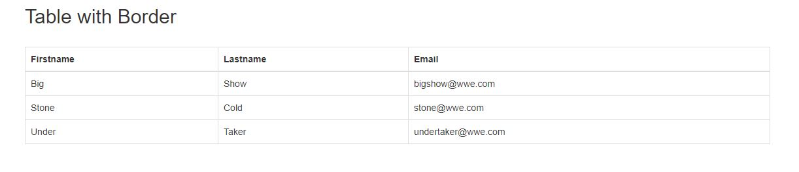
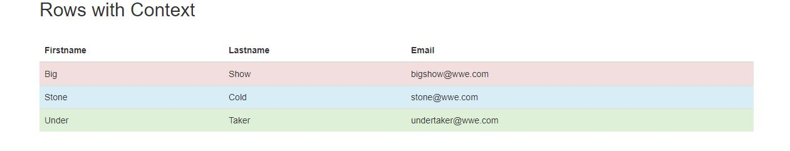

When we start developing a web application, the very first thing that comes to our mind is its UI. With the developing technologies, it is getting easier day by day to develop the UI for such web applications. But after the introduction of Bootstrap, the entire CSS styling scenario has changed. Instead of dealing with so many class or entity properties, we can simply get an awesome layout by just applying Bootstrap classes to our components.

 

Basically, Bootstrap is a popular framework dealing with HTML, CSS, and JavaScript for developing interactive, responsive, multi-device scalable websites. The basic way to implement Bootstrap is to include the required class type to the webpage component. Yeah, it's that simple. But to get it working, we need to include certain js and css files in our code. The list of mandatory scripts and css files to be included are:

 
 > Latest compiled Bootstrap CSS -->  (Use link instead of Script)  
 > jQuery library -->   
 > Latest compiled Bootstrap JavaScript -->   

After we have added all the cdn, we are good to go with bootstrap. So, in this article we will be dealing with one of the most commonly used entities in a webpage i.e., Tables. Here we will have look on all the basic classes to format a table to look appealing using Bootstrap. 

1. The <i>.table</i> class adds simple layout to a table:
    It provides the table with a light padding and only row dividers.
    
2. The <i>.table-bordered</i> class adds borders on all sides of the table.

3. The <i>.table-hover</i> class adds a hover effect to the table rows i.e., whenever we move the cursor to a row it gets highlighted with grey color.

4. We can also color the rows using different colors to indicate their type of data or context. Find a small snippet of the code below along with its output screenshot.

      
      
      <body>

        

          <h2>Rows based on context</h2> 
          <table class="table">
            <thead>
              <tr>
              <th>Firstname</th>
              <th>Lastname</th>
              <th>Email</th>
              </tr>
            </thead>
            <tbody>
              <tr class="danger">
              <td>Big</td>
              <td>Show</td>
              <td>bigshow@wwe.com</td>
              </tr>
              <tr class="info">
              <td>Stone</td>
              <td>Cold</td>
              <td>stone@wwe.com</td>
              </tr>
              <tr class="success">
              <td>Under</td>
              <td>Taker</td>
              <td>undertaker@wwe.com</td>
              </tr>
           </tbody>
        </table>
      

    </body>
    

    
5. The <i>.table-responsive</i> class creates a responsive table that re-organizes its size based on the device screen. The table will then resize itself and scroll horizontally on small devices.

Well, that was a brief summary to get you all started with the Bootstrap Tables. You will gradually find out a lot more classes to upscale your UI. So, happy coding folks !
