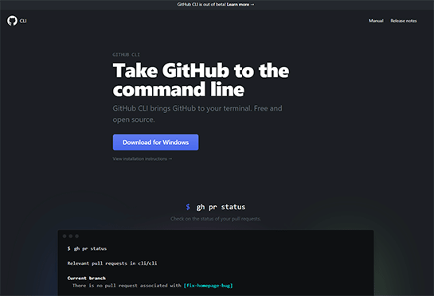
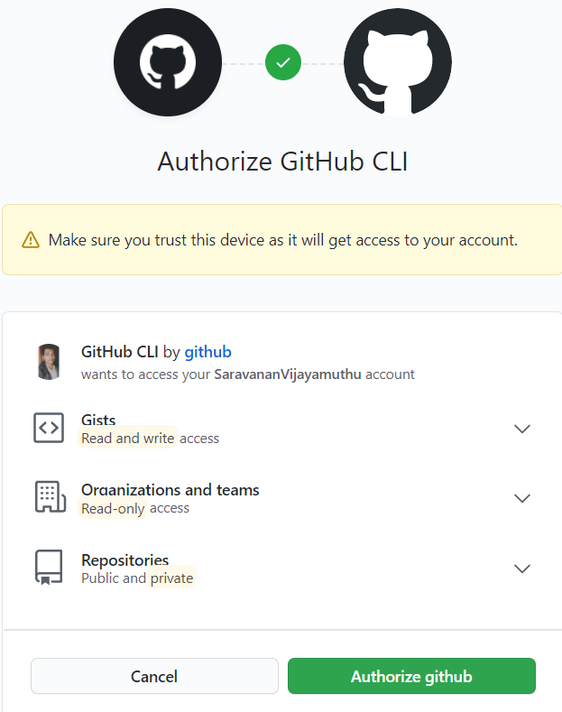
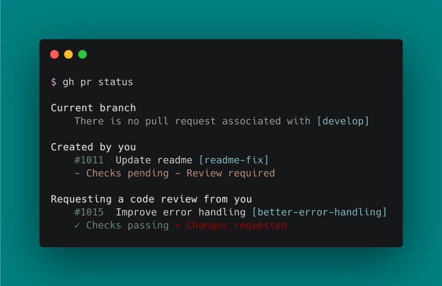
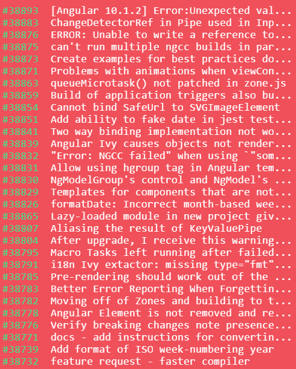
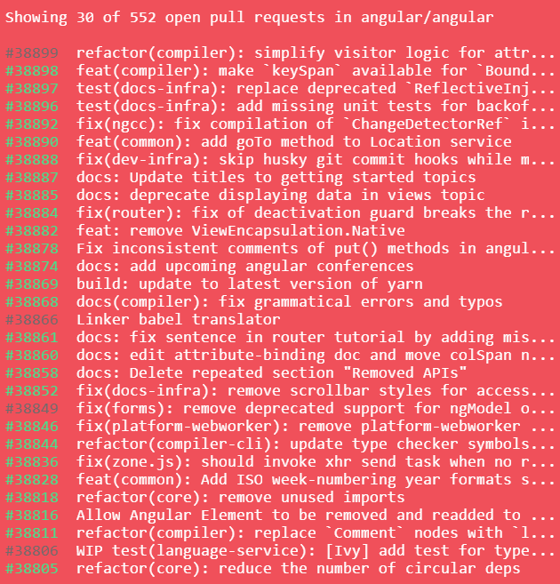

_The [GitHub CLI] (<https://cli.github.com/>) is a recent GitHub released tool that takes tasks of issue / PR management to the terminal. This will be an effective tool that will put more of our workflow for software creation into the textual domain rather than the visual domain. It’s just called ```gh```._

****Installation of GitHub CLI 💡****


GitHub CLI has [releases](https://cli.github.com/manual/installation) with significant operating systems, just visit the [installation](https://cli.github.com/manual/installation) page and find instructions on how to install GitHub CLI for your operating system.

For [Windows] and [macOS], you will use the package managers to update and maintain GitHub CLI and for [Linux](https://github.com/cli/cli/releases/tag/v1.0.0) users, you may need to grab the software from the latest release website.

Here are examples of the installation instructions for each compatible platform:

→ Windows

```bash
scoop bucket add github-gh https://github.com/cli/scoop-gh.gitscoop install gh
```

→ macOS

```bash
brew install github
```

→ Debian/Ubuntu Linux

```sudo apt install git &amp;&amp; sudo dpkg -i gh_*_linux_amd64.deb
```

→ Fedora/Centos Linux

```bash
sudo yum localinstall gh_*_linux_amd64.rpm
```

→ Arch Linux

```bash
yay -S github-cli
```

You’ll need to authenticate your account after you install GitHub CLI. Running any command would activate this process of authentication(via OAuth). Well, you can use Git CLI.


****What is CLI really doing? 🤔****

The GitHub CLI lets you handle issues/ PRs / repositories from inside your console. Let’s have a look at it:

```bash
gh issue [status, list, view, create]
gh pr [status, list, view, checkout, create]
gh repo [view, create, clone, fork]
gh help
```



_It should be said that gh is not the same stuff as git. It’s because ghjust adds GitHub tools to the terminal.Version management is yet to be managed with git._

****CLI Commands ➫****

We’re going to cover a bunch of interesting commands. Let’s use the official [Angular.js repo](https://github.com/angular/angular%60) to run `gh` commands

Clone the `Angular` repo, and navigate to the repository. You can either clone the repo through HTTPS/ ssh/ Git CLI. I’m going to clone the repo through `git CLI` since we are working on GIT CLI.

Let’s execute the `$gh issue --help` see what commands are available

```bash
gh issue --help  
Work with GitHub issues
USAGE
  gh issue <command> [flags]
CORE COMMANDS
  close:      Close issue
  create:     Create a new issue
  list:       List and filter issues in this repository
  reopen:     Reopen issue
  status:     Show status of relevant issues
  view:       View an issue
FLAGS
  -R, --repo OWNER/REPO   Select another repository using the OWNER/REPO format
INHERITED FLAGS
  --help   Show help for command
ARGUMENTS
  An issue can be supplied as argument in any of the following 
  formats:
  - by number, e.g. "123"; or
  - by URL, e.g. "https://github.com/OWNER/REPO/issues/123".
EXAMPLES
  $ gh issue list
  $ gh issue create --label bug
  $ gh issue view --web
LEARN MORE
  Use 'gh <command> <subcommand> --help' for more information about a command.
  Read the manual at https://cli.github.com/manual
```

It’s Time to view Problems/issues in the angular repo😁

```bash
gh issue list
```



****Pull Requests 🤖****

It is now possible to build a Pull Request (PR) on the terminal . You will perform `$gh pr create` right after you have committed a feature or bug branch. This interactively creates the pull request😉

Let’s execute the `$gh pr --help` see what commands are available.

```bash
Work with GitHub pull requests
USAGE
  gh pr <command> [flags]
CORE COMMANDS
  checkout:   Check out a pull request in git
  checks:     Show CI status for a single pull request
  close:      Close a pull request
  create:     Create a pull request
  diff:       View changes in a pull request
  list:       List and filter pull requests in this repository
  merge:      Merge a pull request
  ready:      Mark a pull request as ready for review
  reopen:     Reopen a pull request
  review:     Add a review to a pull request
  status:     Show status of relevant pull requests
  view:       View a pull request
FLAGS
  -R, --repo OWNER/REPO   Select another repository using the OWNER/REPO format
INHERITED FLAGS
  --help   Show help for command
ARGUMENTS
  A pull request can be supplied as argument in any of the following formats:
  - by number, e.g. "123";
  - by URL, e.g. "https://github.com/OWNER/REPO/pull/123"; or
  - by the name of its head branch, e.g. "patch-1" or "OWNER:patch-1".
EXAMPLES
  $ gh pr checkout 353
  $ gh pr create --fill
  $ gh pr view --web
LEARN MORE
  Use 'gh <command> <subcommand> --help' for more information about a command.
  Read the manual at https://cli.github.com/manual
```

******Let’s view some of it:👀******

current PR’s in the repo:

`$ gh pr list`


*****Let’s view a certain pr:*****

I’m going with the first pull request `#38899`. Through gh cmd $ gh pr view `38899`.

```bash
refactor(compiler): simplify visitor logic for attributes
Draft • atscott wants to merge 1 commit into master from testrefactor
Labels: cla: yes, comp: compiler, state: WIP, target: patch
Milestone: needsTriage
The logic for computing identifiers, specifically for bound attributes can  
  be simplified by using the value span of the binding rather than the source span.
View this pull request on GitHub: https://github.com/angular/angular/pull/38899
```

****Repository 🤖****

Let’s execute the `$gh repo --help` see what commands are available

```bash
Work with GitHub repositories
USAGE
  gh repo <command> [flags]
CORE COMMANDS
  clone:      Clone a repository locally
  create:     Create a new repository
  fork:       Create a fork of a repository
  view:       View a repository
INHERITED FLAGS
  --help   Show help for command
ARGUMENTS
  A repository can be supplied as an argument in any of the following formats:
  - "OWNER/REPO"
  - by URL, e.g. "https://github.com/OWNER/REPO"
EXAMPLES
  $ gh repo create
  $ gh repo clone cli/cli
  $ gh repo view --web
LEARN MORE
  Use 'gh <command> <subcommand> --help' for more information about a command.
  Read the manual at https://cli.github.com/manual
```

It is better to clone a repository using the gh command than with the git command. I have done this above. Only through gh cmd, I have cloned angular repo.

```bash
$ gh repo clone angular/angular
$ gh repo fork
- Forking angular/angular...
```

Start functioning. You should create a new PR after this (`$gh pr create`)! It’s sort of awesome that all of that element is now available in the terminal!😍

****Gist 🐱‍🚀****

It is now simple to create a gist on GitHub from the terminal using the CLI cmd.

```bash
gh gist create < file >
```

****Conclusion🙀****

[Git CLI's](https://cli.github.com/) primary objective is to "minimize context switching" by allowing you to continue inside your terminal/console, rather than opening your browser to access [GitHub](https://github.com/). For additional functionality and knowledge on using the current resources, you may link to the [manual](https://cli.github.com/manual/).
