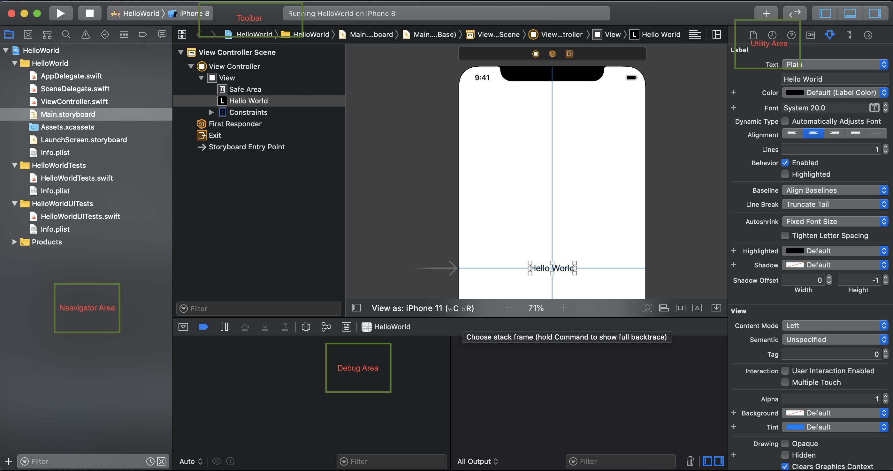

## Introduction
In this blog, you will learn how to start with iOS apps(apps for iPhone/iPad), whether it's developing an iOS app or running and debugging any existing app. After reading this blog, you will be able to start developing an iOS app and play with existing apps.

So let's get started...

### Step 1: Setup your MAC
Apple prefers a closed ecosystem over an open system. iOS can only be run on Apple's own devices, including the iPhone and iPad.
We can run Mac on window machines using VMWare or Hackintosh, but these are not recommended for iOS coding purposes.
So basically, as an iOS developer, you will need a Mac for the development/debugging/testing of an iOS app.

### Step 2: Setup, your editor for development
To start developing iOS apps, Xcode is the only tool you need to download. Xcode is an integrated development environment (IDE) provided by Apple. It includes the iOS SDK (Software Development Kit), a source code editor(UI), debugging tools, and much more. Many helping tools and needed simulators with a particular iOS version can be installed and added to Xcode.
You will need to have an Apple ID to download Xcode, deploy your app to a real iPhone/iPad for testing, and download any other software from AppStore.
Apple ID is used to authenticate a user in Apple devices. You may create it from [here](https://appleid.apple.com/account#!&page=create)
To install Xcode, go to the Mac App Store. App Store can be found in the dock. Login there with your Apple ID. In the Mac App Store, search "Xcode" and click the "Get" button to download it.

### Step 3: Create your first App
Now click and launch Xcode. 
Choose create a new Xcode project option to make a new project. 
Then choose the Single View App option as a type of the project and click Next. It will come with one view controller and a storyboard that you can customize further.
Let's name your project as HelloWorld as per the convention 😉. 
Choose Team None for now. Select Swift as Language, click Next, and you are ready with your empty app doing nothing yet.

> Note: For creating a native iOS app, you have to use one from Objective-c or Swift. Swift is a new and easy language provided by Apple, got so much popularity in less time.

Not to worry, you will soon modify your created app saying Hello to the World. 😍
In Xcode, you can navigate to a file or folder from the code editor's left panel. The right panel of the code editor, called Utility Area, will help you dealing with views or any component in the storyboard. On the top toolbar, you can see the Run and Stop buttons. At the bottom of the code area, you can see the debug/console area with breakpoint and other runtime tools.

Now find and open Main.storyboard in the project directory by clicking on it. The storyboard is a file to design your view to show and layout all the components such as buttons, labels, lists, tab and navigation bars, and many more.
Here you will see a blank view. Select the view by clicking on it. From Xcode 10 or above, for objects like a label to add, click on View menu in menu bar>click Show Library and drag the label to focused view. 
Or in older Xcode, you may find Object Library in the bottom right part of Xcode.
Now double click on the label you have dropped on the view and change it's text to Hello World!

Feeling excited? 😃

**Here you go with your first-ever app on screen**

### Step 4: Run the App
Select the device destination or simulator from the Xcode screen's top left near the Run/Stop button. And press Command ⌘ + R to run the app or click the run button. It will initiate the iOS simulator and run your first app.
For running the app on a real device, connect the device via cable to Mac. The device will automatically be shown in the list of device destinations. Now select the device and press Command ⌘ + R.

Share your first app with your parents and friends, and feel proud. 👏 

> Note: If you want to debug or run any existing app/demo instead of developing your own. For example, You might have some projects downloaded from Github on your local system. Now follow the instructions from project's Github to explore the project. 
> Open the project in Xcode and run in a simulator or real device by following step 4 described above.

That's it. 

I hope you liked this tutorial. Kindly share the blog and comment for any query or suggestion. 
