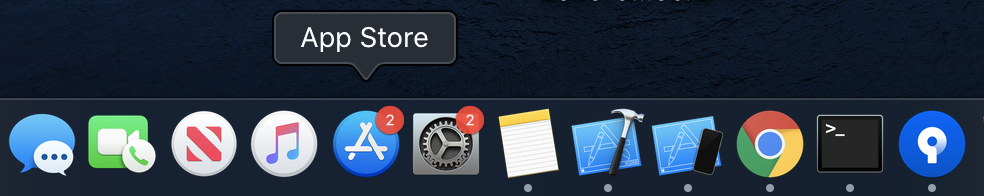
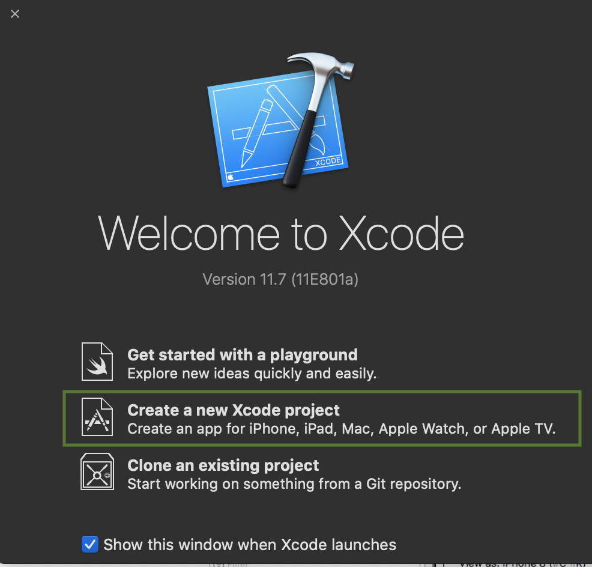
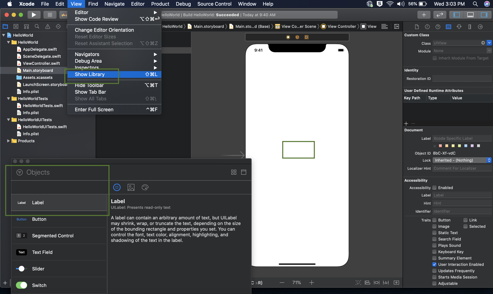
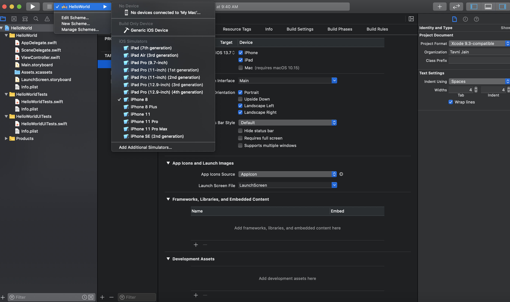
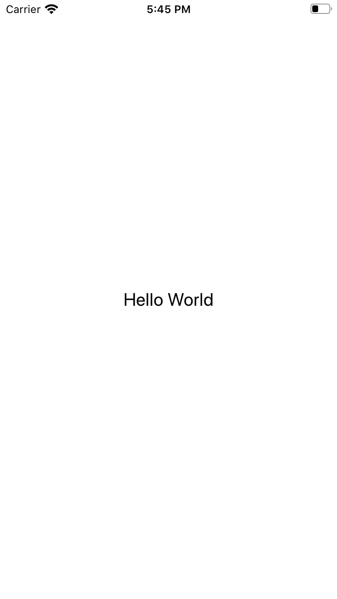

## Introduction
In this blog you will learn how to start with iOS apps(apps for iPhone/iPad) whether its development of iOS app or running and debugging of existing app. After this blog you will be able to start developing iOS app.

So let's get started...

### Step 1: Setup your MAC
Apple has favoured a closed ecosystem over the open system. iOS can only be run on Apple's own devices including iPhone and iPad.
You can run Mac on window machines using VMWare or Hackintosh etc. But these approaches are not recommended at all.
As an aspiring iOS developer, what this means to you is that you will need a Mac for app development.
To develop an iPhone (or iPad) app, you need to get a Mac with an Intel-based processor running on macOS.

### Step 2: Setup your editor for development
To start developing iOS apps, Xcode is the only tool you need to download. Xcode is an integrated development environment (IDE) provided by Apple. It already bundles the latest version of the iOS SDK (short for Software Development Kit), a built-in source code editor, graphic user interface (UI) editor, debugging tools and much more.
You will need an Apple ID to download Xcode, access iOS SDK documentation, and other technical resources. Most importantly, it will allow you to deploy your app to a real iPhone/iPad for testing.

To install Xcode, go up to the Mac App Store. Appstore can be found in dock. In the Mac App Store, simply search "Xcode" and click the "Get" button to download it.

### Step 3: Create your first App
Now Launch Xcode. 
Select create a new Xcode project. 
Select Single View App and click Next. 
Provide your first app a name, Let’s say it HelloWorld. 
Choose Team None for now. Select Language Swift, click Next and Create your first app.

Open Main.storyboard in project directory by clicking on it. Storyboard is a file to design your screen and layout all the components such as buttons, labels, lists, tab and navigation bars and many more.
Now you are seeing blank view with nothing inside it, click on the centre of the view to focus on it. In latest Xcode 11, for objects like label to add, click on View menu>Show Library and drag label to focused view.
Now double click on label you have dropped on the view and change it’s text to Hello World!

Feeling excited? 😃

**Here you go with your first ever app on screen**

### Step 4: Run the App
Select device destination or simulator from top left of Xcode screen. And press Command ⌘ + R to run the app. It will start the iOS simulator and run your first app.

Share your first app to your parents and friends and be proud. 👏 

If you liked this tutorial then share this so that others can learn from it. And comment for any query or suggestion. 
