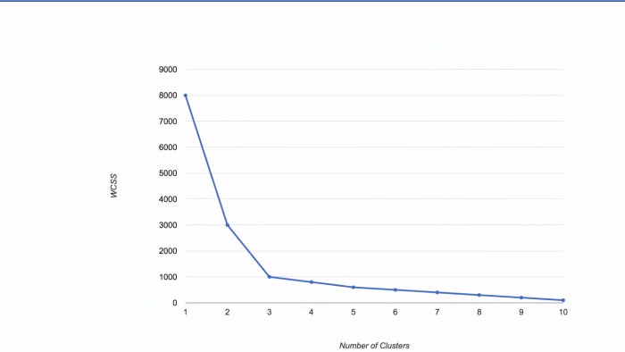

Before we get into details of finding out optimal clusters, let's first see what KMeans clustering algorithm and some basics is.


## What is Clustering?
Clustering is an unsupervised ML technique wherein we cluster the data in order to get insights from the data, clustering the data is quite essential for some business models and problems. It gives us conclusions on what is a cluster, i.e. data which is similar and in the form of cluster or groups.

```Clustering is the process of dividing the entire data into groups (also known as clusters) based on the patterns in the data```

## What is KMeans clustering alogrithm?
It is an algorithm for clustering. We will be discussing this method with code in the further sections.

## Intial Imports :
```python

import pandas as pd
import numpy as np
import matplotlib.pyplot as plt
from sklearn.cluster import KMeans
%matplotlib inline

```

## Method :

Now let's discuss the method behind finding out the right number of clusters on a K-Means clustering algorithm.
So we will learn how to decide what number of clusters to input into your K-Means algorithm.
Here we've got a data science problem.
We've got only two variables, x and y coordinates.

Now, if we run the K means clustering algorithm on this dataset with three clusters or with K pre-determine the clusters to be three, then the result will look something like this.


We need a specific metric we need a way to understand or evaluate how a certain number of clusters performs compared to a different number of clusters, and preferably, that metric should be quantifiable.

So what kind of metric can we impose upon our clustering algorithm that will tell us something about the final result?
There is such a metric called the within-cluster sum of squares. (WCSS)





So you can see here that it jump from 8000 down to 3000, that's a massive change of 5000 let's just call them units 5000 units and then from 3000 as we increase the number of the close from two to 3, they jump from 3000 to 1000.

Again quite a large drop And then from three to four what's going to happen is going to jump from 1000 to maybe eight hundred and from 800 to 600, 600 to 500 and so on so as you can see the first two improvements or first two changes from one cluster to two from two to three created some huge jumps or considerable drops in the WTS going forward The WCR says drops not substantially. And this is our hint at selecting the optimum optimal number of clusters, and the method we're going to use is the elbow method, and it is very visual. All you have to do is look at your chart and look for that change, or that's kind of like it does look like an ELBOW.


Look for that elbow in your chart where the drop goes from being quite substantial to being not as significant not as proven is not as great, and therefore, that point in your chart will be the optimal number of clusters.


In this case, it is indeed three clusters.

That is the optimal number. And as you can imagine, this method is entirely arbitrary.
Sometimes, the situations are not as pronounced as the elbow might not be as evident as in this case, and therefore, somebody might pick one number of clusters. Someone else might come along and select a different number.

## CODE :

```python

from sklearn.cluster import KMeans
wcss = []

for i in range(1, 11):

  kmeans = KMeans(n_clusters = i, init = 'k-means++', random_state = 42)

  kmeans.fit(X)
  
  wcss.append(kmeans.inertia_)

plt.plot(range(1, 11), wcss)

plt.title('The Elbow Method')

plt.xlabel('Number of clusters')

plt.ylabel('WCSS')

plt.show()
```
