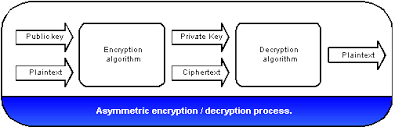

## Introduction
The Secure Enclave is a hardware-based key manager that’s isolated from the main processor to provide an extra layer of security. Using sec enclave we can create the key, securely store key, and perform operations with key. Thus makes it difficult for the key to be compromised. 

We usually save data persistently in the app using UserDefaults, Keychain, Core Data or SQLite.
For ex. - To save session of logged in user, we save username and password. But this process puts our data at high security risk. So it's always recommended to store sensitive data in encrypted format. But again it's a challenge to secure keys used in encryption/decryption.



Now here **Secure Enclave** comes in the role. 

In this blog, we will use Secure Enclave to generate key pair and use those in encryption/decryption of sensitive data further.

Here I am gonna create a wrapper to generate key pair using Secure Enclave and use them to encrypt/decrypt sensitive data. And also a viewcontroller to show how to use wrapper to get encrypted and decrypted data.
You may implement wrapper's methods as common methods and use wherever needed in project. But its recommended to use a separate wrapper for handling communication with Secure Enclave.

 ## Wrapper
 
 I have created .h and .m files named as SecEnclaveWrapper as subclass of NSObject.
 In .h file I am declaring function for being accessible from other classes like: 
 ```
 /**
 Return encrypted form of data
 */
 - (NSData *_Nonnull)encryptData:(NSData *_Nonnull)data ;
 
/**
Return decryrpted value of encrypted data
*/
 - (NSData *_Nonnull)decryptData:(NSData *_Nonnull)data ;
 
/**
Return an initialized instance of wrapper
*/
 - (instancetype)init;
````

Then in .m file, define following methods as : 

The method 'init' initializes and return object of this wrapper class. And 'encryptData' and 'decryptData' method return encrypted data and decrypted data of encrypted data respectively.
```
- (instancetype)init {
    self = [super init];
    
    if(![self lookupPublicKeyRef] || ![self lookupPrivateKeyRef])
        [self generatePasscodeKeyPair];
    
    return self;
}
- (NSData *)encryptData:(NSData *)data {
    if (data && data.length) {
        
        CFDataRef cipher = SecKeyCreateEncryptedData(publicKeyRef, kSecKeyAlgorithmECIESEncryptionStandardX963SHA256AESGCM, (CFDataRef)data, nil);
        
        return (__bridge NSData *)cipher;
    } else {
        return nil;
        
    }
}
- (NSData*)decryptData:(NSData *)data {
    
    if(data && data.length){
        
        CFDataRef plainData = SecKeyCreateDecryptedData(privateKeyRef, kSecKeyAlgorithmECIESEncryptionStandardX963SHA256AESGCM, (CFDataRef)data, nil);
        return  (__bridge NSData *)plainData;
    }
    else {
        return nil;
    }
}
```

The 'lookupPublicKeyRef' method below will lookup keychain for public key & 'lookupPrivateKeyRef' method search for private key and return key if found.
```
- (SecKeyRef) lookupPublicKeyRef
{
    OSStatus sanityCheck = noErr;
    NSData *tag;
    id keyClass;
    
    if (publicKeyRef != NULL) {
        // already exists in memory, return
        return publicKeyRef;
    }
    tag = [kPublicKeyName dataUsingEncoding:NSUTF8StringEncoding];
    keyClass = (__bridge id) kSecAttrKeyClassPublic;
    
    
    NSDictionary *queryDict = @{
        
        (__bridge id) kSecClass : (__bridge id) kSecClassKey,
        (__bridge id) kSecAttrKeyType : (__bridge id) kSecAttrKeyTypeEC,
        (__bridge id) kSecAttrApplicationTag : tag,
        (__bridge id) kSecAttrKeyClass : keyClass,
        (__bridge id) kSecReturnRef : (__bridge id) kCFBooleanTrue
    };
    
    sanityCheck = SecItemCopyMatching((__bridge CFDictionaryRef) queryDict, (CFTypeRef *) &publicKeyRef);
    if (sanityCheck != errSecSuccess) {
        NSLog(@"Error trying to retrieve key from server.  sanityCheck: %d", (int)sanityCheck);
    }
    
    return publicKeyRef;
}
- (SecKeyRef) lookupPrivateKeyRef
{
    CFMutableDictionaryRef getPrivateKeyRef = newCFDict;
    CFDictionarySetValue(getPrivateKeyRef, kSecClass, kSecClassKey);
    CFDictionarySetValue(getPrivateKeyRef, kSecAttrKeyClass, kSecAttrKeyClassPrivate);
    CFDictionarySetValue(getPrivateKeyRef, kSecAttrLabel, kPrivateKeyName);
    CFDictionarySetValue(getPrivateKeyRef, kSecReturnRef, kCFBooleanTrue);
    //   CFDictionarySetValue(getPrivateKeyRef, kSecUseOperationPrompt, @"Authenticate to sign data");
    
    OSStatus status = SecItemCopyMatching(getPrivateKeyRef, (CFTypeRef *)&privateKeyRef);
    if (status == errSecItemNotFound)
        return nil;
    
    return (SecKeyRef)privateKeyRef;
}
```

Following methods will actually deal with Secure Enclave to generate private key and public key.
```
- (bool) generatePasscodeKeyPair
{
    CFErrorRef error = NULL;
    SecAccessControlRef sacObject = SecAccessControlCreateWithFlags(
                                                                    kCFAllocatorDefault,
                                                                    kSecAttrAccessibleAfterFirstUnlockThisDeviceOnly,
                                                                    kSecAccessControlPrivateKeyUsage,
                                                                    &error
                                                                    );
    
    if (error != errSecSuccess) {
        NSLog(@"Generate key error: %@\n", error);
    }
    
    return [self generateKeyPairWithAccessControlObject:sacObject];
}

- (bool) generateKeyPairWithAccessControlObject:(SecAccessControlRef)accessControlRef
{
    // create dict of private key info
    CFMutableDictionaryRef accessControlDict = newCFDict;;
#if !TARGET_IPHONE_SIMULATOR
    
    CFDictionaryAddValue(accessControlDict, kSecAttrAccessControl, accessControlRef);
#endif
    CFDictionaryAddValue(accessControlDict, kSecAttrIsPermanent, kCFBooleanTrue);
    CFDictionaryAddValue(accessControlDict, kSecAttrLabel, kPrivateKeyName);
    
    // create dict which actually saves key into keychain
    CFMutableDictionaryRef generatePairRef = newCFDict;
#if !TARGET_IPHONE_SIMULATOR
    
    CFDictionaryAddValue(generatePairRef, kSecAttrTokenID, kSecAttrTokenIDSecureEnclave);
#endif
    CFDictionaryAddValue(generatePairRef, kSecAttrKeyType, kSecAttrKeyTypeEC);
    CFDictionaryAddValue(generatePairRef, kSecAttrKeySizeInBits, (__bridge const void *)([NSNumber numberWithInt:256]));
    CFDictionaryAddValue(generatePairRef, kSecPrivateKeyAttrs, accessControlDict);
    
    OSStatus status = SecKeyGeneratePair(generatePairRef, &publicKeyRef, &privateKeyRef);
    
    if (status != errSecSuccess){
        NSLog(@"Error trying to retrieve key from server.  sanityCheck: %d", (int)status);
        
        return NO;
    }
    [self savePublicKeyFromRef:publicKeyRef];
    return YES;
}
```

The private key is generated and stored in Secure Enclave which cannot be directly used. Whereas public key have to be stored manually in keychain by following method.
```
- (bool) savePublicKeyFromRef:(SecKeyRef)publicKeyRef
{   OSStatus sanityCheck = noErr;
    NSData *tag;
    id keyClass;
    
    
    tag = [kPublicKeyName dataUsingEncoding:NSUTF8StringEncoding];
    keyClass = (__bridge id) kSecAttrKeyClassPublic;
    
    
    NSDictionary *saveDict = @{
        
        (__bridge id) kSecClass : (__bridge id) kSecClassKey,
        (__bridge id) kSecAttrKeyType : (__bridge id) kSecAttrKeyTypeEC,
        (__bridge id) kSecAttrApplicationTag : tag,
        (__bridge id) kSecAttrKeyClass : keyClass,
        (__bridge id) kSecValueData : (__bridge NSData *)SecKeyCopyExternalRepresentation(publicKeyRef,nil),
        (__bridge id) kSecAttrKeySizeInBits : [NSNumber numberWithUnsignedInteger:256],
        (__bridge id) kSecAttrEffectiveKeySize : [NSNumber numberWithUnsignedInteger:256],
        (__bridge id) kSecAttrCanDerive : (__bridge id) kCFBooleanFalse,
        (__bridge id) kSecAttrCanEncrypt : (__bridge id) kCFBooleanTrue,
        (__bridge id) kSecAttrCanDecrypt : (__bridge id) kCFBooleanFalse,
        (__bridge id) kSecAttrCanVerify : (__bridge id) kCFBooleanTrue,
        (__bridge id) kSecAttrCanSign : (__bridge id) kCFBooleanFalse,
        (__bridge id) kSecAttrCanWrap : (__bridge id) kCFBooleanTrue,
        (__bridge id) kSecAttrCanUnwrap : (__bridge id) kCFBooleanFalse
    };
    sanityCheck = SecItemAdd((__bridge CFDictionaryRef) saveDict, (CFTypeRef *)&publicKeyRef);
    if (sanityCheck != errSecSuccess) {
        NSLog(@"Error trying to retrieve key from server.  sanityCheck: %d", (int)sanityCheck);
        
    }
    
    return publicKeyRef;
}
```
## Demo

Now I am creating ViewController.h and .m files. In viewDidLoad in .m file, having a string to be stored in UserDefaults. I will encrypt this string by private key generated above and then store persistently encrypted data for later use.
```
- (void)viewDidLoad {
    [super viewDidLoad];
    NSString *strDatatosave = @"example data to save";
    NSString *bundleIdentifier = [[NSBundle mainBundle] bundleIdentifier];
    NSString *strGroupID = [NSString stringWithFormat:@"group.%@",bundleIdentifier];
    SecEnclaveWrapper *keychainItem = [[SecEnclaveWrapper alloc] init];
    
    NSData *encrypted = [keychainItem encryptData:[strDatatosave dataUsingEncoding:NSUTF8StringEncoding]];
    NSString *strEncrypted = [[NSString alloc] initWithData:encrypted encoding:NSUTF8StringEncoding];
    NSLog(@"encrypted string %@",strEncrypted);
    
    NSData *decrypted =[keychainItem decryptData:encrypted];
    NSString *strDecrypted = [[NSString alloc] initWithData:decrypted encoding:NSUTF8StringEncoding];
    
    NSLog(@"decrypted string as real string%@",strDecrypted);

}
```

## Conclusion
In this blog, we learned about the basics of key generation via Secure Enclave and encryption and decryption using keys.
By default asymmetric key-pairs are created and stored in the secure enclave. The private key is available only at creation time and can not be obtained later. Asymmetric operations that use the private key obtain it from the keychain without exposing it to user code.
 

 You can find the complete repository link 

Also watch  for ease and get ready to dive into implementation.

