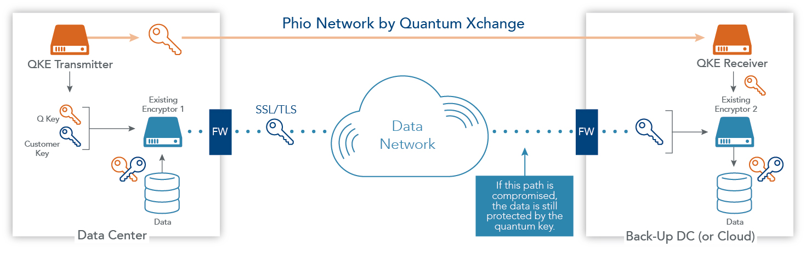

Have you ever wondered that how our universe is stitched together? Or how matter behaves at the atomic and subatomic levels? Do you know, how is a quantum computer different from a supercomputer or what are the functions that it can perform which a typical computer can't? 

Or, have you ever thought of the amplification of photon particles in a laser beam? Our universe is full of occurrences that are hard to explain. However, the answer to all these questions lies in understanding the fundamentals of nature. For that, let us take a look at Quantum mechanics, which explains the functioning of particles together at the smallest level. Quantum mechanics is a branch of physics which is mainly concerned with the behaviour and nature of matter and energy and atomic and subatomic levels. 

With huge advancements in this field, the concept of quantum computers and quantum internet has now come to life. Typical computers are based on binary digits, that is, 0 and 1. Quantum computers, on the other hand, are based on qubits. A qubit or quantum bit is the basic unit for quantum information. They are based on the physical properties of particles, such as the spin of an electron and hence differ in various ways. We know that electron spin can either up or down, but when it comes to quantum mechanics, things change. It follows the concept of superposition according to which an electron can exist in a state in which it has a spin in both the directions simultaneously. This may sound strange according to what we observe generally, yet this is how Quantum mechanics work. 

The peculiar behaviour that particles display can be useful in various ways. Qubits can store much more information than conventional bits. This can be explained as two bits will have one of the four possible values, 00, 01, 10 or 11. Qubits, on the other hand, can be both 0 and 1 at once. This implies they can have all the four values all at once.
Thus, the amount of information you store using qubits increases tremendously. 

Quantum computers have the scope of performing operations even faster than the fastest supercomputers. Quantum computing also promises higher security and encryption. If we see the current methods of encryption, all of them have some loopholes due to which information can be compromised sooner or later. Through quantum computing, the information will travel through qubits. The users will know in case someone tries to abstract the information. Thus, quantum computers promise you a very secure future!

But then, how is all this information transmitted? It is Quantum networks that facilitate the transmission of information through qubits. It is an essential part of quantum computing and quantum communication systems. For quantum communication to be possible, qubits have to move from one quantum processor to the other, over long distances. Thus, an
intra-connection of local quantum networks with quantum internet is required. To understand quantum network even better, let us take a look at its elements. The classical network and quantum network have a lot in common. 

They are:

 - we require quantum processors with at least one qubit. A quantum processor is a small quantum computer which is capable of performing quantum logic gates on a given number of qubits. These quantum processors along with one qubit are known as end nodes, on which the application is run. Some applications might also require more than one qubit to function. 

 - Transfer of qubits requires communication lines, for which standard telecom fibres can be used.

- optical switches are required to optimize the communication infrastructure as they deliver qubits to the required processors. Fourthly, we require quantum repeaters so that qubits or information can travel through long distances. 

According to the current scenario, IBM has 18 quantum computers and Google AI Quantum is also advancing towards quantum computing. The current period of quantum computing is referred to as the Intermediate-Scale Quantum (NISQ) era by quantum computing scientists. Quantum supremacy is not too far as Quantum computers of over 50 qubits have already been created. 

Google has also demonstrated quantum supremacy with its quantum computer, the Sycamore Processor. It took 200 seconds to perform a computation which would have required 10,000 years if solved using a traditional computer. Amazon and Microsoft are also a part of bringing global access to quantum computing. This is the future of quantum networking, and according to Deffner, "We cannot rely on old concepts anymore, but we need something new."
