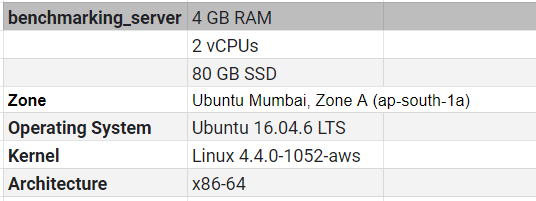
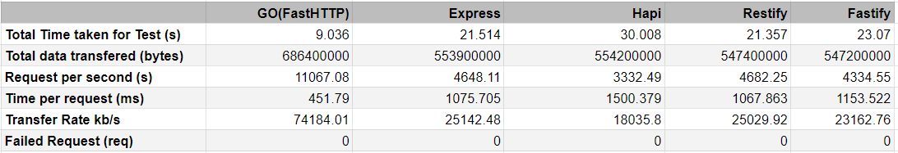
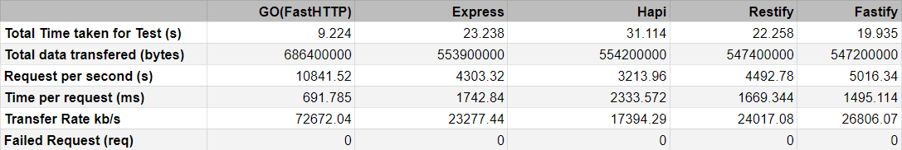

Migrating your existing code to a new programming language is a very tedious task. We need to have a proper set of requirements and some obvious benchmarking between the new and existing technology.

So here our journey started to transform (not conversion) our existing code to a new language. You might think that why I’ve used word transformation rather than conversion so -

**Conversion:** Conversion is just about to write your existing code in different languages as it is.

**Transformation:** Transformation is about to leverage all possible benefits of a new language and convert accordingly.

## Why we decided to change?

The idea of migrating code to a new programming language started with a simple requirement which was we wanted to take our cloud solution to on-premise as well. till now, our services were written in NodeJS for a cloud solution and it was doing pretty well. The performance was also good but there is nothing that can not improve. So along with performance improvement, we started to find out that **can we make a GUI or CLI using existing NodeJS code that can take our solution on-premise?**

Answer for that was practically YES. but, technically NO. If we’re writing apps with a GUI, Node can’t do it on its own. We had to use some other projects which provide GUI creation capabilities (eg: ElectronJS, NW.js, etc). Making CLI seemed doable but there were also problems like we can't have single file distribution for our code. And the ability to download a single file and execute commands - without an installer, or even setup process - does wonder to a user. This also makes the product easily backward compatible.

Also, another factor came in that it was better to switch to a technology that works closely with gRPC.

So, we drew out a few goals for our new solution
- Zero deployment dependencies
- Performance up-gradation
- Single file distribution
- Easily compatible with gRPC
- Good memory management
- Better readability and maintainability

After research with our requirement, we were able to figure out that we can achieve these with Golang, developed by google.
On the basis of our research, we also did some benchmarking on different node js framework and GoLang.

**Benchmarking sever** we’ve used with below configurations

**The benchmarking result** was pretty much similor that we are thinking. Here are the benchmarking result -

#### 100000 Requests 5000 Concurrency

#### 100000 Requests 7500 Concurrency

There was a big difference, For better clarity let’s see the below graphs.

### Total Time taken for Test(s)

In the below chart, we can clearly see that Golang won the competition and Hapi has taken the maximum time to finish the test.

### Request per second (s) and Transfer Rate kb/s

In the below chart, we can see that Golang served maximum requests per second.

### Request per second (s) and Time per request (ms)

The below chart is showing that the Number of requests is very high compared to other node js frameworks.

### Total Data Transferred

All the data clearly shows the direction so we decided to move to GoLang.