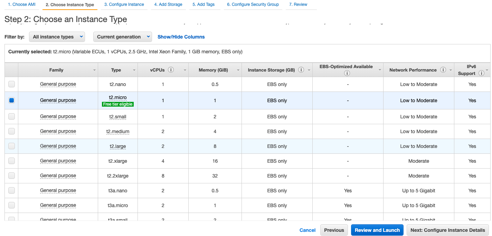
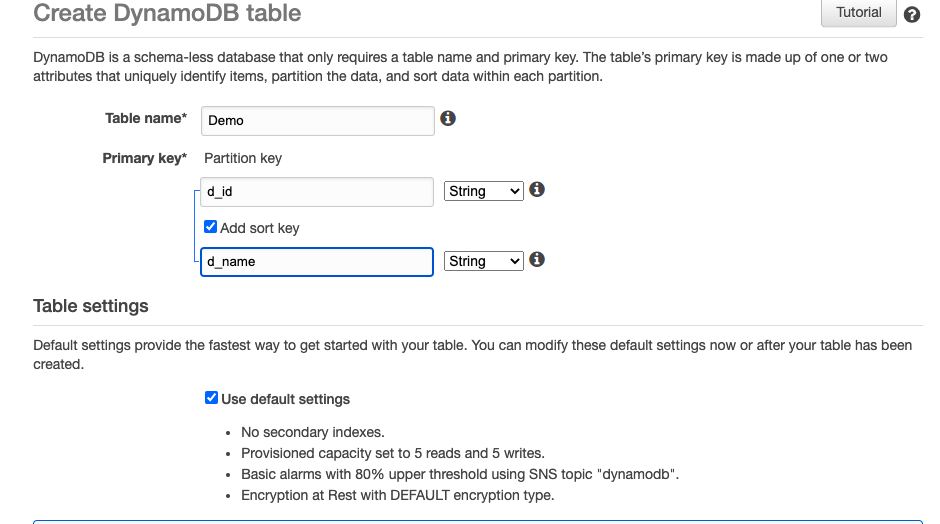

Amazon Web Services offers reliable, scalable, and inexpensive cloud computing services. Below are some salient features provided by AWS.
1.  Secure cloud services platform
2.  Compute power
3.  Database storage
4.  Content delivery 
5.  **Pay for what you use**

Prerequisites:

- AWS Account
- Active internet connection
- CLI usage

## AWS EC2(Elastic Compute Cloud)
This is the most commonly used service of AWS and catered deployment of various applications as per AMI configured before creating an EC2 Instance.
Amazon Elastic Compute Cloud (Amazon EC2) is a web service that provides secure and resizable compute capacity in the cloud. 
It is designed to make web-scale cloud computing easier for developers. <br>
**Here are some of the important steps while setting up new EC2 Instance->** <br>

Choose an Amazon AMI.


Choose the instance type.


Configure security group(It allows specific IP's that user will give permission to specific ports as per requirement.)


Login to EC2 via CLI
```
$ ssh -i ec2-key.pem ec2-user@11.11.11.111
```
Switch to ROOT
```
sudo su
```
## AWS RDS(Relational Database Service)
Amazon Relational Database Service is a web service that makes it easier to set up, operate, and scale a relational database in the AWS Cloud. It provides cost-efficient, resizable capacity for an industry-standard relational database and manages common database administration tasks.
After setting up RDS, you can be logged in to the local tool(SQL Developer/ MY SQL Workbench) and copy the endpoint of RDS with Username/Password configured while setting RDS.


## AWS ElastiCache
Amazon ElastiCache allows you to seamlessly set up, run, and scale popular open-Source compatible in-memory data stores in the cloud. This service is commonly used to avoid unnecessary calls to RDS and improving the user experience by displaying the data at a faster rate.

There are two types of cluster engine supported by AWS ElastiCache
- Redis
- Memcached


Login to Redis in local via this command (First port can be anything except 6379 as it will direct AWS Redis to local Redis installed on the machine) and after first port just paste the endpoint of Redis.

```
ssh -f -i ec2-key.pem -N -L 6378:demo-redis.xxxx.xx.0001.xxxx.cache.amazonaws.com:6379 ec2-user@11.11.11.111
```
## AWS Lex
Amazon Lex provides advanced deep learning functionalities of ASR(Automatic Speech Recognition) & NLU(Natural Language Understanding). With the use of Lex, we can build chatbots that can converse using speech and text as mediums.
There are a few components of BOT that need to be understood in order to build it.

- Intent:- It is a particular goal that the user wants to achieve.
- Utternaces:-These are spoken/typed phrases that invoke content.
- Slots:- Data provided by the user to fulfill the intent.
- Prompts:-These are queries/questions asked by the user to input the data.


Moreover, there are VERSIONS linked with bots, intents, and custom slots. With the help of versions we can make changes in dev version without any impact occuring in PROD hence it helps to make Immutable versions of bot that is created using AWS Lex.


## AWS API Gateway
This AWS service is used to Create, Publish, Maintain and Monitor secure Application Programming Interfaces(**API**). Moreover it provides an easy interface for code running on AWS Lambda.
Here are some of the pointers that explain the need for this service.
- Efficient API Development.
- Performance at Scale.
- Cost-saving at scale.
- Flexible Security Controls.

This service enables us to make APIs on the go with a few clicks, also we can use the Mocking approach to make dummy routes without any original data. In this faking data is used and bouncing back to without any activity.


## AWS DynamoDB
Dynamo DB is a NO SQL database provided by Amazon Web Services. The main job of Dynamo DB is to Store & Retrieve any amount of data and serve any level requests of traffic.
In this, there are different terminologies as that of a normal database. Secondary Indexes is a Data Structure that contains a subset of attributes from a table.
- Partition & Sort Keys (Partition key is single primary key composed of one attribute only)
- Local & Global Secondary Indexes
  - Local Index: Index with same partition key as of base table but different sort key
  - Global Index: In the global index both partition key, as well as sort key, can differ from that of the base table.  




