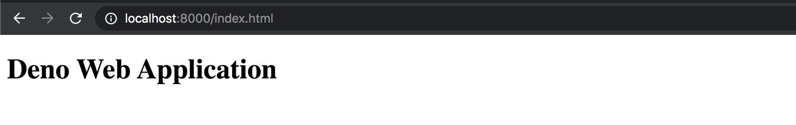
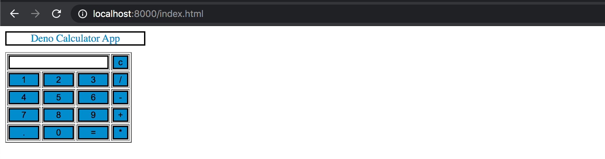

Hello, let's create a simple web app using deno, In this blog, I will be using the [Deno Third-Party Module](https://deno.land/x/) called **[abc](https://deno.land/x/abc)** for creating a simple web application.

I am assuming that you are familiar with the basic setup of deno. If not you can start with basic deno installation from [here](/blog/hello-world-deno/)

### Simple Web Application

So without wasting time lets jump into the code and write a simple hello world program using the **abc** module.

Create a file `index.ts`, and copy the code there.
```js
import { Application } from "https://deno.land/x/abc@v1.0.0-rc10/mod.ts";

const app = new Application();

app
  .get("/hello", (c) => {
    return "Hello, Abc!";
  })
  .start({ port: 8000 });
```
After saving the file you can run the code using the below cmd
```
deno run --allow-net=0.0.0.0:8000 index.ts
```
**Explanation:**
Deno is secure by default. Therefore, unless you specifically enable it, a deno module has no file, network, or environment access for example. Access to security-sensitive areas or functions requires the use of permissions to be granted to a deno process on the command line.

`--allow-net=\<allow-net>` Allow network access. You can specify an optional, comma-separated list of domains to provide a whitelist of allowed domains. For more information on the different kind of permissions needed in the deno you can visit [Permissions in Demo](https://deno.land/manual/getting_started/permissions)

Now once you run the above cmd you can see the **Hello, Abc!** in the browser by redirecting to http://localhost:8000/hello

### Lets Go Deeper!!!

Now let's try to serve the static file using the `abc` module. In the above example, `app` will have lots of different methods that we can use, one of them is `static()`, it used to serve the static files.

Let us create a folder called `public` in the root of the project. And inside that create an `index.html` file. Your `index.html` will look something like this.

```html
<!doctype html>
<html>
    <head>
        <title>Deno Web Application</title>
    </head>
    
    <body>
    <div>
        <h1>Deno Web Application</h1>
    </div>
    </body>
</html>
```

After creating this file let's modify our `index.tsx` file by adding the below code.
```ts
import { Application } from "https://deno.land/x/abc@v1.0.0-rc10/mod.ts";

const app = new Application();

app
  .get("/hello", (c) => {
    return "Hello World"
  })
  .static("/", "./public")
  .start({ port: 8000 });
```
**Explanation:**
As you can see `.static("/", "./public")` we have added this route `/` and we are serving our static file using the `static()` method provided by the `abc` module.

`static()` registers a new route with path prefix to serve static files from the provided root directory.

Let's try to run this using the previous cmd that is 
```
deno run --allow-net=0.0.0.0:8000 index.ts
```
Oops!! once you try to run this it will compile successfully but when you visit this path
http://localhost:8000/index.html, you will get below error in the browser.
```json
{"statusCode":500,"error":"Internal Server Error","message":"read access to <CWD>, run again with the --allow-read flag"}
```
It's because as we know deno requires the permission to read the file from the system. Hence to run the above cmd with `--allow-read` flag will solve our problem. So let's use this cmd to compile our index file.
```
deno run --allow-read --allow-net=0.0.0.0:8000 index.ts
```
After successful compile, you will see the output as below.



### Creating a basic calculator app
Hence after the successful serving of our static file, we can also add `js` in it. Let start with the basic calculator app for now.

Firstly lets modify our `index.html` file and add the below code
```html
<html>
  <head>
    <script src="script.js"></script>
    <link rel="stylesheet" type="text/css" href="style.css">
  </head>
  <!-- create table -->
  <body>
    <div class="title">Deno Calculator App</div>
    <table border="1">
      <tr>
        <td colspan="3"><input type="text" id="result" /></td>
        <!-- clr() function will call clr to clear all value -->
        <td><input type="button" value="c" onclick="clr()" /></td>
      </tr>
      <tr>
        <!-- create button and assign value to each button -->
        <!-- dis("1") will call function dis to display value -->
        <td><input type="button" value="1" onclick="dis('1')" /></td>
        <td><input type="button" value="2" onclick="dis('2')" /></td>
        <td><input type="button" value="3" onclick="dis('3')" /></td>
        <td><input type="button" value="/" onclick="dis('/')" /></td>
      </tr>
      <tr>
        <td><input type="button" value="4" onclick="dis('4')" /></td>
        <td><input type="button" value="5" onclick="dis('5')" /></td>
        <td><input type="button" value="6" onclick="dis('6')" /></td>
        <td><input type="button" value="-" onclick="dis('-')" /></td>
      </tr>
      <tr>
        <td><input type="button" value="7" onclick="dis('7')" /></td>
        <td><input type="button" value="8" onclick="dis('8')" /></td>
        <td><input type="button" value="9" onclick="dis('9')" /></td>
        <td><input type="button" value="+" onclick="dis('+')" /></td>
      </tr>
      <tr>
        <td><input type="button" value="." onclick="dis('.')" /></td>
        <td><input type="button" value="0" onclick="dis('0')" /></td>
        <!-- solve function call function solve to evaluate value -->
        <td><input type="button" value="=" onclick="solve()" /></td>
        <td><input type="button" value="*" onclick="dis('*')" /></td>
      </tr>
    </table>
  </body>
</html>
```
As you can see the above code we have already imported our `js` and `css` inside to so lets create JS file called `script.js` and add the following functions in it.
```js
//function that display value
function dis(val) {
  document.getElementById("result").value += val;
}

//function that evaluates the digit and return result
function solve() {
  let x = document.getElementById("result").value;
  let y = eval(x);
  document.getElementById("result").value = y;
}

//function that clear the display
function clr() {
  document.getElementById("result").value = "";
}
```
And also add some css into it by creating `style.css` file.
```css
.title {
  margin-bottom: 10px;
  text-align: center;
  width: 210px;
  color: #0d8dcf;
  border: solid black 2px;
}

input[type="button"] {
  background-color: #0d8dcf;
  color: black;
  border: solid black 2px;
  width: 100%;
}

input[type="text"] {
  background-color: white;
  border: solid black 2px;
  width: 100%;
}
```

Great!!! Our calculator app is now almost ready, let's save all the file and reload the http://localhost:8000/index.html.

You can see our calculator app in the browser like below.



If you'd like to see the full code, the repository is linked [here](https://github.com/LoginRadius/engineering-blog-samples/tree/master/Deno/WebAppWithDemo).

