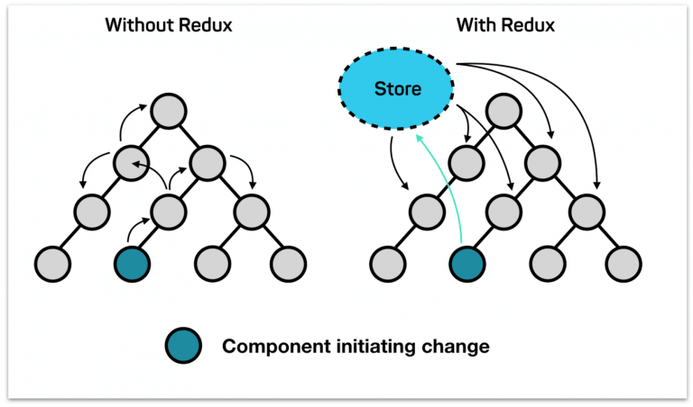
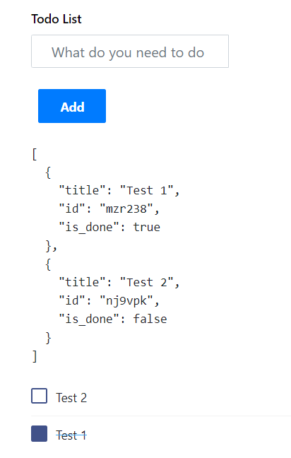

In this article, we will learn about state management in Angular with NGXS. Here we will understand the basic concept of NGXS and create a simple TO-DO App.

## What is State
In the bigger apps, managing the data states is very complicated. In angular, each component has its own state, to share the data/state between the components we normally use @Input and @Output decorators, but when the application goes bigger, its challenging to maintain the data consistency. So to solve this problem, redux was introduced. It provides a central store that holds all states of your application. Each component can access the stored state without sending it from one component to another.




## What is NGXS
NGXS is a state management pattern + library. It provides as a single source of truth for your application's state, providing simple rules for predictable state mutations.

NGXS is modeled after the CQRS pattern popularly implemented in libraries like Redux and NgRx but reduces boilerplate by using modern TypeScript features such as classes and decorators.


## How NGXS works:
NGXS is very simple to use as compared to other state management patterns like redux and Akita. NGXS takes full advantage of angular and typescript over the redux pattern.
There are majors 4 concepts to NGXS
#### 1. Store: 
It is a global state container and manages the states of the application.We can dispatch the actions to perform certain operations.
```typescript
    this.store.dispatch(new TodoActions.AddTodo(form));
```
#### 2. Actions 
An action is a type of command which should be called when something happens or you want to trigger at any event like adding a new todo, listing todos etc.
```typescript
export class AddTodo {
    static readonly type = '[Todo] Add';
    constructor(public payload: ITodo) { }
}
```
#### 3. State 
States are classes along with decorators to describe metadata and action mappings.
```typescript
import { Injectable } from '@angular/core';
import { State } from '@ngxs/store';

@State<ITodoStateModel[]>({
    name: 'todoList',
    defaults: {
        todoList: [],
    },
})
@Injectable()
export class TodoState {}
```
#### 4. Select
Selects are functions that slice a specific portion of the state from the global state container i.e. to get the data from the specific global state whenever you want to use.
```typescript
  @Select(TodoState) todoList$: Observable<ITodo>;
```


## Lets build a To-Do App:
#### 1. Get started
Install the `npm install @ngxs/store --save` then import the below code in  `app.module.ts`
```typescript
//File name app.module.ts
import { NgxsModule } from '@ngxs/store';
@NgModule({
  imports: [
    NgxsModule.forRoot([ToDoState], { // here login state 
      developmentMode: !environment.production
    })
  ]
})
export class AppModule {}
```
#### 2. Create your store
Here we have created a component that dispatches actions to create a to-do and for other operations. Apart from that, we are using a selector `TodoState`, from which we are listening for the updated to-do list.

Put this code in the `app.component.ts`
```typescript
// File name app.component.ts
import { Component } from '@angular/core';
import { Store, Select } from '@ngxs/store';
import { TodoActions } from './state/todo-actions';
import { FormGroup, FormControl, Validators } from '@angular/forms';
import { TodoState, ITodo } from './state/todo-state';
import { Observable } from 'rxjs';
@Component({
  selector: 'app-root',
  templateUrl: './app.component.html',
  styleUrls: ['./app.component.scss']
})
export class AppComponent {
  title = 'ngxs-todo-app';

  @Select(TodoState) todoList$: Observable<ITodo>;

  addForm = new FormGroup({
    title: new FormControl('', [Validators.required])
  });
  constructor(private store: Store){}
  onSubmit(form: any){
    this.store.dispatch(new TodoActions.AddTodo(form));
  }
  markDone(id: string, is_done: boolean){
    this.store.dispatch(new TodoActions.markDone(id, is_done));
  }
}
```
#### 3. Create your actions
Create a folder `state` and put the `todo-actions.ts` file and add below code

```typescript 
// File name todo-actions.ts
export class AddTodo {
    static readonly type = '[Todo] Add';
    constructor(public payload: any) { }
}

export class EditTodo {
    static readonly type = '[Todo] Edit';
    constructor(public payload: any) { }
}

export class FetchAllTodos {
    static readonly type = '[Todo] Fetch All';
}

export class DeleteTodo {
    static readonly type = '[Todo] Delete';
    constructor(public id: number) { }
}
```

#### 4. Create your State:

Here we have created the state of the todo, it contains the global state of the todo list.
Create a folder `state` and put the `todo-state.ts` file and add below code
```typescript

// File name todo-state.ts
import { Injectable } from '@angular/core';
import { State, NgxsOnInit, Action, StateContext } from '@ngxs/store';
import { TodoActions } from './todo-actions';
import { patch, updateItem } from '@ngxs/store/operators';

export interface ITodo {
    id: string;
    title: string;
    is_done: boolean;
}
export interface ITodoStateModel {
    todoList: ITodo[];
}
@State<ITodoStateModel>({
    name: 'todoList',
    defaults: {
        todoList: [],
    },
})
@Injectable()
export class TodoState implements NgxsOnInit {
    ngxsOnInit(ctx) {
        ctx.dispatch(new TodoActions.FetchAllTodos());
    }
    @Action(TodoActions.markDone)
    markDone(
      ctx: StateContext<ITodoStateModel>, 
      { payload, is_done }: TodoActions.markDone
    ) {
        ctx.setState(
            patch({
                todoList: updateItem(
                  (item: ITodo) => item.id === payload, 
                  patch({ is_done: !is_done })
                )
            })
        );
    }

    @Action(TodoActions.AddTodo)
    add(
        ctx: StateContext<ITodoStateModel>,
        { payload }: TodoActions.AddTodo,
    ) {
        const state = ctx.getState();
        ctx.setState({
            ...state,
            todoList: [
                ...state.todoList,
                {
                    ...payload,
                    id: Math.random().toString(36).substring(7),
                    is_done: false
                }
            ],
        }
        );
    }

}
```
#### 5. Create your html view

Here we have created a form that we use to create todo and listed all todos.
put this code in your `app.component.html`
```html
<!-- File name  app.component.html -->
<form [formGroup]="addForm" (ngSubmit)="onSubmit(addForm.value)">
  <input type="text" formControlName="title" class="form-control todo-list-input" placeholder="What do you need to do today?">
  <button class="add btn btn-primary font-weight-bold todo-list-add-btn">Add</button> 
</form>
<ul class="d-flex flex-column-reverse todo-list">
    <li *ngFor="let todo of (todoList$ | async) ?. todoList" [ngClass]="{'completed': todo.is_done}">
      <div class="form-check"> 
        <label class="form-check-label"> 
          <input (click)="markDone(todo.id, todo.is_done)" class="checkbox" type="checkbox" [checked]="todo.is_done">{{todo.title}} <i class="input-helper"></i></label> 
      </div>
    </li>
  </ul>
```
After lots of code, it's time to see the results. So here is the UI you will get. To get the complete code please go to [Github Repo.](https://github.com/LoginRadius/engineering-blog-samples/tree/master/Angular/To-do-App-in-angular-with-NGXS)


## Conclusion

We have gone through the basic concepts of NGXS and built a simple to-do app. There are a lot of advanced features and plugins by NGXS, but beyond the scope, we could not add, but hopefully, we will be exploring in future blogs.


