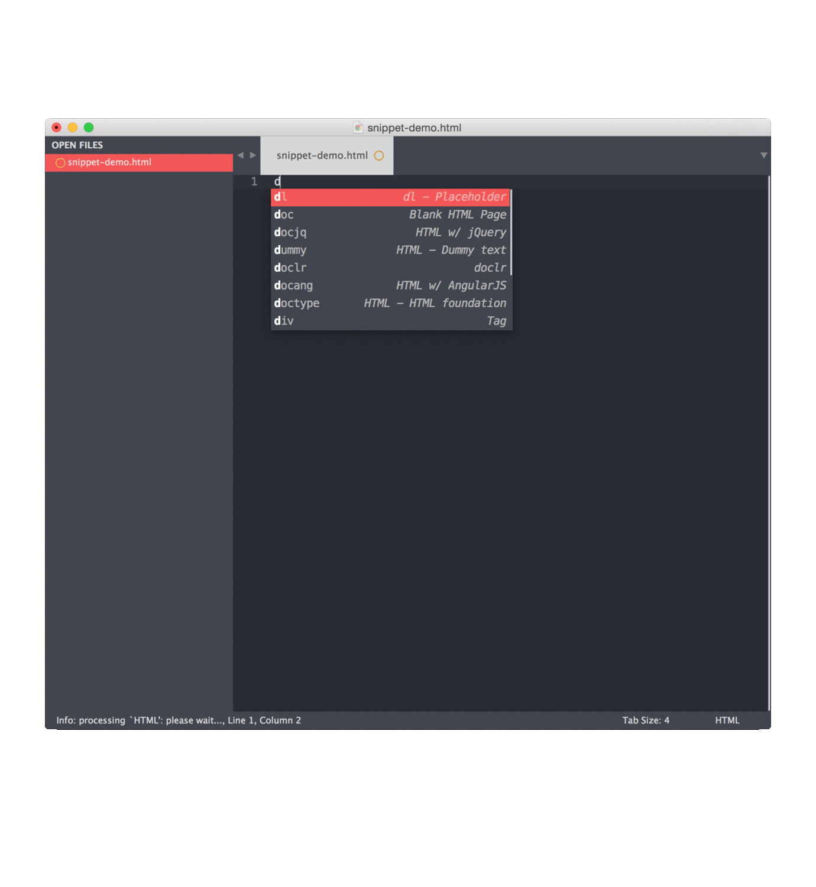
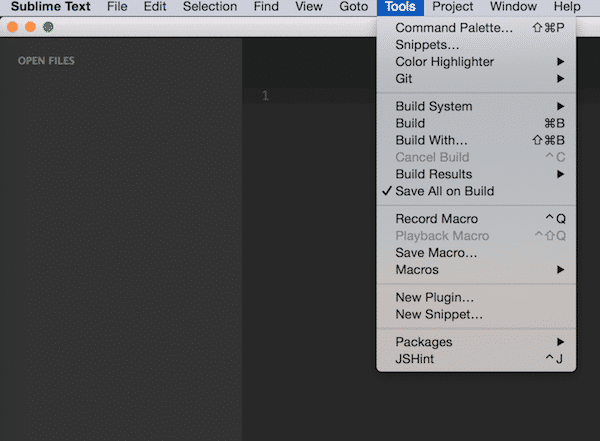

In this blog, I will cover some of my favorite Sublime features. Using these plugins will dramatically reduce the amount of tedious tasks you have to perform, and make your work really fun. I will start with some basic features that come with a fresh install of Sublime. There are lots of good tutorials on Sublime shortcuts and plugins on the internet, but I kinda feel there should be more about these fundamental features, as I have seen lots of people who are familiar with the plugins but not these cool built-in features. In this article we will be introducing "Snippets", "Project" and "Macros".

Here we go:

### Snippets



When I introduce Sublime to my friends, this is usually the first feature that I demo start off with. To give a quick peek what a snippet looks like:  
  
This is definitely the feature you will use the most! To start using snippets, you can either create your own snippets according to your needs or download some pre-made snippets created by others to fulfill some general needs. Like the one I demonstrated, it is pre-made from a plugin called `Html Page Snippets`, and command `docjq` will create a boiler template for a Html page that contains bootstrap and jQuery.


To create your own snippet, go to "Tools" => "New Snippet", an interface to create your own snippet will pop up, it would look something like this:  

- Replace the default line with your snippet, the default one looks like this:

```
Hello, ${1:this} is a ${2:snippet}.
```
Note: The dollar sign "$" allows you to use tab key to jump between, so set it wisely!

- Uncomment this line to set up a tab trigger for the shortcut

Now save it, but keep in mind putting it in the correct location is important!

If you can not find it, go to "Sublime" - > "Preferences" -> "Browse Packages", and create a folder called "User" if there isn't one already, and save it there.


### Project

Using Project to organize your projects is super easy and handy. It saves a lot of time that you'd normally spend finding different folders and then dragging and dropping to your Sublime each time. Additionally, it saves where you were last time when you closed it so you can just pick up where you left off. Let's see a quick demo:

Saving and using your projects is very straightforward.

- First drag some folders and files that you want to open into Sublime
- Then go to the menu, click "Project" -> "Save Project As"  
    
    
    
- Note the extension is ".sublime-project" and you may want to put all your project files in one central location

That's it! You're done! Super easy right?

### Macros


Do you always feel you are repeating yourself for some tedious task? Hmm... at least that's how I feel when I need to covert a vertical line of data into an array. Tasks like this are pretty common when you need to copy a line of data from spreadsheets. Using shortcuts, the best way I can come up with to accomplish this would be like so:  

It takes about 8 shortcuts to finish each process, that's including the first paste action and then adding a space character after each comma. Imagine having to do this for each line of a table, and for every single spreadsheet you have to work on. It would be hundreds of shortcuts you need to press and each time you are just repeating the exact same sequence of keys.



Well you might think there must be a better way! You bet there is! "Macros" are designed to handle this kind of nasty situation and save you from all that boring work. Here I made a very quick and easy example, it converts a vertical line of data into an array:  

Magic! Lots of time and lives will be saved by this little gadget. So now, how to make your very own macros. First of all I would recommend trying out your set of operations several times to make sure it will get recorded correctly. When you are ready, open a new window/tab in Sublime, clear your mind, take several deep breaths, and here we go.

- Go to "Tools" -> "Record Mac  
    
    
    
- Do your operations

Usually you will have something copied in your clipboard, so it could start with a "Paste" command. Now it's your time to shine, do a clean and precise set of operations to format the data.

- Stop your macro  
    
    
    
- Playback

You can find it under the same "Tools" menu. Just use it to make sure it did what you want, sometimes even though you recorded it properly, the macro does not recognize the operation correctly. For this reason it's important to make sure everything is correct and smooth, and if it is not, try find some alternatives for your operations.

- Save It!

Similar to other Sublime tools, it will be saved with an extension called ".sublime-macro", after it gets saved you will be able to find it in your Macro User List.

### To Be Continued ..

I hope you had fun and learned something new about Sublime. Next time we will cover some really good packages/plugins that you should consider using to make your life and work even simpler. Happy coding.
