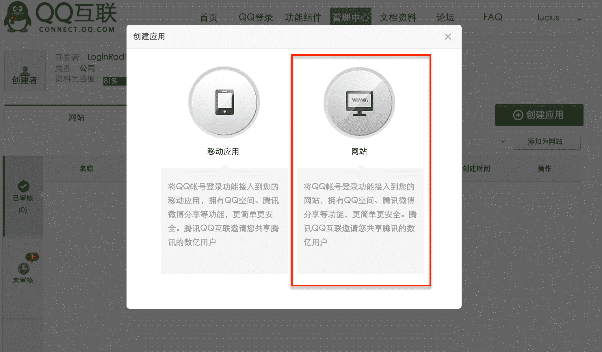
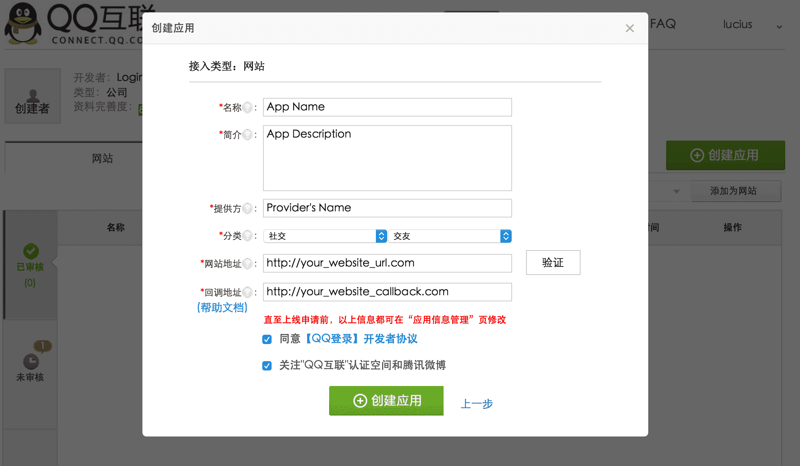
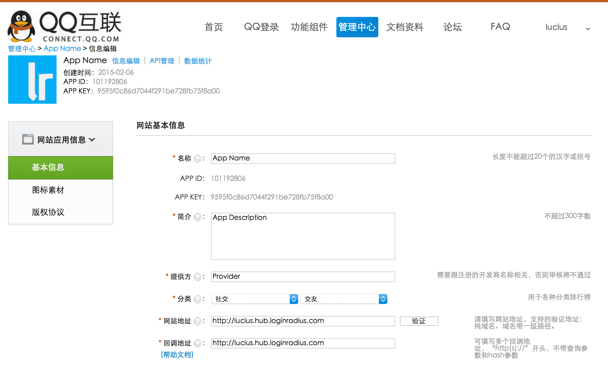
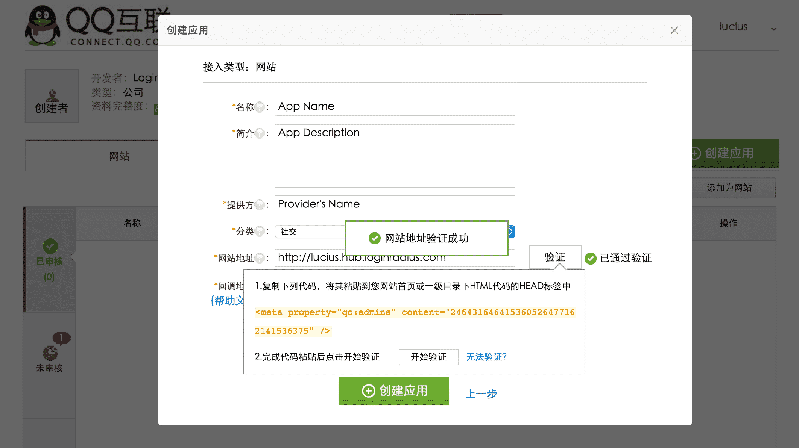
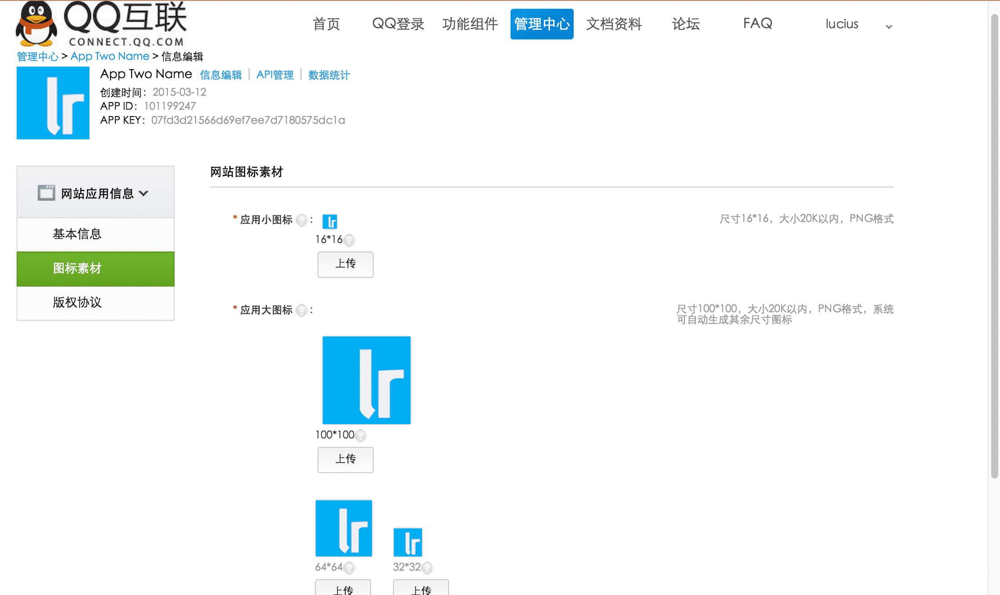
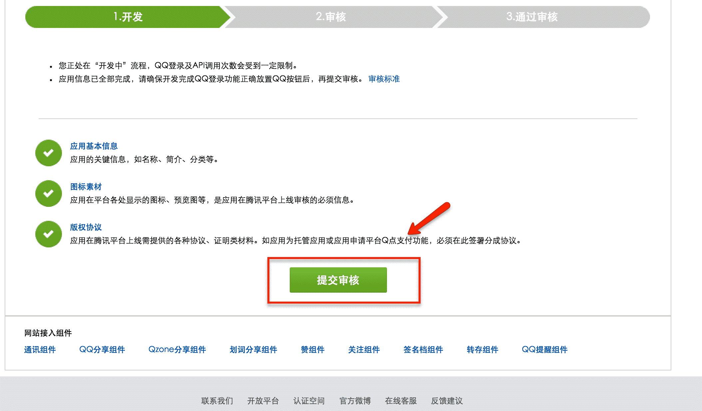
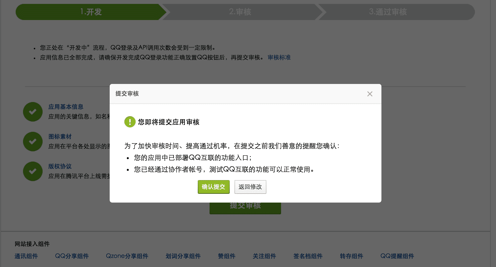

QQ is the most popular ID provider for Chinese people since the 90s, it is always the first choice for websites who want to provide social login functionality for their Chinese users. But similar to other ID providers from China, the app you created needs to be reviewed before actually launching it. Reading Chinese and using Google translate for each line is not that much of fun, and in this tutorial we will go through step by step to figure out how to submit a QQ app for review. Do note: You can always download a Google translate extension for your browser to translate each page to English, it would probably be the easiest way for you, but here I decide to keep it Chinese, lets go.

1. ### Navigate to [QQ Connect](http://connect.qq.com/)
    
    And click the 4th tab (in orange box)  

    
    

2. ### Registration
    
    After being redirected to [http://connect.qq.com/manage/login](http://connect.qq.com/manage/login), it asks you to fill in your credentials, since I do not have one, I will register for one and feel free to skip this step if you have already got one.
    
    Click "register a new account", like shown:
    
    
    
    It will link you to this page [http://zc.qq.com/en/index.html?from=pt](http://zc.qq.com/en/index.html?from=pt), it is written in English, sweet! I am pretty sure you can register an account by yourself. After filling in the information, it will send a confirmation email to your email box. After your email is verified go back to this page [http://connect.qq.com/manage/login](http://connect.qq.com/manage/login), and use the QQ number you just got to log in with.
    

3. ### Creating the app
    
    Click the big green button on the right side of your screen to create an app, and here we will create a website type app.
    
    
    
    
    
    After choosing the type, you need to fill in some basic information for your website, in case if you do not use Google translate to translate the page, I did a little translations for you, there you go.
    
    
    
    Here is what I have filled in  

    
    
    Please note, when you fill in your website address, it will ask you to verify your website, so you need to copy and paste the javascript code under your website page, and then click the button beside to verify it.  
    
    
    Once all the information is filled, then move on to next step, click the blue text link, it asks you to upload different sizes of the images about your company.
    
    
    
      
    Then, it is time to submit by clicking that big green button in the middle.
    
    
    
    Confirm it by clicking the right button again.
    
    
    

If everything works well, you will get you app approved in a week, just remember to check it back periodically, good luck!
