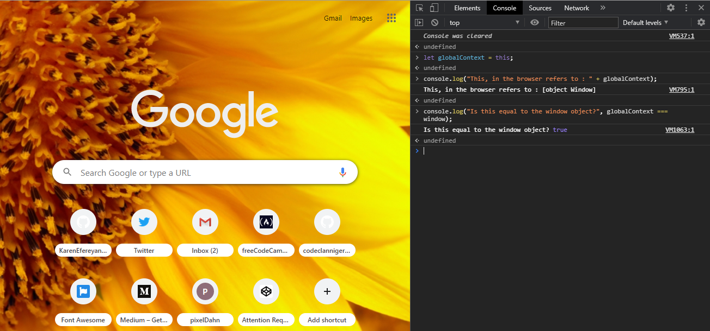
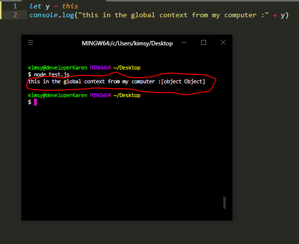

## What is 'this' in Javascript

The `this` keyword is, without doubt one of the most difficult Javascript concepts to understand. However, understanding it is key to being a great developer because it is an extremely common part of Javascript code.
In simple terms, [this](https://www.w3schools.com/js/js_this.asp) refers to the object it belongs to. It can also be defined as a property of an execution context, which is always a reference to an object when not in strict mode. It is worthy to note that the 'this' keyword finds usage mostly in the context of [object oriented programming](https://www.geeksforgeeks.org/objects-in-javascript/#:~:text=Loosely%20speaking%2C%20objects%20in%20JavaScript,the%20context%20of%20an%20object). With that in mind, the 'this' keyword will refer to the object to which it belongs; This is true most of the times. Let us use an example to explain this better.

```js
let bellBoy = {
  firstName: "Andrew",
  lastName: "Mike",
  gender: "Male",
  age: 18,
  greet: function () {
    return (
      "Hi! I am " +
      this.firstName +
      " " +
      this.lastName +
      ", a bell boy and I am at your service"
    )
  },
}
console.log(bellBoy.greet())
```

In the example above, there exists a bellBoy Object which consists of four properties and a greet method. When the greet method of the bellBoy object is called, can you figure out what will be returned? The console.log will print the following string: Hi! I am Andrew Mike, a bell boy, and I am at your service.

How did 'this.firstName' and 'this.lastName' translate to Andrew and Mike respectively? Well, to answer that, let us go back to the definition of the 'this' keyword. It was said earlier, that it refers to the object it belongs to. So, in the example above, the 'this' keyword refers to the bellBoy object, which is the owner of the greet() method. The dot(.) operator can be used to access members of the object as defined by the 'this' keyword. In the current console.log(), we are using the dot(.) operator to call or access the greet() method. In the same vein, we can use the dot(.) operator to access the properties method of the bellBoy object like the gender and the age.

## Contexts in which the 'this' keyword can be used

The definition of [this](https://developer.mozilla.org/en-US/docs/Web/JavaScript/Reference/Operators/this) as the property of an execution context is much more accurate because depending on how it is called at runtime, 'this' can refer to many things. Let's dive deeper.

- ### `this` in the method of an object

  First, a method is used to refer to a function that is a member of an object. All methods are functions, but not all functions are methods. Now, when the 'this' keyword is used inside a method, it refers to the owner of the method it is used in. Let's use the example defined above to take a deeper look at 'this' in this context.

  ```js
  greet : function() {
   return "Hi! I am " + this.firstName + " " + this.  lastName + ", a bell boy and I am at your service";
  }
  ```

  In this example, `this` which is used inside the `greet()` method refers to the bellBoy object, which is the owner of that `greet()` method.

- ### `this` in the Global Context

  When the 'this' keyword is used alone, not inside any function or better referred to as being used in the global context, the keyword refers to the global object. The global object refers to the owner of the 'this' keyword in this case. When it is in a browser window, this global object refers to the window object.

  ```js
  let y = this
  console.log(y)
  ```

  . 

  Since that is true, if you make a strict comparison between the value of this and the window object, we get the boolean value of true.

  If you run this javascript file inside your computer using a tool like [node](https://www.w3schools.com/nodejs/), this keyword refers to an object of type of object, like so......
  
  

- ### `this` in a function 

  Note, we are talking about what the keyword 'this' refers to when it is used in an ordinary function, one not affiliated with any object. Just a function is standing on its own.
  In such a javascript object, the default value of 'this' is the owner of the function. If the code is not in strict mode and it is not been set to a member of an object, then `this` defaults to the global object.

  ```js
  function function1() {
    return this
  }
  function1() === window
  ```

  In the example above, the value of the `this` keyword as used inside this function refers to the window object. This is why the output of the string comparison between funtion1 and the window object will equal to `true` because they hold the exact same value.

- ### `this` in a funtion (Strict Mode)

  When in [strict mode](https://developer.mozilla.org/en-US/docs/Web/JavaScript/Reference/Strict_mode) however, Javascript does not permit default binding, and because of that, it is undefined. Put simply strict mode prevents sloppy code. Thinking it from a programmers' point of view, there is most likely no good reason to want to access the value of this in a function since it will return the window object. In most cases, we access the `this` keyword because we want to get some other properties from its owner. Strict mode enforces this. So when in this mode, 'this' is undefined.

  ```js
  "use  strict"
  function function1() {
    return this
  }
  function1() === window
  ```

  As can be seen in the above example, in the strict mode, the value of `this` inside a function is `undefined`.


- ### `this` when used inside Event Handlers

  An event handler is an action carried out when an event is perceived to have happened. For example, when a button is clicked, we as programmers might decide hide the button. To achieve that the click event must be listened for, and an event handler must be thrown to take the action when that event is triggered. In the case of event handlers, the `this` keyword refers to the element that received the event, like this:

  ```js
  window.addEventListener("keydown", function (event) {
    // `this` will point to `element`, in this case the window object
    console.log(this.event.key)
  })
  ```

  In the example above, an event listener of `keydown` is being listened for by the window object, and once that event is perceived, a function that takes in the event will be run. The job of that function is to console.log `this.event.key`. If you try to run this code on the browser, you will get back whichever key the user pressed. Hence, in this case, `this` refers to the window object which is the one receiving the object, and as with all other objects, its properties can be accessed using the dot(.) operator. The value of `this` when used in an event handler will refer to the receiver of the event, which can be the window object in this case or any other local HTML elements we might create.


- ### `this` in an inline Event Handler

  ```js
  <button onclick="alert(this.tagName.toLowerCase());">
  I am a this
  </button>
  ```
  It is a little bit different when 'this' is used in an inline event handler. In this case, its value is set to the DOM element on which the listener is placed. In the example above, the button is returned because the onClick event is being accepted by the DOM element whose tag name is returned in the alert method.

#### More contexts exist in which the value of the 'this' keyword differs. 
- <b>this in classes</b>
- <b>this as a constructor</b>
- <b>this with a getter or setter method</b>
- <b>this on an object's prototype chain</b>
- <b>this in arrow functions</b>

And many more. For a full description of `this` keyword, check out these links:

- [w3Schools](https://www.w3schools.com/js/js_this.asp)
- [MDN](https://developer.mozilla.org/en-US/docs/Web/JavaScript/Reference/Operators/this)
- [TutorialsTeacher](https://www.tutorialsteacher.com/javascript/this-keyword-in-javascript)

It might be a good idea to run the snippets of code to be sure that you understand how they work. To do this, use the free [webmaker](https://webmaker.app/app/) or the [codeplay](https://www.codeply.com/) code playgrounds.
