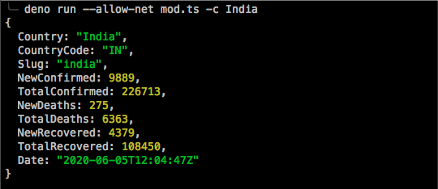

### What is Deno?

Deno is a JavaScript/TypeScript runtime with secure defaults and great developer experience. It's built on V8, Rust, and Tokio.
I suggest you watch these talks by Ryan: He talks about his mistakes with Nodejs [here](https://www.youtube.com/watch?v=M3BM9TB-8yA&vl=en) and a more in-depth look into deno [here](https://www.youtube.com/watch?v=z6JRlx5NC9E)
##### Features
* Secure by default. No file, network, or environment access (unless explicitly enabled).
* Supports TypeScript out of the box.
* Ships a single executable (deno).
* Has built-in utilities like a dependency inspector (deno info) and a code formatter (deno fmt).
* Has a set of reviewed (audited) standard modules that are guaranteed to work with Deno.
Scripts can be bundled into a single JavaScript file.

### Let's Build Something!!!

In this article, we're going to build a simple cli tool to demonstrate some of the features of [deno](https://deno.land/). Our cli will be interacting with a **COVID** API to fetch live data.

> Requirement: make sure you have deno installed. If you don't, refer to this [link](/blog/hello-world-deno/). It's pretty straightforward.

Deno has the entry file `mod.ts` so we will follow the same in this article if you are following this article along with the coding you can create a folder named `covid-cli`, inside that folder you can create a file called `mod.ts` and copy the below code there.

```ts
const { args } = Deno;
import { parse } from "https://deno.land/std/flags/mod.ts";

console.dir(parse(args));
```
Here the `parse(args, options = {});` contains two parameters where args is an `Array` and `options` is an object, let try to run the above code using this cmd.
```
deno run mod.ts arg1 -f hello --flag World --booleanFlag
```
After running the above code you will see the **output** as
```
{ _: [ "arg1" ], f: "hello", flag: "World", booleanFlag: true }
```
> The first property in the object is always an array containing all arguments that did not have an option associated with them(i.e it doesn't match -f or --flag). If you do not pass a corresponding value to a flag, it defaults to true.

I will be using the [this](https://documenter.getpostman.com/view/10808728/SzS8rjbc?version=latest) postman doc for all the COVID related API and we will perform the below to action through our CLI.
1. A summary of new and total cases globally updated daily.
1. A summary of new and total cases per country updated daily.

Let's write out the function for our first command, so our `mod.ts` file will look like this.
```ts

const { args } = Deno;
import { parse } from "https://deno.land/std/flags/mod.ts";

// flags:
// -h, --help: display help message
// -g, --global: display global stats
// -c, --country: get data of mentioned country

const BASE_URL: string = "https://api.covid19api.com/"
const parsedArgs = parse(args)

async function getGlobalStats() {
    const res = await fetch(`${BASE_URL}summary`)
    const data = await res.json();
    console.log(data["Global"])
}
```
Here, we have an async function that returns the data from our API call. We're making a fetch request (yes, deno has browser functionality in-built) to the API endpoint to get the global stat of covid19.

The function for the second command looks very similar, just we need to filter our data only for a particular country which is provided.

```javascript
async function getCountryStats(country: string) {
  if (country) {
    const res = await fetch(`${BASE_URL}summary`);
    const data = await res.json();
    const index = data["Countries"].findIndex((c: any) => c.Country.toLowerCase() === country.toLowerCase())
    if (index !== -1) {
        console.log(data["Countries"][index])
    } else {
        console.log("Country Not Found")
    }
  } else {
    console.log("Country Name is needed")
  }
}
```

We will now write our `main()` function. We have a switch statement to check the first flag that was passed and calls the appropriate function. The default case simply displays a welcome message. Let add the below code in our `mod.ts` file
```
async function main() {
  switch (Object.keys(parsedArgs)[1]) {
    case "help":
    case "h":
      console.log(displayHelpMsg());
      break;
    case "global":
    case "g":
      await getGlobalStats();
      break;
    case "country":
    case "c":
       let country = parsedArgs.c || parsedArgs.country || ""
       await getCountryStats(country)
       break;
    default:
       console.log(displayHelpMsg());
  }
}

main()
```
And our `displayHelpMsg()` will look something like this
```
function displayHelpMsg() {
  return "flags:\n-h, --help: display help message\n-g, --global: display global stats\n-c, --country: get data of mentioned country ";
}
```

### Testing Time!!!
To test our program, we're going to run $ deno run `--allow-net mod.ts -g`. We should get the following result:

* For Global Records


* For Country Wise Record



* For Help


That's all there is for our cli tool. If you'd like to see the full code, the repository is linked [here](https://github.com/LoginRadius/engineering-blog-samples/tree/master/Deno/covid-cli). In conclusion, Deno is a very exciting project especially because you get all the benefits of typescript out of the box without the need to compile your files to js. 

You can build a lot with it, ranging from cli Programs to HTTP servers. Do have a look at one of my [blog](blog/a-webapp-in-deno/) where I have built a basic calculator app using the [abc](https://deno.land/x/abc) module.


