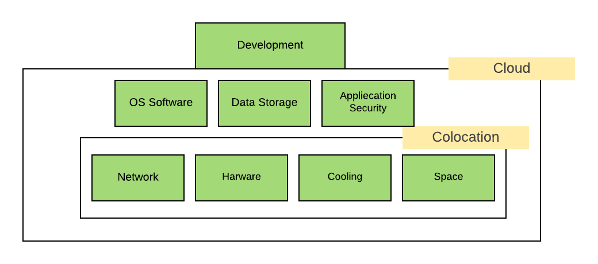
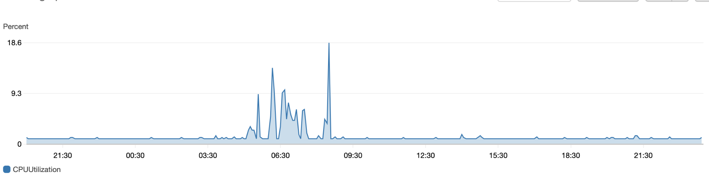
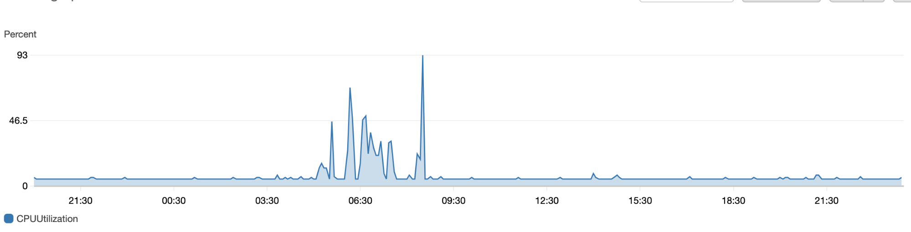

Organizations adopting cloud infrastructure also they are increasingly working with multiple cloud providers. 
"By 2021, over 75% of midsize and large organizations will have adopted a multi-cloud and/or hybrid IT strategy."
Gartner Predicts

A recent [Gartner](https://www.gartner.com/smarterwithgartner/4-trends-impacting-cloud-adoption-in-2020/) report cloud cost optimization is the first factor that will impact cloud adoption in 2020. There all some other factors also but they will come in the future  

### Infrastructure Journey
##### On-Premise
On-Premise Infrastructure was only option around 10 years ago but managing On-premise Infrastructure include the extra cost with other challenges, Challenges are Network, Hardware, Cooling, Power, Space also needed technical staff for taking care all infrastructure

##### Colocation
The Colocation is when a business places its own server in a third-party data center and uses its infrastructure services. Colocation takes responsibility for Network, Hardware, Cooling, Space also business not need to worry about technical man force for managing servers

Still business have more challenges OS software, Application security, Data storage   

##### Cloud 
 
The Cloud service provider is providing solutions for all the challenges. The cloud service provider takes total responsibility for hardware, network, space, power, maintaining, and security also they are managing all technical workforce for the whole infrastructure 

  
  
#### How to Reduce Cloud Cost 
Reducing Cloud cost is not a one time task. it is a recurring process. We need to identify underutilized resources, Right size machine, reserving capacity for higher discounts also need to optimization Application for reducing hardware cost. Let's start 
 
#### Choose the Right Cloud Provider 
Cloud infrastructure is increasing day by day. Choosing the right cloud provider is the most important decision for long term success. The big three cloud providers are  Amazon Web Services (AWS), Microsoft Azure, and Google Cloud Platform (GCP). These three cloud providers are providing mostly services so they might be confused about choosing the right cloud provider. We can easily evaluate the right cloud provider from the following steps

- Compliance
- Security 
- Downtime
- Support
- Pricing structure
- Location wise availability 

#### Different types of Instances
All Big Cloud Providers are providing spot instances. Spot instances are unused instances. Cloud Providers offered up to 90% discount on these instances compared to on-demand or reserved instances.AWS, Azure, and Google (GCP) all provide the option to use Spot Instances.
- AWS Spot Instances 
- Azure Low Priority VMS
- GCP Preemptible VMS

#### Discounted Instances
All Big Cloud Providers are providing discounted Instances or spot instances. Spot instances are unused instances. Cloud Providers offered up to 90% discount on these instances compared to on-demand or reserved instances. The majority of organizations have some workloads that are not critical, We can reduce the cost for not critical workload by using spot instances. AWS, Azure, and Google (GCP) all provide the option to use Spot Instances.
- AWS Spot Instances 
- Azure Low Priority VMS
- GCP Preemptible VMS

##### Identify Instance Right Size  
Identify the right size for the Instance, not an easy task. We need to configure multiple matrices in our cloud service provider. Key metrics to look for are CPU and memory usage. Identify instances with a maximum CPU usage and memory usage of the month.

###### How Check metrics
Generally, people make mistakes during checking metrics. Most of the people prefer averages in monitoring but averages mislead the measurement. Let understand this by example 

You are running an online technology tutorial site. Suppose 1million active users on your website in normal days. Now you are hosting weekly technology webinars in your platform. During webinars time your platform traffic should increase. At that time CPU usages and memory usages should be high compared to the rest of the time. Now suppose you have checked the 24 hours average CPU usages and memory usages. It was around 40% and you have decided this is underutilized and scale down the lower size instance. It can impact you 5% - 10% traffic Let’s look at a real-world example. This chart shows the overall CPU usages 

  
  
First Image showing Average CPU utilization. You can see Maximum CPU was 18.6 %

Now, let’s check the CPU 99th percentile:
  
  
As expected, the 99th percentile is higher than the average. 99th percentile is around 93% 

The conclusion is We need to always check the 99th percentile. The average can mislead and it can impact your users.

### Creating Underutilization Alarm 
We can create different types of resources and applications utilization monitoring matrix and based on the data we can configure multiple alarms. You can configure notification or alarms on email, SMS from the Cloud provider dashboard. you can also configure alarms that automatically stop or terminate EC2 instances or VM when instance unused or underutilized according to the configured threshold. For example, if you are a DevOps or developer, you can create a group of alarms that sends an email notification to developers whose instances have been underutilized or ideal for some hours, then terminates an instance. It will save the overall infra cost. different cloud providers provide different ways for creating these type alarms
-  [Amazone (Aws)](https://aws.amazon.com/cloudwatch/features/)
-  [Azure](https://azure.microsoft.com/en-in/blog/announcing-azure-advisor-azure-monitor-and-resource-health/) 
-  [Google Cloud](https://cloud.google.com/compute/docs/instances/viewing-and-applying-idle-vm-recommendations)

#### Creating time based  actions
You can save around 75% cost for your Non - Production Development, Staging, and QA environment. Non - Production environment generally needed during working days. You can turn off these servers during off-hours. Cost-saving depends on the infrastructure size, it can be hundred, thousands of dollars

You can create automation scripts for infrastructure deployment. Schedule the script in your cloud provider         

###  In-memory cache Storage
Application in-memory cache reduces the cost of transferring data in the network and overall application performance because reduce the traffic between the database servers or any other external application reduce the network level cost in the cloud also caching improves data accessibility by moving frequently accessed things in-memory instead of retrieving data from the storage server. Suppose your application is fetching user configuration or settings in every request from the database server. We can keep this type of configuration, which is not changing frequently in the in-memory cache. it will save a lot network-level cost 

### Data Transfer Cost Optimization 
Data Transfer cost mostly hidden or Some time we don't take care of it. Generally, data transfer is free in the same region between different services Storage, Compute service, etc. 
If you do a lot of cross-region transfer, it will increase your network data transfer cost also if you will deploy multiple services in the same region it will improve application performance 
 
### Cost visibility
This includes knowing what you spend in detail, how specific services are billed, and the ability to display how (or why) you spent a specific amount Here, keep in mind key capabilities such as the ability to create shared accountability, hold frequent cost reviews, analyze trends, and visualize the impact of your actions on a near-real-time basis. You can also use cost controls like budget alerts and quotas to keep your costs in check over time. 

#### Consider a Multi-Cloud Architecture
Enterprises or Mid Level companies are adopting multi-cloud infrastructure. Consider this recent prediction from IDC: “By 2020, over 90% of enterprises will use multiple cloud services and platforms.” Or this one from 451 Research: “The future of IT is multi-cloud and hybrid with 69% of respondents planning to have some type of multi-cloud environment by 2019.”  

##### Benefits of multi-cloud Architecture
- Low latency
- Competitive Pricing
- more compliance options
- Enhanced Security 
 
### Conclusion
Organizations need to develop a cost optimization culture and awareness. Cost optimization is an ongoing activity in the organization. Need to decide someone responsible for the cost optimization it can be an Engineering team or DevOps team. Most cloud providers provide billing alarm’s they can alert you in case of cost increment also we can configure budget in the Cloud provider dashboard
 