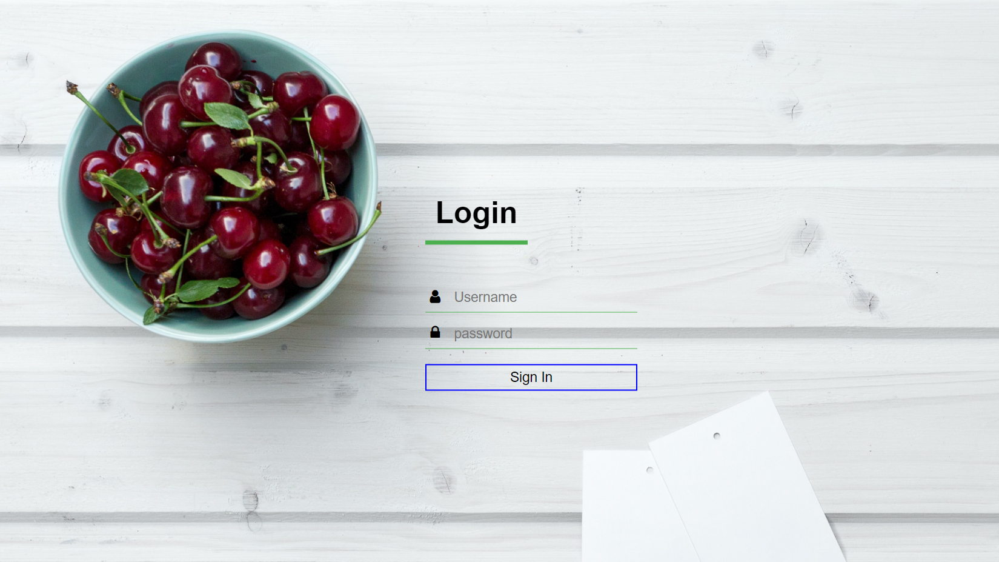

Technologies: HTML5, CSS3, JavaScript.  
Prerequisites:

- Basic knowledge of HTML and CSS.
- code editor like vs code should be installed.

This tutorial will guide you how to create a transparent login form using HTML and CSS from scratch.Some Font Awesome Icons were also added to make it more attractive. 

### Let's get started

First of all create two files one **index.html** and another **style.css**.In index.html we will write our base code and in style.css we will write code to style our base code.

Let's start creating our __index.html__ first!.In this file we will first create a login form  which includes username ,password and a sign in button then we will add font awesome icons to add icons we first have to add the cdn link of font awesome icons inside the head tag of our html page.We will use user and lock icons in our form.

```html
<!DOCTYPE html>
<html lang="en">
<head>
    <meta charset="UTF-8">
    <meta name="viewport" content="width=device-width, initial-scale=1.0">
    <title>Login Form Design</title>
    <link rel="stylesheet" href="style.css">
    <link rel="stylesheet" href="https://cdnjs.cloudflare.com/ajax/libs/font-awesome/4.7.0/css/font-awesome.min.css">
</head>
<body>
    <div class="login-box">
        <h1>Login</h1>
        <div class="textbox">
            <i class="fa fa-user"></i>

            <input type="text" placeholder="Username" name="" value="">
        </div>

        <div class="textbox">
            <i class="fa fa-lock"></i>
            <input type="password" placeholder="password" name="" value="">
        </div>


        <input class="btn" type="button" name="" value="Sign In">


    </div>
    
</body>
</html>
```

So after creating login form we now have to *design* our form and for that we have to make __style.css__ file to give some styling to our form,to the body we will add background image to our login page and background size should be cover.

```css
body {
    margin: 0;
    padding: 0;
    font-family: sans-serif;
    background: url(background.jpg) no-repeat;
    background-size: cover; 
  }

```
 After body we will now add styling to the login box.Add width,position, top margin ,left margin, transform and color to our login box.On top of our login box we will add our heading **Login**.To style this we will add float,margin,padding,border-bottomand font size.This whole styling is up to you that how more creatively you can design.

```css
.login-box{
    width: 280px;
    position: absolute;
    top: 50%;
    left: 50%;
    transform: translate(-50%,-50%);
    color: black;
  }

  .login-box h1{
      float: left;
      font-size: 40px;
      border-bottom: 6px solid #4caf50;
      margin-bottom: 50px;
      padding: 13px;
  }
```
Now we style our textboxes *username* and *password* and will give a decent look to our *sign in* button.
```css
.textbox{
      width: 100%;
      overflow: hidden;
      font-size: 20px;
      padding: 8px 0;
      margin: 8px 0;
      border-bottom: 1px solid #4caf50;

  }
  .textbox i{
      width: 26px;
      float: left;
      text-align: center;
  }

  .textbox input{
      border: none;
      outline: none;
      background: none;
      color:black;
      font-size: 18px;
      width: 80%;
      float: left;
      margin: 0 10px;

  }
  .btn{
      width: 100%;
      background: none;
      border: 2px solid blue;
      color: black;
      padding: 5px;
      font-size: 18px;
      cursor: pointer;
      margin: 12px 0;
      
  }
```
so after doing all the stuff your page will look like this:


And this is how is ends.I hope this will Definitely helps you in creating your own Transparent login page.


