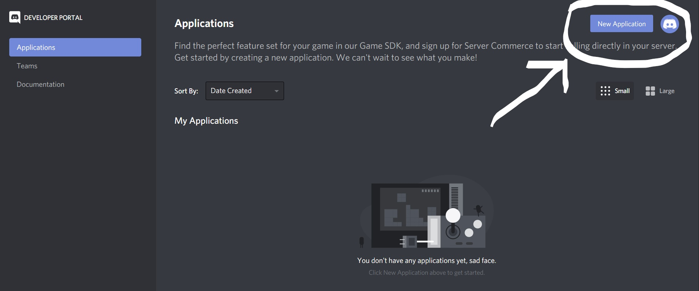
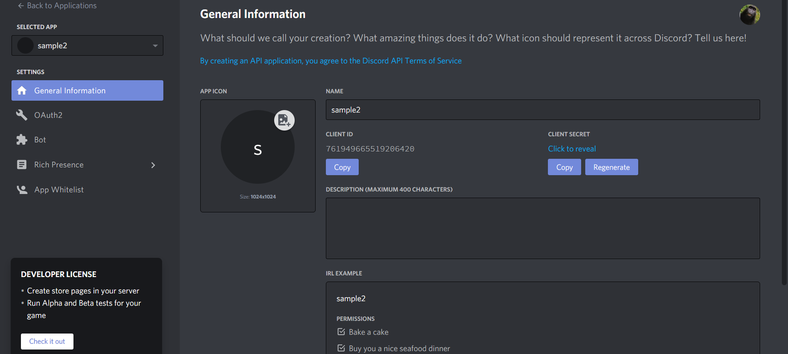
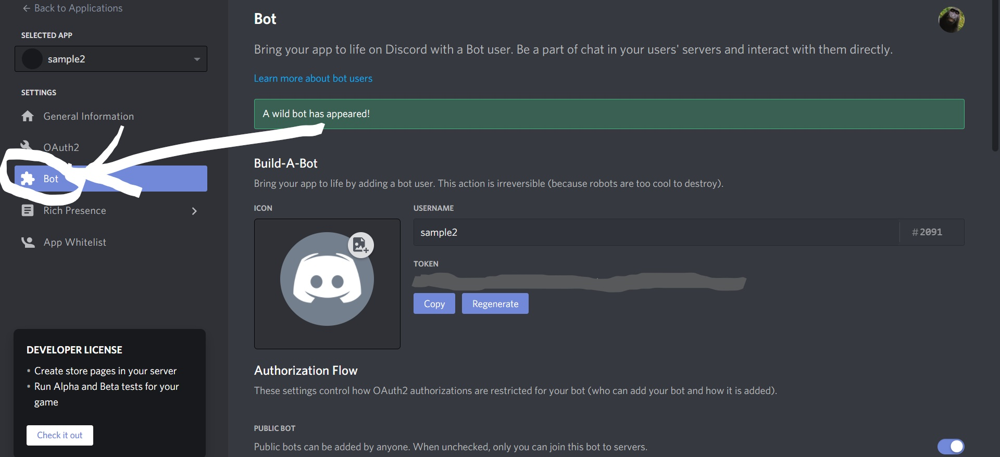

---

title: Creating a discord bot using discordJs

date: "2020-10-03"

coverImage: "discord.png"

author: "Sanidhya Purohit"


---

# Steps on how to create a discord bot using discordJs

A quick guide which will help you to create a very basic discord bot.


# Prerequisites 

+ Should know about Javascript (basic concepts)
+ Node.js installed 
+ Discord account 

# Step 1:- Installing Node.js and discord.js 

+ ## Installing Node.js
 
First of all you'll need to install Node.js. Go to [Node.js](https://nodejs.org/en/)  website and download it for the respective OS.

+ ## Installing Discord.js
  
After installing node.js you need to install discord.js
To install discord.js, simply run the 

```npm install discord.js```

# Setting your bot 
 
After you finish setting up the environment you are ready to proceed further

## step2:- Create a bot
<hr>

Quick steps:-

+ Open up the [Discord](https://discord.com/) website and [login](https://discord.com/login).
+ Click on the Developer Portal link( In "Developers" drop-down menu and click on the Developer Portal link) and Click on the "New Application" button.
+ Enter a name and then confirm the pop-up window by clicking the "Create" button.
  





## step3:- Add your bot to the server
<hr>

A special invite Link is used to invite your bot to the server.
The above mentioned invite link is created by using your bot application's client ID.


Example of the invite link:

`https://discord.com/oauth2/authorize?client_id=123456786962344578&scope=bot`

The structure of the url is quite simple:

You'll need to replace the client_id=... part with your client's ID in order to create a valid invite link.
scope=bot-> to add this application as a Discord bot.


## step4:- Creating and using your own invite link
<hr>

**Note:- you'll need the "Manage Server" permission to do this step**

To find your app's ID:

+ Go to My Apps page under the "Applications" section 
  
+ click on your bot application.

+ Insert your app's ID into the link template and then access it in your browser. 

+ Choose the server you want to add it to and click "Authorize". 
  
Your bot is successfully added to the server.

Getting your bot up & running


## step5:- bot file
<hr>

Open up your code editor and create a `.js` file, you can name it whatever you want but the best practise is to go with `index.js`


## step6:-Logging in to Discord
<hr>

 Just copy the code below and paste it into your file to check if the bot is working.

``` const Dis = require('discord.js');
const client = new Dis.Client();

client.once('ready', () => {
	console.log('Hello World!');
});

client.login('your-token');
``` 

Go to the console window, type `node your-file-name.js`, and press enter. If you see the `Hello World!` message, you're good to go! 
To stop the process in the console window press `Ctrl + C`

## code explained
<hr>

code with comments, so it's easier to understand what's going on.

``` // require the discord.js module
const Dis = require('discord.js');

// create a new Discord client
const client = new Dis.Client();

// when the client is ready, run this code
// this event will only trigger one time after logging in
client.once('ready', () => {
	console.log('Ready!');
});

// login to Discord with your app's token
client.login('your-token-goes-here');
``` 


## step7:- Receiving a message
<hr>

 Go to your file and enter the following code above the `client.login()` line.

``` client.on('message', message => {
	console.log(message.content);
});
``` 

## step8:- Replying to messages
<hr>

 Here we are trying to reply the message that we receive for that  line from your  replace `console.log(message.content)`  with the following:

``` if (message.content === '>hi') {
	// send back "hello human" to the channel the message was sent in
	message.channel.send('hello human');
} 
``` 

Restart your bot and then send `>hi` to a channel your bot has access to. 


# End


It is just a handy way to create a very basic Discord bot, I hope you understood the basics of discordJs and discord bot
 
Also for detailed info about creating a bot please visit **[discordJs](https://discordjs.guide/#before-you-begin)**


