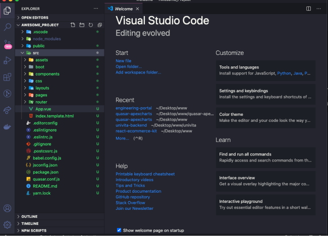
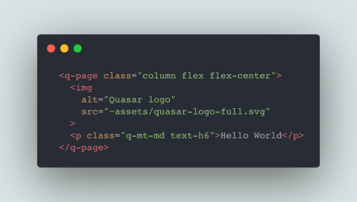
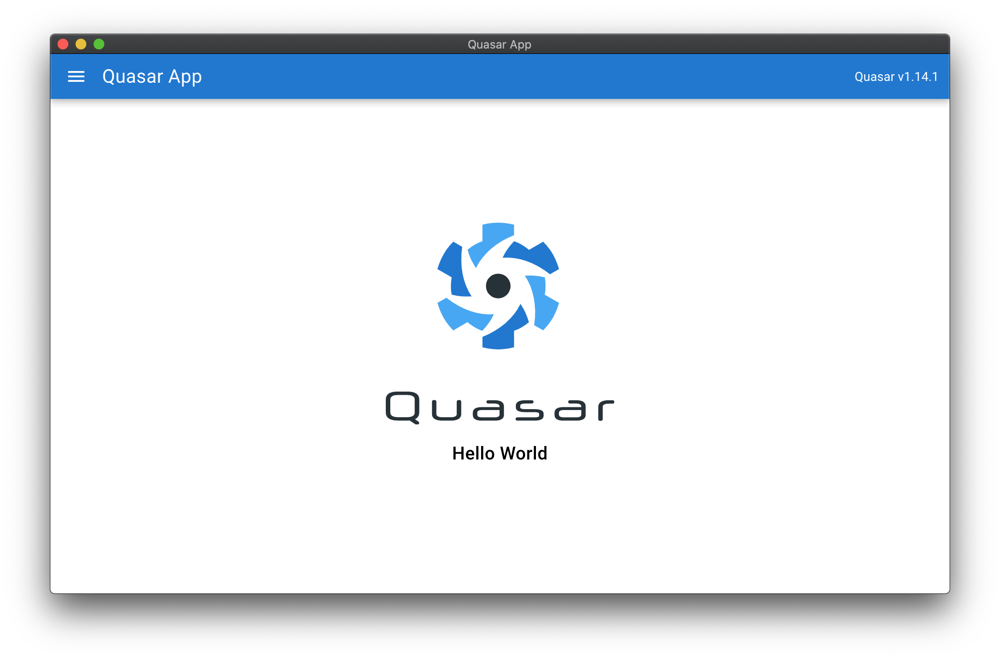
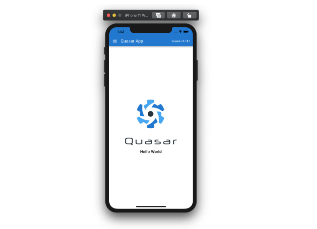

Time Required: 15 minutes.  
Technologies: Quasar Framework, VueJS, Javascript.

Prerequisites:

- Node.js >=10
- VueJS

Install quasar/CLI, look at the&nbsp;
<a href="https://quasar.dev/quasar-cli/installation" target="_blank"> Quasar Site</a> and run

```
$ yarn global add @quasar/cli

# or

$ npm install -g @quasar/cli
```

## Let's get started

To create or project we'll run the following command

```
$ quasar create awesome-project && cd awesome-project
```

Now our project is created, we have the following structure, run **\$ quasar dev** to start our project

<center>
<br />



</center>

<br />

Let's open pages/Index.vue file and add a `<p>` tag with 'Hello World', add quasar classes

<br />

```
  Column: Flex direction column

  q-mt-md: Margin top medium (16px)

  text-h6: Text h6 size
```

<center>

<br />



</center>
<br />

## Build to Electron

- First we'll add electron mode to our APP. Run

```
$ quasar mode add electron
```

- Now we run

```
$ quasar dev -m electron
```

That's it, very easy. To build in production run

```
$ quasar build -m electron
```

<center>



</center>

## Build to Mobile

- First we add capacitor mode to our APP. Run

```
$ quasar mode add capacitor
```

- Now we run

```
$  quasar dev -m capacitor -T [ios|android]
```

Quasar is so simple, right?. To build in production run

```
$ $ quasar build -m capacitor -T [ios|android]
```

<center>



</center>

## Voilà! Now you are ready to develop your own apps using quasar!
