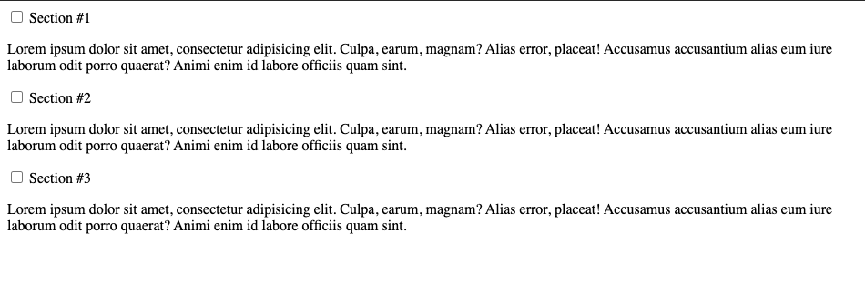
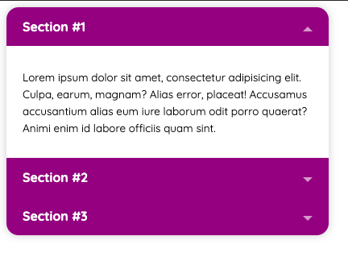

Hello everybody, in this article, we are going to learn how to make a beautiful accordion with HTML and CSS only! Yes! You heard that right, just plain HTML and CSS with no Javascript at all!

### Let's Begin

Firstly, let's make some markup with HTML. We are going to create a ```div``` and give it a class of ```accordion``` like so:
```html
<div class="accordion">

</div>
```
Next, inside the accordion div, we will create another ```div```, this time without a class.
```html
<div class="accordion">
  <div>
  
  </div>
</div>
```
Next up, we will create a checkbox or a radio button. We are creating a checkbox or a radio button so that we can make their checked states open or close the accordion. So if you want to be able to open all accordions at the same time, you will use checkbox, otherwise you will use radio buttons. But in this article, I've chosen to use checkbox.
We will give the checkbox an ```id``` of ```section1``` and a ```class``` of ```accordion__input```.
```html
<div class="accordion">
  <div>
    <input type="checkbox" id="section1" class="accordion__input">
  </div>
</div>
```
Under the checkbox, we are going to create a ```label``` for the checkbox. This label will later on become the head of the accordion tab.
```html
<div class="accordion">
  <div>
    <input type="checkbox" id="section1" class="accordion__input">
    <label for="section1" class="accordion__label">Section #1</label>
  </div>
</div>
```
Next, we will create a new ```div``` and give it a ```class``` of ```accordion__content``` because it will hold the content of the accordion. In this example, we will make the content of the accordion a paragraph.
```html
<div class="accordion">
  <div>
    <input type="checkbox" id="section1" class="accordion__input">
    <label for="section1" class="accordion__label">Section #1</label>
    <div class="accordion__content">
      <p>
        Lorem ipsum dolor sit amet, consectetur adipisicing elit. Culpa, earum, magnam? Alias error, placeat! Accusamus accusantium alias eum iure laborum odit porro quaerat? Animi enim id labore officiis quam sint.
      </p>
    </div>
  </div>
</div>
```
Repeat the ```div``` without a class for as many as you want depending on how many accordion tabs you want. In this example, we will use only three of them.
```html
<div class="accordion">
  <div>
    <input type="checkbox" id="section1" class="accordion__input">
    <label for="section1" class="accordion__label">Section #1</label>
    <div class="accordion__content">
      <p>
        Lorem ipsum dolor sit amet, consectetur adipisicing elit. Culpa, earum, magnam? Alias error, placeat! Accusamus accusantium alias eum iure laborum odit porro quaerat? Animi enim id labore officiis quam sint.
      </p>
    </div>
  </div>
  <div>
    <input type="checkbox" id="section1" class="accordion__input">
    <label for="section1" class="accordion__label">Section #1</label>
    <div class="accordion__content">
      <p>
        Lorem ipsum dolor sit amet, consectetur adipisicing elit. Culpa, earum, magnam? Alias error, placeat! Accusamus accusantium alias eum iure laborum odit porro quaerat? Animi enim id labore officiis quam sint.
      </p>
    </div>
  </div>
  <div>
    <input type="checkbox" id="section1" class="accordion__input">
    <label for="section1" class="accordion__label">Section #1</label>
    <div class="accordion__content">
      <p>
        Lorem ipsum dolor sit amet, consectetur adipisicing elit. Culpa, earum, magnam? Alias error, placeat! Accusamus accusantium alias eum iure laborum odit porro quaerat? Animi enim id labore officiis quam sint.
      </p>
    </div>
  </div>
</div>
```
That's it with the HTMl, and it should be looking like this:


Now let's start playing with the CSS part.
We'll start by styling the ```div``` with the class of ```accordion```.
We will give it a:
  - ```max-width``` to set a size for it.
  - ```box-shadow``` to give it a beautiful shadow.
  - ```border-radius``` to give it nice rounded corners.
  - ```overflow``` to hide the content of the accordion tab when it is closed.
  - ```background-color``` to set the color of the accordion tabs.

So now we have: 
```css
.accordion{
    max-width: 400px;
    box-shadow: 0 0 10px rgba(0, 0, 0, 0.2);
    border-radius: 15px;
    overflow: hidden;
    background-color: purple;
}
```
Now we will set some padding to the label and content so that there is some space between them and their borders.
```css
.accordion__label, .accordion__content{
    padding: 14px 20px;
}
```
Next, we will style the accordion label and set the following properties:
  - ```display: block``` to make the label take the full width of the accordion.
  - ```color: white``` to make the text of the label white.
  - ```font-weight: bold``` to make the text of the label bold.
  - ```cursor: pointer``` to make the cursor pointer when it is hovered on the label. This is important to make the user know the label can be clicked.
  - ```transition: background-color 0.1s```
  - ```position: relative```
So we it looks like this when combined:
```css
.accordion__label{
    display: block;
    color: white;
    font-weight: bold;
    cursor: pointer;
    position: relative;
    transition: background-color 0.1s;
}
```
Now, we will make the color of the label darker when the user hovers on it. This is also just to make the user know that he/she has placed the cursor on something that can be clicked.
```css
.accordion__label:hover{
    background-color: rgba(0, 0, 0, 0.1);
}
```
Next up, we will style the content of the accordion and set the following properties:
  - ```background: white``` to make the background color of the content of the accordion white.
  - ```line-height: 1.6``` to increase the the line height of the text in the content.
  - ```font-size: 0.85em``` to set the font size of the text of the content.
  - ```display: none``` this is the most important property here, so that we can hide the content of the accordion tab by default until the label is clicked.
So when we put it together, we have this:
```css
.accordion__content{
    background: white;
    line-height: 1.6;
    font-size: 0.85em;
    display: none;
}
```
Now we have to hide the checkbox from showing. To do that, we set the ```display``` property of it to ```none```
```css
.accordion__input{
    display: none;
}
```
Next thing to do is to show the content of the accordion tab if the label is clicked. To do this, we have to set the ```display``` property of it to ```block``` when the label is clicked. We are able to know that the label is clicked by using the check-state of the checkbox that we hid earlier.
```css
.accordion__input:checked ~ .accordion__content{
    display: block;
}
```
Hurrayy🎉, we now have a very beautiful and functioning accordion that looks like this

}
