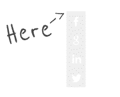

What’s up, my neighbor? This is your boy, Darryl Tec. I am here to teach you how to create a responsive and awesomely scalable icon using CSS sprites. On top of that, we will also add a fallback for browsers that do not support SVG files.

### Quick FAQ.

SVG - Stands for Scalable Vector Graphics. In short it scales perfectly and you don’t need to worry about having a pixelated image anymore.

Sprite - Google said it’s a fairy. This is not a fairy. It’s just a bunch of different icons in 1 image. Use it as background image and shift the positioning to show 1 icon. This saves you a lot of loading time. Because instead of loading, say 10 images, you’re loading just 1.

CSS - Cascading Style Sheet. If you don’t know what this is, I have bad news for ya.

### Let's Begin


First things first, we need a sprite image that consists four icons – or more, it’s up to you. Luckily, I have one in my digital pocket.  

We’re just going to use a normal PNG file at first and change it later. Make sure it has a transparent background.

Now, let’s make their placeholder. The icons you see above is using a grid of 32px by 32px and it’s lining up vertically. I made it like that so it’s easier to find anything, you’ll see why later.

  ```js
  </pre>
    <div class="frame"></div>
  <pre>
  ```

Now we need to style them.

```css
.icon {
  width: 32px;
  height: 32px;
  background: #eee;
  float: left;
  background-image: url("[ put your image here ]");
  background-size: 100% auto;
  /*extra fluff*/
  margin: 10px;
  border-radius: 5px;
}

```

  
**Explanation**

Looks simple right? But the one thing that’s very important here is the background-size, which makes our sprite responsive. When you put 100% as the value, it will stretch the image depending on what width and height you have. So, be very careful when putting a value on both X and Y axis, because this will distort the image. To stop it from distorting, you should only put a value on one axis and put the other on ‘auto’ so the image scales proportionally.

If you look at the image I provided, there’s only one icon on X-axis. That means we can just say 100% on X and auto on Y.

So, we get background-size: 100% auto.

Cool, right? No crazy percentage. Your icon should look like this:


It’s time to map those icons properly. Facebook is not a problem because it’s first on the list. But for defaults sake, let’s add a code for it.

 ```CSS
  .icon.facebook {
    background-position: 0 0;
    background-color: #3b5998;
  }
 ```

The positioning of 0 0 will map it to the top left of the element.



For the background-color, you can get almost all of the official social icon colors in hex [here](/blog/social-media-colors-hex/).

How about the rest? Well, there’s a simple formula for that.

### The raw CSS way

Since we’re making this responsive, we need to use percentage. We need to get the height of the image via percentage. Remember what I said earlier about x and y and scaling proportionally? Since the icons are lined up vertically, we need to get the Y-axis, which is the height. The easy way to do that is to just use 100% and never touch x axis again.

Now, we have to get the position of the icons. Let’s start by counting the icons starting with 0 (zero).

0 = Facebook

1 = Google

2 = LinkedIn

3 = Twitter

Facebook isn’t really a problem because we already know where it is. So, let’s exclude it from the count. That gives us 3 icons. We can now use those numbers to get the icon position.

imageHeight = 100%  
iconCount = 3  
iconPosition = \[1,  2 or 3\]  
We need to go downwards on the sprite. That means it’s negative.

\-imageHeight / iconCount \* iconPosition  
\-100% / 3 / 1 = 33.33% is Google’s position  
\-100% / 3 / 2 = 66.66% is LinkedIn’s position  
\-100% / 3 / 3 = 99.99% is Twitter’s position  
That gives us this code

```css
.icon.twitter {
  background-position: 0 -33.33%;
  background-color: #55acee;
}
.icon.linkedin {
  background-position: 0 -66.66%;
  background-color: #007bb6
}
.icon.google {
  background-position: 0 -99.99%;
  background-color: #F90101;
}

```

##   The Stylus way

If you use stylus you can just do this:  
Create the mixin

```javascript
getPos(imageHeight, iconCount, iconPosition)
  imageHeight / iconCount * iconPosition
```
  
Then call it.

```javascript
.icon.twitter
  background-position 0 getPos(-100%, 3, 1)
  background-color #55acee
 
.icon.linkedin
  background-position 0 getPos(-100%, 3, 2)
  background-color #007bb6
 
.icon.google
  background-position 0 getPos(-100%, 3, 3)
  background-color #F90101

```
  
By now your icon should look like this.


It’s time to change that PNG background to an SVG background.

and link it to your background image

```css
.icon {
  width: 32px;
  height: 32px;
  background: #eee;
  float: left;
  background-image: url("[ put your PNG image here ]”);
  background-image: linear-gradient(transparent, transparent), url("[ <b>put your SVG image here</b> ]”);
  background-size: 100% auto;
 
/*extra fluff*/
  margin: 10px;
  border-radius: 5px;
}
```  

If you’re wondering why we’re adding 2 background images is because not all browsers support SVG file. The linear-gradient(transparent, transparent) tricks the CSS into falling back to the PNG image if it doesn’t support it.

Now, Rescale your width and height and see the magic of responsive icons.

Aaaaaand then we’re done. That’s how you create a responsive icon.
