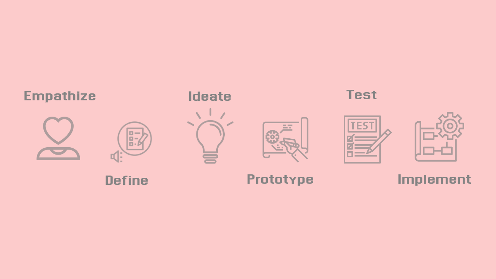

### Overview
Each business relies on a specific target set of users, who has a problem area.

Analysis and further finding out the right solution for the identified problem hence helps businesses to meet their target user’s needs.

If the solution meets the needs completely and resolves the pain area, at the right time, acts as an ointment and proves and builds trust for businesses.

Design Thinking plays an important role to reiterate the understanding of problems, causes, environmental changes leading innovation and experimentation for a competitive advantage.

### How to define a problem for the business problem with DESIGN THINKING

  1. **Empathise** the emotions
  Observation of user needs with past and market trends and economic forecasts. It includes interaction with the target user to hear and see the user’s desire and the real cause within the contextual area.

  2. **Define** the problem - based on
      5 W’s- who, what, where, why, when
      1. Why-What user needs?
      2. What is the pain area of the problem?
      3. When the problem arises?
      4. Who-For whom the problem exists?
      5. Where-What are the driving aspects of the problem which increases the problem impact- like legal compliance?                                                                                                        

  3. **Ideation** - Design Thinking solutions 
      - Research new ways to solve existing problems 
      - Focus on humans, NOT users 
      - Ideation of solutions with collaboration and participation of brainstorming, sketching, etc 
      - Fit best in the existing environment with minimal change

  4. **User Experience** - prototype
    - From the best solutions to prototypes for UI testing
    - Feedback from target users.
    - Rapid change compatibility with changing needs.
    - Competitors collaborate in the same environment.

  5.**Testing of design and solution**
  
   Match the solution ideas demonstrated via designs to target users, to make sure every detail of the solution chosen matches the requirements and observations made.

  6. **Evaluate** and reiterate the solution for measuring user needs.

### New Design Thinkings VS Traditional Business Thinking

| Criteria | Design Thinking | Traditional Problem Solving | 
|---|---|---|
| **Nature** | Visual Thinking Process | Old traditional documented process | 
| **Initial Stage** | Observation, based on Emotional intelligence | Problem Defining, based on intelligence |
| **Based Depends on**| Experiment, Innovation based on user needs| Based on founders vision| 
| **Focussed On**| What People needs| Business model|
| **User means**| Real Humans| Customers| 
| **Solution Proposal**| Restricts proposing solutions within the problem definition stage.| Includes proposing solutions while problem understanding | 
|**Future Scope**| Visualize the future of business organization via innovation thinking, via releasing products before actual development.| Rework and re-iteration with improvement are supported to reach final product deliverable.|
| **Meaning**| Discovery of what WORKS.So encourages Multiple POSSIBLE answers| Discovery of what is RIGHT = CORRECT solution.| 
| **Approach**| Based on storytelling following a bottom-up approach| Based on facts and figures, based on top-down approach|
| **Testing with real users**| User is unaware that he is in test mode and experiences the service he expects to perceive. Example- ability to customize furniture without buying.| User is well aware that he is using test services and does not expect much.| 
| **Phase** | There is no planning, instead there exists building of Prototypes and presenting fast to get feedback without delaying the GO-TO market.| Follows conventions process of THINKING and PLANNING| 
|**Failure**| Failure Driven- learn from failure and read to fail anytime as the cost associated is low. FAIL EARLY- FAIL FAST| Failure Restrictor- Tries to avoid failure, to avoid huge money loss involved. | 

### How is it useful for business Organizations?

  1. Real-Time- Feedback from the end-user is instant and does not take months to develop.

  2. Low Cost- Just involves a small team, rather than a big team, processes, roles, etc.

  3. Prototype instead of Planning- providing better visual experience to users instead of lengthy documents to analyze a viable solution.

  4. Leads to EXPERIMENTS, INNOVATIONS of -
      -Experience
      -Emotions
      -Processes 
      -Features or functionality

### Successful Case Studies

1. **Pepsico design-led problem-solving**
    For female user experience, it released a new line of Doritos in china in a stack of the tray and packaged in a canister, instead of a snack bag, so that women can use it opening the drawer and push it back when done, as they don't like other to notice them munching.
    
    Ref:https://hbr.org/2015/09/how-indra-nooyi-turned-design-thinking-into-strategy?referral=03759&cm_vc=rr_item_page.bottom

2. **Samsung’s design-led innovation**
    It realized the need of Korean and Japanese business users who had common practice to note or schedule events or important points in small pocket-sized notebooks, This led to an innovative idea where the user was observed and the need was created and hence realized to users.
    Samsung launched a successful Galaxy Note series. with the innovation of “smart diary” a 5.5-inch interface with a stylus pen to pair.
    
    Ref: https://hbr.org/2015/09/how-samsung-became-a-design-powerhouse 

3. **Samsung design concept used for experimenting**
    Where it experimented with TV units, realizing the fact that users are spending more time on furniture, so TV ‘s are supposed to be a bit more attractive. This led to the radical change for the speaker’s positioning at the TV sets to be hidden at the bottom instead of the traditional side panes. This has experimented in the European market first and after a successful adaption, Samsung experimented more with visual appearance and by the time it was building the product, it had already sold a million units.
    
    Ref: https://hbr.org/2015/09/how-samsung-became-a-design-powerhouse?registration=success

4. **IBM**  - It got an ROI of 301 %, by investing in Design Thinking services which can be experienced at https://www.ibm.com/design/thinking/

5. **Stanford Hospital** for improvement
    It worked on improving the experience of a patient within the emergency room and for staff to serve patients a better way
    
    Ref: https://think360studio.com/blog/what-is-design-thinking-and-design-thinking-process

### Last but not least
It is very important to drive and extract meaningful images out of the observations from real humans. 
This requires an influencing processor who can drive the team to opt for an approach for DESIGN THINKING. Here even the market leaders are at risk to sustain with innovations and experiments involved with Early FAILURES.