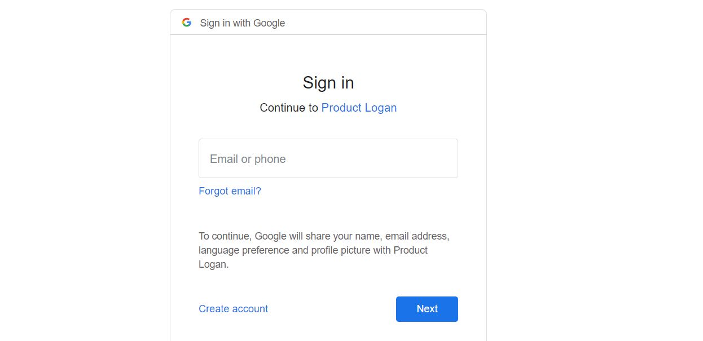
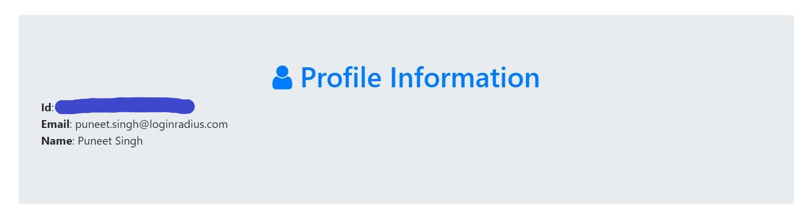

In this blog, we’ll be implementing authentication via Google in a Node.js web application. For this, we’ll be using [Passport.js](http://www.passportjs.org/), an authentication package for Node.js.

## Before You Get Started
This tutorial assumes you have:

*   Basic knowledge of HTML/CSS
*   A good understanding of JavaScript and Node.js
*   Latest Node.js version installed on your system

### Step 1: Create a Google client ID and client secret

We can create a  client ID and client secret using its [Google API Console](https://console.developers.google.com/). You need to follow below steps once you open Google API Console

- From the project drop-down, select an existing project, or create a new one by selecting Create a new project
- In the sidebar under "APIs & Services", select Credentials
- In the Credentials tab, select the Create credentials drop-down list, and choose OAuth client ID.
- Under Application type, select Web application.
- In Authorized redirect URI use http://localhost:3000/auth/google/callback
- Press the Create button and copy the generated client ID and client secret

**Note:** If Google doesn't support http://localhost:3000, then use http://127.0.0.1:3000

### Step 2: Initialize a node.js project with all the dependencies

First in an empty folder run the below command

```
npm init
```
It essentially just creates the package.json file with all the basic information you will provide. after that, we will install all the dependencies needed in our project 


- **express:**  Node.js framework to create a server and accept requests
- **ejs:**  To render HTML pages for login and profile
- **express-session:**  To save information from google in session and use it on the success page
- **passport:** Social Authentication package for Node.js
- **passport-google-oauth:**  Google authentication module by Passport.js

```
npm install express ejs express-session passport passport-google-oauth --save
```


### Step 3: Writing express server code to accept web requests

Create a file **index.js** in the root folder of your app and add the following code: 


```javascript
// index.js

/*  EXPRESS */

const express = require('express');
const app = express();
const session = require('express-session');

app.set('view engine', 'ejs');

app.use(session({
  resave: false,
  saveUninitialized: true,
  secret: 'SECRET' 
}));

app.get('/', function(req, res) {
  res.render('pages/auth');
});

const port = process.env.PORT || 3000;
app.listen(port , () => console.log('App listening on port ' + port));
```

Our web server has been set up, now we will add the code related to the passport at the bottom of the **index.js** file:


```javascript
// index.js

/*  PASSPORT SETUP  */

const passport = require('passport');
var userProfile;

app.use(passport.initialize());
app.use(passport.session());

app.set('view engine', 'ejs');

app.get('/success', (req, res) => res.send(userProfile));
app.get('/error', (req, res) => res.send("error logging in"));

passport.serializeUser(function(user, cb) {
  cb(null, user);
});

passport.deserializeUser(function(obj, cb) {
  cb(null, obj);
});
```


Now, at last, we are ready to implement Google Authentication in our app, Add the following code at the bottom of your **index.js** file, use your client Id and Secret instead of placeholders:


```javascript
// index.js

/*  Google AUTH  */
 
const GoogleStrategy = require('passport-google-oauth').OAuth2Strategy;
const GOOGLE_CLIENT_ID = 'our-google-client-id';
const GOOGLE_CLIENT_SECRET = 'our-google-client-secret';
passport.use(new GoogleStrategy({
    clientID: GOOGLE_CLIENT_ID,
    clientSecret: GOOGLE_CLIENT_SECRET,
    callbackURL: "http://localhost:3000/auth/google/callback"
  },
  function(accessToken, refreshToken, profile, done) {
      userProfile=profile;
      return done(null, userProfile);
  }
));
 
app.get('/auth/google', 
  passport.authenticate('google', { scope : ['profile', 'email'] }));
 
app.get('/auth/google/callback', 
  passport.authenticate('google', { failureRedirect: '/error' }),
  function(req, res) {
    // Successful authentication, redirect success.
    res.redirect('/success');
  });

```
**Note:** The callback URL should be the same as used in the google app configuration.

### Step 4: Creating a Login and Profile page

Create an ejs file under path **views/pages/auth.js**, it will render into a nice looking social login page:

```html
<!-- views/pages/auth.ejs -->
<!doctype html>
<html>
<head>
    <title>Google SignIn</title>
    <link rel="stylesheet" href="https://stackpath.bootstrapcdn.com/bootstrap/4.4.1/css/bootstrap.min.css">
    <link rel="stylesheet" href="https://stackpath.bootstrapcdn.com/font-awesome/4.7.0/css/font-awesome.min.css">
    <style>
        body        { padding-top:70px; }
    </style>
</head>
<body>
<div class="container">
    <div class="jumbotron text-center text-primary">
        <h1><span class="fa fa-lock"></span> Social Authentication</h1>
        <p>Login or Register with:</p>
        <a href="/auth/google" class="btn btn-danger"><span class="fa fa-google"></span> SignIn with Google</a>
    </div>
</div>
</body>
</html> 
```

After it we wll create an ejs file under path **views/pages/success.js**, it will be used to show the user profile information we will get after authenticated by google

```html
<!-- views/success.ejs -->
<!doctype html>
<html>
  <head>
    <title>Google SignIn</title>
    <link rel="stylesheet" href="https://stackpath.bootstrapcdn.com/bootstrap/4.4.1/css/bootstrap.min.css"> <!-- load bootstrap css -->
    <link rel="stylesheet" href="https://stackpath.bootstrapcdn.com/font-awesome/4.7.0/css/font-awesome.min.css"> <!-- load fontawesome -->
      <style>
          body        { padding-top:70px; }
      </style>
  </head>
  <body>
    <div class="container">
      <div class="jumbotron">
          <h1 class="text-primary  text-center"><span class="fa fa-user"></span> Profile Information</h1>
          <div class="row">
            <div class="col-sm-6">
                <div class="well">
                        <p>
                            <strong>Id</strong>: <%= user.id %><br>
                            <strong>Email</strong>: <%= user.emails[0].value %><br>
                            <strong>Name</strong>: <%= user.displayName %>
                        </p>
                </div>
            </div>
        </div>
      </div>
    </div>
  </body>
</html> 
```
**Note:** Here we are also using bootstrap and font-awesome css to make our web pages look good. 


We have finished building our social login page, let's run the application by below command


```js
node index.js
```

Once our server is running, we can see our social login page on http://localhost:3000/


We need to click on **SignIn with Google button**, which will redirect us to the google login page.



After login with our google credentials, it will redirect back to our application and on the success page, we can see the details of the logged-in user and can save this detail in a database for future use also.



As we have seen it is fairly easy to build a google social authentication system with Node.js and Passport.js, You can found the complete code used in this tutorial on our [Github Repo](https://github.com/LoginRadius/engineering-blog-samples/tree/master/NodeJs/GoogleAuthenticationPassport)