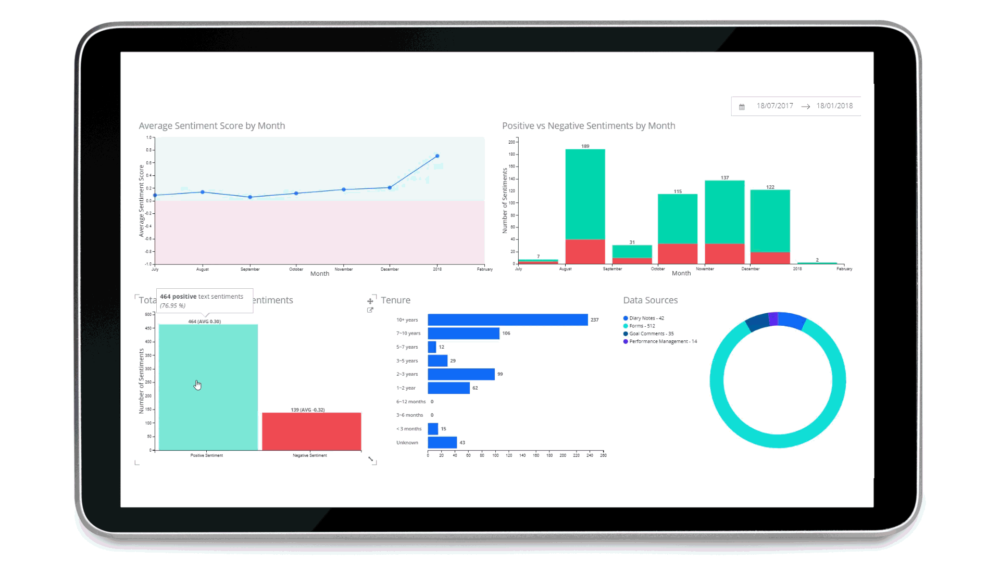
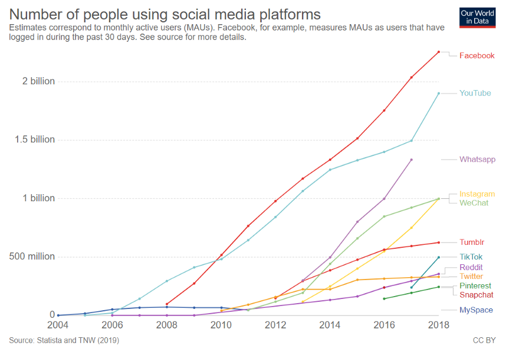
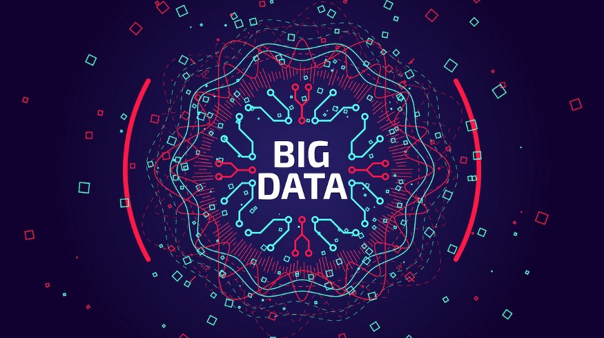
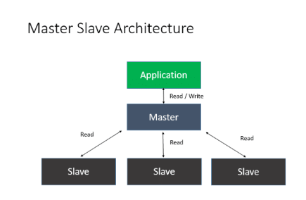

# Handling the Cheapest Fuel- “Data”

## You can have data without information, but you cannot have information without data

 **~Daniel Keys Moran**
 

## Who runs the World?
**Simple Question! Isn’t it?**

**Answer- Of course, we humans, “People” run the world.**

The correct answer would be Data. Precisely, the Information we gain from data. In this digital world, the one most common thing we all do is
“We all generate data”. Whenever we do something digitally, we generate data. While listening to a song, watching a movie, playing a game, chatting with friends, reading a comic blah blah blah. Everything generates data.
## Can you imagine?

**7.8 Billion** people currently live on Earth, and almost **4.57 Billion** people are active internet users, encompassing 59 percent of the global population.
This is the sixth edition of DOMO’s report, and according to their research:
**“Over 2.5 quintillion bytes of data are created every single day, and it’s only going to grow from there. By 2020, it’s estimated that 1.7MB of data will be created every second for every person on earth.”**
As 1 Exabyte = 1 quintillion bytes, so 2.5 Exabytes ( 2.5 * 10¹⁸ bytes) of data is generated per day.

Big companies like Google, Amazon, Netflix, Instagram, Facebook, Twitter, and many more are generating tons of data daily.

## Some Insights into their data generation-
## Google: 40,000 Google Web Searches Per Second
More than 3.7 billion humans now have regular access to and use the internet. That results in about 40,000 web searches per second — on Google alone.

## Facebook: 500 Terabytes Per Day
In 2012, Facebook’s system was generating 2.5 billion pieces of content and more than 500 terabytes of data per day.

## Twitter: 12 Terabytes Per Day
One wouldn’t think that 140-character messages comprise large stores of data, but it turns out that the Twitter community generates more than 12 terabytes of data per day.

## General Stats: Per Minute Ratings
Here are some of the per-minute ratings for various social networks:

**Snapchat:** Over 527,760 photos shared by users

**LinkedIn:** Over 120 professionals join the network

**YouTube:** 4,146,600 videos watched

**Twitter:** 456,000 tweets sent or created

**Instagram:** 46,740 photos uploaded

**Netflix:** 69,444 hours of video watched

**Giphy:** 694,444 GIFs served

**Tumblr:** 74,220 posts published

**Skype:** 154,200 calls made by users

These companies use this data to uncover the hidden patterns, correlations, and also to give insights so as to make proper business decisions. They analyze data for Customer Acquisition and Retention and try to personalize their products for their customers to establish a solid customer base.

As of August 2020, desktop hard disk drives typically had a capacity of 1 to 8 terabytes, with the largest-capacity drives reaching 20 terabytes (single-disk drives, “dual” drives are available up to 24 TB).

## Another Question- How they do it?
If the capacity of storage devices is much lesser than the data generated per day by such companies, how they manage it. How they process such a large amount of data without storing it anywhere? How Google search gives results in just a few seconds after processing the data stored from years? Can we store data in a storage device whose volume exceeds the capacity of the hardware?

## Problem:- Big Data
All these problems combined together called Big Data. Below are some subparts of the Big Data problem-
1) Firstly, the **volume of data** is too large. Even if we build storage devices of huge capacity, we can’t cope up with the increasing data per day.

2) Secondly, the **cost of manufacturing**. Even if we manufacture large size storage, it is not possible to afford their manufacturing prices even for high-profit organizations. So, What are the solutions for low- budget companies? How can they manage data?

3) Thirdly, **Velocity of data transfer(I/O Operations)**. If we ignore the above limitations, the next problem posed is the time taken by Processing units to process this data. Because of the huge volume of data stored in large-capacity storage devices, data transfer is time-consuming.

## Solution:-

Big Data can be taken as technology or field that treats ways to analyze, systematically extract information from, or otherwise deal with data sets that are too large or complex to be dealt with by traditional data processing.
One of the concepts that solve the above problem is Distributed Storage.

**Distributed Storage Cluster-**

Distributed storage is an attempt to offer the advantages of centralized storage with the scalability and cost base of local storage. A distributed object store is made up of many individual object stores, normally consisting of one or a small number of physical disks. These object stores run on commodity server hardware, which might be the compute nodes or might be separate servers configured solely for providing storage services. As such, the hardware is relatively inexpensive. The disk of each virtual machine is broken up into a large number of small segments, typically a few megabytes in size each, and each segment is stored several times (often three) on different object stores. Each copy of each segment is called a replica. The team of master and slave nodes working together for one purpose called a cluster.

One of the Topologies or the architecture used for implementing a Distributed storage system is **Master-slave architecture**.
Master-slave architecture- Master-slave is a model of asymmetric communication or control where one device(the “master”) connected to one or more other devices(the “slaves”) are connected using a protocol(Network), where the slave nodes/devices can contribute a part/whole of their storage devices to the master node, like this centralized master node can store data exceeding its local storage limit.

The slave nodes can be commodity hardware/device that need not be expensive and high functioning.
As the data is split and stored in(and loaded from) other devices/nodes, the I/O operations (data transfer) can be performed parallelly on all the devices. Thus, reducing the time consumption by a large factor.

**Hence, distributed storage solves all the problems- Volume, Cost, and Velocity.**

## Apache Hadoop

Distributed storage is just a concept and some companies have launched different software or products that work on this concept which solve the problem of Big Data. One such company is **APACHE and the software APACHE HADOOP**.
The Apache Hadoop software library is a framework that allows for the distributed processing of large data sets across clusters of computers using simple programming models. It is designed to scale up from single servers to thousands of machines, each offering local computation and storage.
