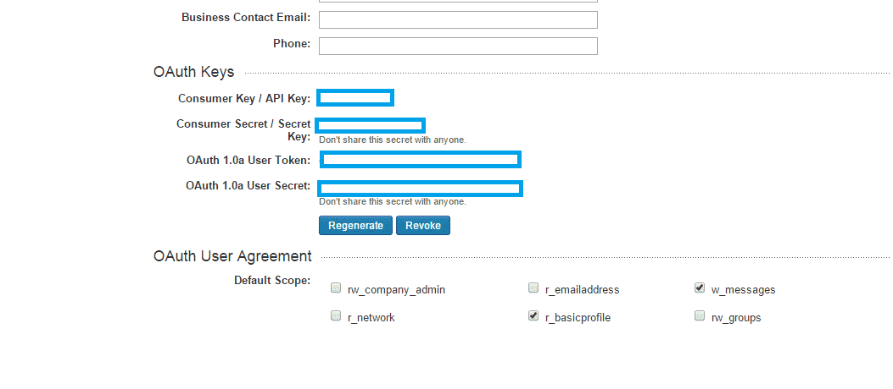

It is important nowadays to allow your user to sign into your website with their social network account, it provides better experience for your user and also lets you obtain more information about your user. The most welcomed social platforms are Facebook, Twitter, LinkedIn and Google. In this article we will cover how to integrate LinkedIn social login authentication into your website.

**Create a LinkedIn App**

Creating an app for the social platform is always the first step no matter which platform you are working with in this case the created app will service the LinkedIn social login. Basically you are creating a gate to let your user go through this gate and access the service, and in this gate you can specify the permissions and the preferences you want to grant to your user. You can refer to the instructions [here](https://docs.loginradius.com/development/social-network/linkedin-app-review) for clear instructions on how to create a LinkedIn social login app.

**Set your App**

After creating the app, you need to set the “JavaScript API domain” field of your app.  In the field, fill in your website URL, I will use http://localhost for this article.


**Implement the script in your html file**

Now you are ready to code! First put this JavaScript code snippet inside your head tag:

```js
<!--<script type="text/javascript" src="http://platform.linkedin.com/in.js">
api_key: your_api_key_goes_here
-->
```

You can find your API key inside your application, the first entry under OAuth Keys “Consumer Key / API Key “.  This script is used to load the LinkedIn script into your website, and it will not display anything on your page, at least not the front-end.



Next you will need to add another script inside your body tag, it is used to actually display the sign in button.

```js
<!--
Hello, ; .
-->
```

If everything has been done correctly, load your page and you will see this lovely button appear on your site.


Want to extend your social systems with additional provider functionality check out this post on [Twitter social login](/blog/integrating-twitter-social-login/ "Integrating Twitter Social Login").
