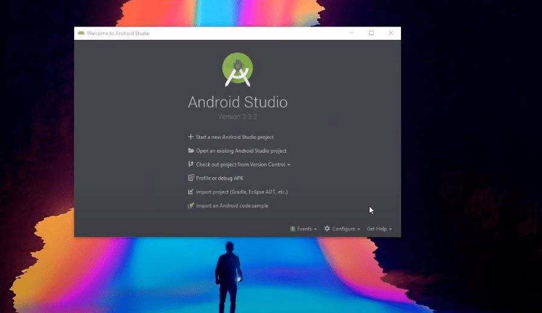
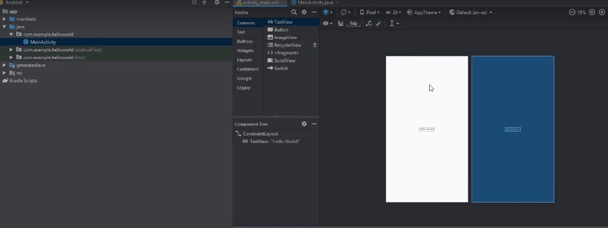

### What is Android Studio?
In recent time, Android became the world’s most popular operating system for various reasons. As an android programmer, I want to share what the android studio is? Android Studio is an IDE for Google Android Development that was launched on 16th May 2013, during Google's  I/O 2013 event. Android studio contains all the Android tools to design, test, debug and profile your application. The Android Studio uses “Gradle” to manage your project which is a Build Automation Tool. To know more, please visit the following link gradle.org

For developing your first app you need to download Android Studio for your preferred platform (Windows®, Mac OS X, or Linux) from the Android developers site. Android Studio has the ability to develop and test your application on either a real device or the emulator.
##### Android Studio has many cool features that can help you to develop your android application like : 
* Powerful code editor with smart editing and code re-factoring.
* Emulator to show your code output in various resolutions including Nexus 4, Nexus 7, Nexus 10 and many other android phones.
* Gradle based build support.
* Maven Support.
* Template-based wizards.
* Dracula Theme Environment to enjoy your coding experience.

You can experience all the cool features by using Android Studio in-hand.
### Let's Build Something!!!
In this article, we're going to build a simple "Hello World" Android Application.
> Requirement: Make sure you have Android Studio installed. If you don't, refer to this [link](https://developer.android.com/studio). It's pretty straightforward.

To create the application, we will follow these steps through the process in a pretty painless manner.

**Step 1. Open your Android Studio after installing and this following screen appears after starting:**

**Step 2. Then Click on "Start a New Android Project" and choose the activity we want the project to be. For me I'm choosing an empty activity.**

**Step 3. Configure your project like changing the name of the project and the desired language the user wants to code with. Android Studio supports two languages i.e. Java and Kotlin. Also the user can choose their desired API like which android version they want to run and then click on finish.**

**Step 4.Wait until your gradle build finishes successfully and find your java and .xml file from folders of the app which is hown in the given image.**

**Step 5. Click onto your .xml file where you can see the initial layout of the file like the given image. You can drag and drop from the items given in the pallete and and change your layout by dragging and dropping.**

**Step 6. At last Run your file by the run button on the top right corner in your emulator configured.**
**And hurray! You created your First Android Application!**

### Closing Thoughts
This article served as an introduction to Android , including just enough hands-on dragging and dropping to hopefully get you excited to explore more of the Android platform. Android has gone from market entrant to dominant force in its relatively brief existence. As we dig deeper we can explore the capabilities of this remarkable platform.

