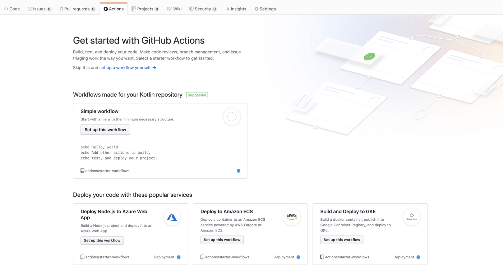
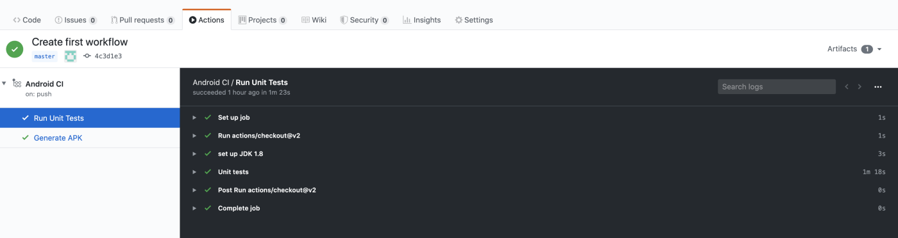
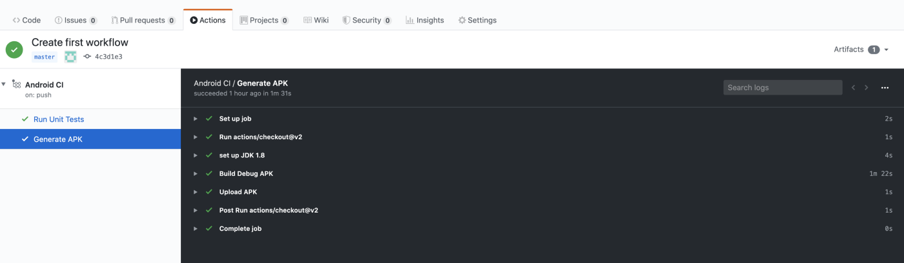
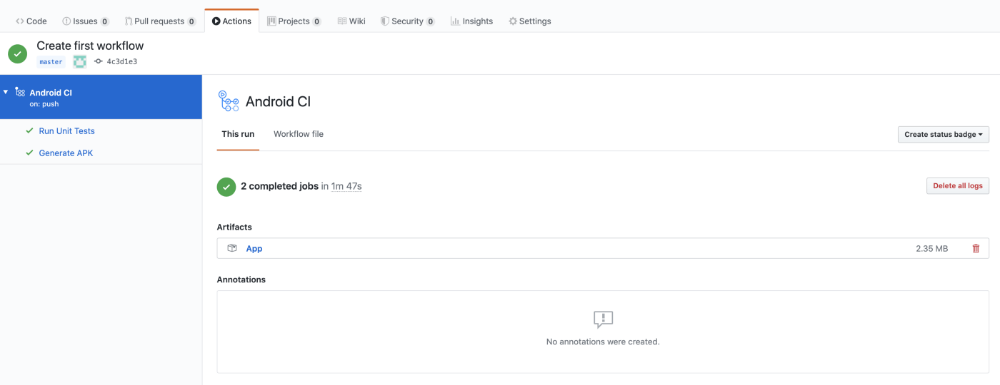

## What is Github Actions?

It is a CI/CD tool to automate the software workflow very easily. There are several tools like Jenkins, CircleCI, TeamCity, TravisCI which help you to automate your workflow, but setting up Github Actions for your repository on Github is extremely easy.
A CI system allows you to run your tests every time you integrate a change in your codebase. Moreover, builds and tests are running in an isolated environment. This will exclude variability introduced by the local developer machine.

Advantages of Github Actions:

1) GitHub actions are very easy to debug. It is simply successive docker runs. It is possible to reproduce the built environment for container-based Travis, but quite difficult. On GitHub actions it’s only a docker assemble docker flee.

2) Every action in a workflow is separated as a matter of course. You can utilize an entirely different registration condition for, similar to, compilation and testing. Travis CI (or other “traditional” CI) would run all actions in the same computing environment. Once more, GitHub actions are a lot simpler to reason about and debug.

3) The main.workflow specification is open-source. The entire thing is wrapped into Docker in any case, so stage lock-in is apparently insignificant.

### Getting Started

When you open your repository on Github, you will now see a new tab called “Actions”. Since we don’t have any action setup as yet the page will look similar to this.



We will start by creating a YAML file that is commonly used for configurations. We can do so either by clicking “setup a workflow yourself” link in the Actions tab (see the above screenshot) or by creating a file in your favorite IDE. We first have to create .github/workflows folder in the root of the repository, and in that folder, we will create a file called first-workflow.yml.

In this file, we will define the actions that we need to perform. We will be defining 3 actions which include running unit tests, building an apk file, and uploading the apk file to Github servers.

Now open first-workflow.yml and paste the following code

# This is a basic workflow to help you get started with Actions

```
name: Android CI

  on:
    push:
      branches: [ master ]
    pull_request:
      branches: [ master ]

jobs:
  test:
    name: Run Unit Tests
    runs-on: ubuntu-latest

    steps:
    - uses: actions/checkout@v2
    - name: set up JDK 1.8
      uses: actions/setup-java@v1
      with:
        java-version: 1.8
    - name: Unit tests
      run: bash ./gradlew test --stacktrace

  build:
    name: Generate APK
    runs-on: ubuntu-latest

    steps:
    - uses: actions/checkout@v2
    - name: set up JDK 1.8
      uses: actions/setup-java@v1
      with:
        java-version: 1.8
    - name: Build Debug APK
      run: bash ./gradlew :app:assembleDebug
              
    - name: Upload APK
      uses: actions/upload-artifact@v2
      with:
        name: App
        path: ${{ github.workspace }}/app/build/outputs/apk/debug/app-debug.apk
```
        
We will cover what each line means one by one.

First, we name our workflow with the following line.

```
name: Android CI
```
We can have multiple workflow files in the .github/workflows directory and each workflow runs in parallel on a different container.

Next, we provide information about when to trigger this workflow by the following lines
```
on:
  push:
    branches: [ master ]
  pull_request:
    branches: [ master ]
    
 ```

Here we define that this workflow should run when either some commit is pushed to the master branch or when some pull request is raised against the master branch.

Now we define jobs. As its name implies jobs will perform some actions. We have defined 2 jobs namely test and build

Let's look at first job: test

```
test:
  name: Run Unit Tests
  runs-on: ubuntu-latest

  steps:
  - uses: actions/checkout@v2
  - name: set up JDK 1.8
    uses: actions/setup-java@v1
    with:
      java-version: 1.8
  - name: Unit tests
    run: bash ./gradlew test --stacktrace
```
We name this job “Run Unit Tests” with the key name:. 

After this, we define in which virtual machine this job will run. We could choose a virtual machine from “ubuntu”, “windows” or “macOS”. Here are have chosen to run this job on the latest version of Ubuntu (a Linux based operating system) with key runs-on.

Now we define the steps to be performed in this job with steps:

    The first step checks out the repository for which we have defined actions.
    In the second step we setup java version 8 to run the unit tests. We do this by actions/setup-java@v1. It is a predefined action which Github server uses to setup java environment for us.
    In the third step, we run the tests with run: action using the gradle wrapper command-line tool.

Now when you commit this file and push it the master branch you could see the workflow starts running and if all of your unit tests pass then you should see something like this.



Your first workflow is up and running.

Now let's look at the second job: build

```
build:
  name: Generate APK
  runs-on: ubuntu-latest

steps:
  - uses: actions/checkout@v2
  - name: set up JDK 1.8
    uses: actions/setup-java@v1
    with:
      java-version: 1.8

  - name: Build Debug APK
    run: bash ./gradlew :app:assembleDebug

  - name: Upload APK
    uses: actions/upload-artifact@v2
    with:
      name: App
      path: ${{ github.workspace }}/app/build/outputs/apk/debug/app-debug.apk
```
It starts with the job name “Generate APK” and we define which virtual machine it runs on just like we did for test job.

Now we define steps:

    Checking out the repository and setting up java is done in the same way we did earlier. We have defined it again as this job will run in a different container parallel to the first one.
    Now we build the APK with run: action using the gradle wrapper command-line tool.
    Next, we upload the APK using predefined action actions/upload-artifact@v2. Here we define the name of the artifact which will be shown on the Artifacts Github page and the path where the APK was generated in the above step.

After you commit this file and push it to the master branch, the workflow will start executing, and after the APK is built and uploaded you would see something like this.



In order to see and download the APK that was generated and uploaded, we can click on the workflow name (In our case it is “Android CI”). We should see the following screen.



We can see the link named “App” under the Artifacts heading. If we click on it then a zip file will be downloaded which contains the APK.

That's it. You have defined CI/CD flow in a very simple way that will make your software development faster and reliable.

I hope you have learned how to set up and use Github Actions.

Happy learning.

### Author Information

## id: Akshita Gupta

bio: Loves Coding eating repeating.

<h3>Connect with me!</h3>
 
[](https://www.linkedin.com/in/akshita-gupta-a4a895187/) [](https://twitter.com/Akshita_archer/)
[](https://medium.com/@akshitagupta15june)   [](https://akshita1506.home.blog) 


