Programming is one of the fields which have a lot of funniest memes and dark jokes available. we have to deal with lots of bugs and errors/issues, which ruins the whole day. So, a little meme break is necessary for a Programmer, which will help in releasing the stress and anxiety of the whole day.

**“If debugging is the process of removing software bugs, then programming must be the process of putting them in – Edsger Dijkstra”**

## Our Developers has picked top 20 memes for the developer community

### 1. Always ready for new!!!

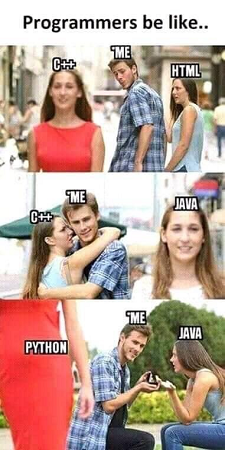 

### 2. Nothing Changes With Time

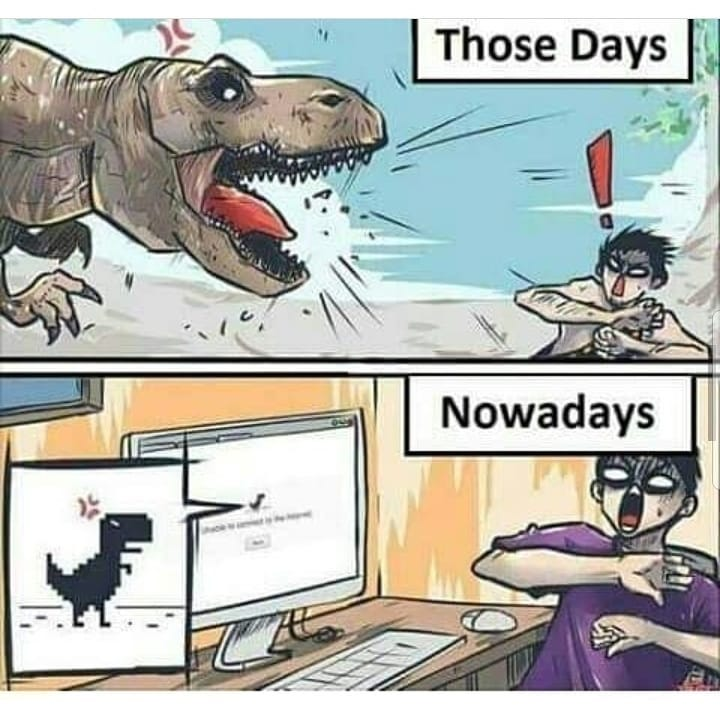

### 3. Heaviest Object In The Universe

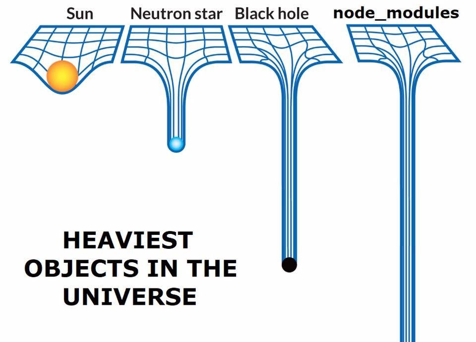

### 4. Perception!!

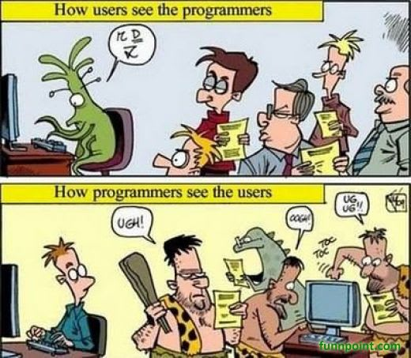

### 5. Maths Always A hurdle !!

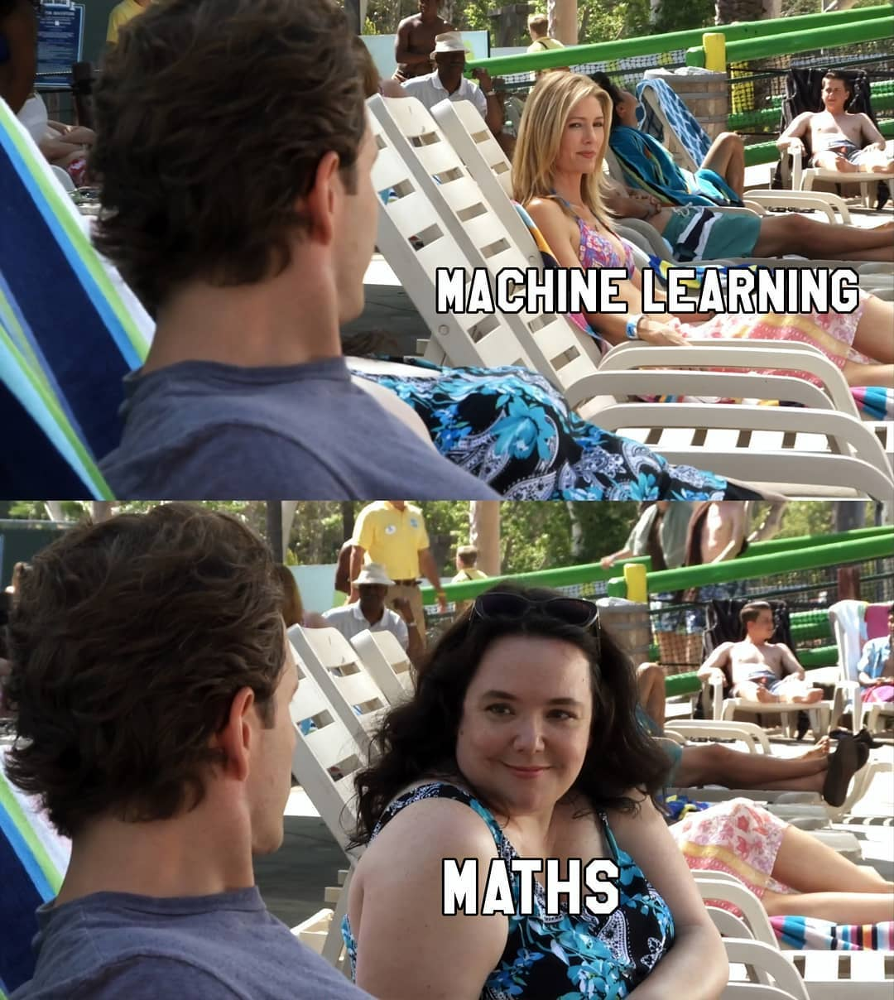

### 6. I had a problem so I thought to use Java

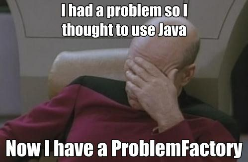

### 7. Avoid Handshakes.

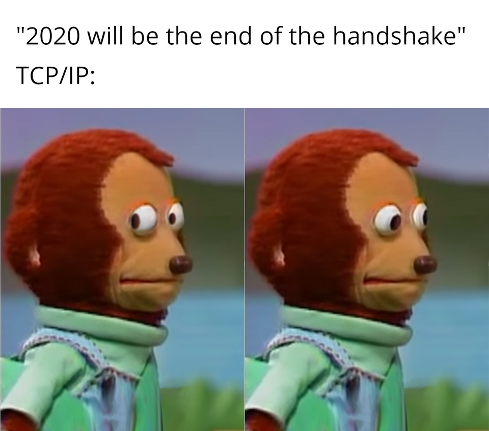

### 8. I’m Really Unsure About My Own Creation   

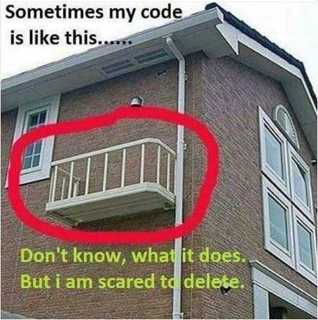

### 9.  That Missing Fact

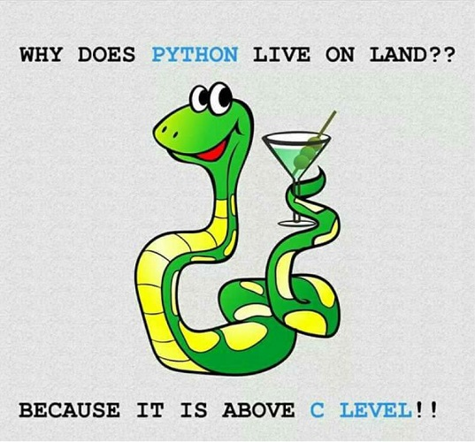

### 10. Every IT Administrator.

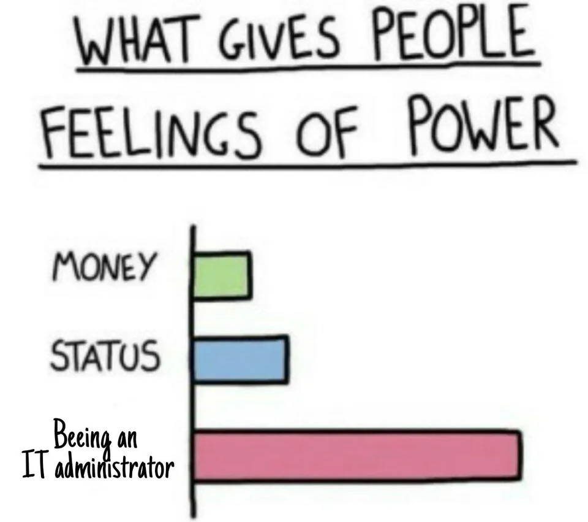

### 11. Imma Genius!

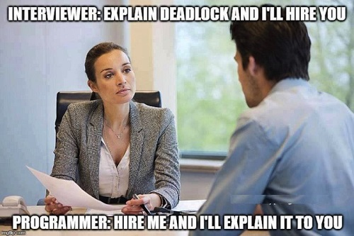

### 12. My Logical Thinking as Programmer​​​. 

### 13. HTML is a Programming Language

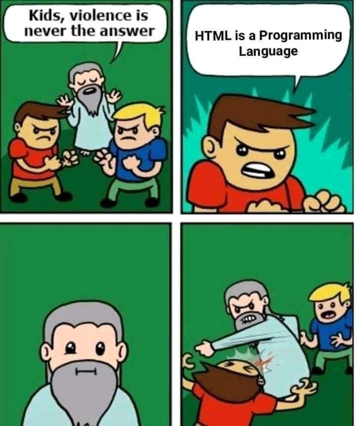

### 14. Programmers while Sleeping​.

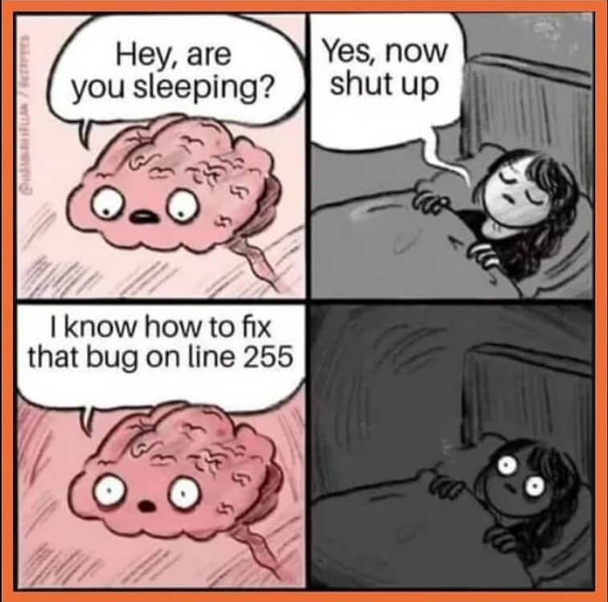

### 15. Programmer Swag!!

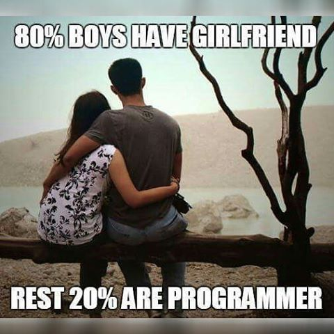

### 16. QA Life!!

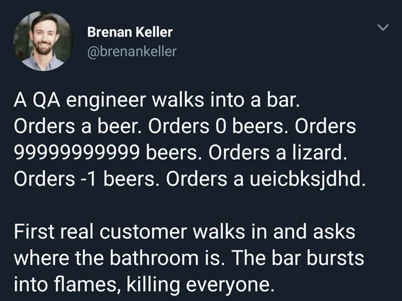

### 17. Infinite...

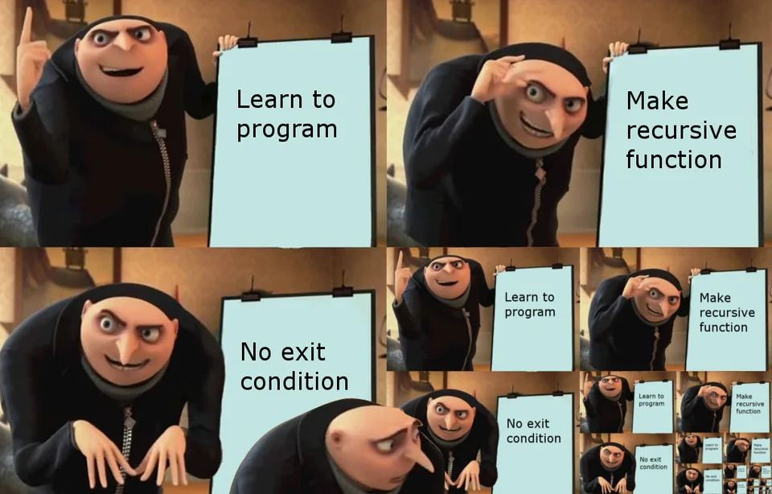

### 18. Python Lover!!

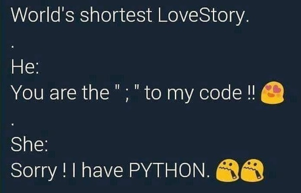

### 19. What's your address?

### 20. Semicolon; 

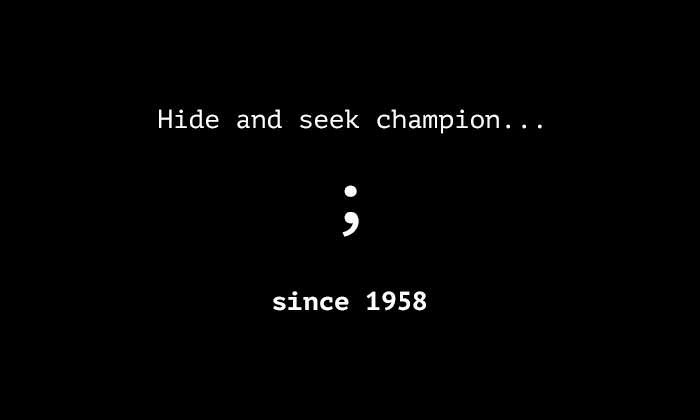

If you have better ones, reply in the comments below and we’ll include them.
