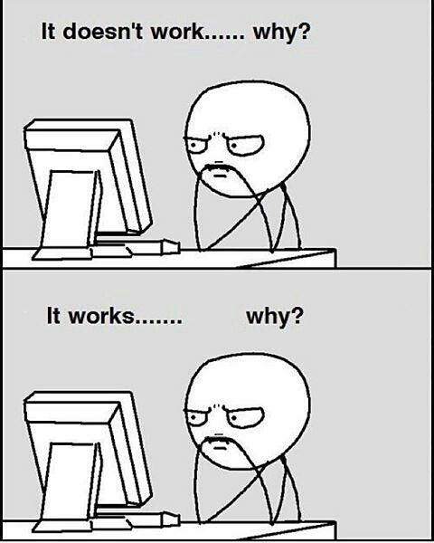
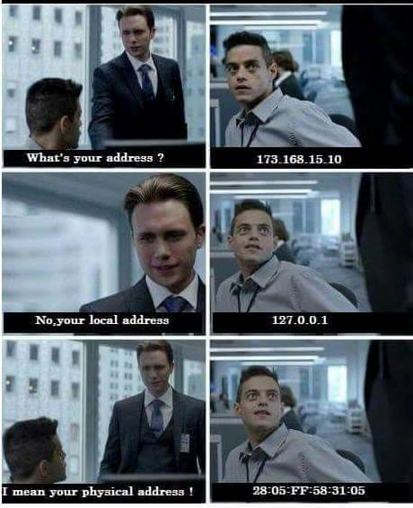

Programming is one of the fields which have a lot of funniest memes and dark jokes available. we have to deal with lots of bugs and errors/issues, which ruins the whole day. So, a little meme break is necessary for a Programmer, which will help in releasing the stress and anxiety of the whole day.

**“If debugging is the process of removing software bugs, then programming must be the process of putting them in – Edsger Dijkstra”**

## Our Developers has picked top 20 memes for the developer community

### 1. Always ready for new!!!

 

### 2. Nothing Changes With Time

### 3. Heaviest Object In The Universe

### 4. Perception!!

### 5. Maths Always A hurdle !!

### 6. I had a problem so I thought to use Java

### 7. Avoid Handshakes.

### 8. I’m Really Unsure About My Own Creation   

### 9.  That Missing Fact

### 10. Every IT Administrator.

### 11. Imma Genius!

### 12. My Logical Thinking as Programmer​​​. 

### 13. HTML is a Programming Language

### 14. Programmers while Sleeping​.

### 15. Programmer Swag!!

### 16. QA Life!!

### 17. Infinite...

### 18. Python Lover!!

### 19. What's your address?

### 20. Semicolon; 

If you have better ones, reply in the comments below and we’ll include them.
