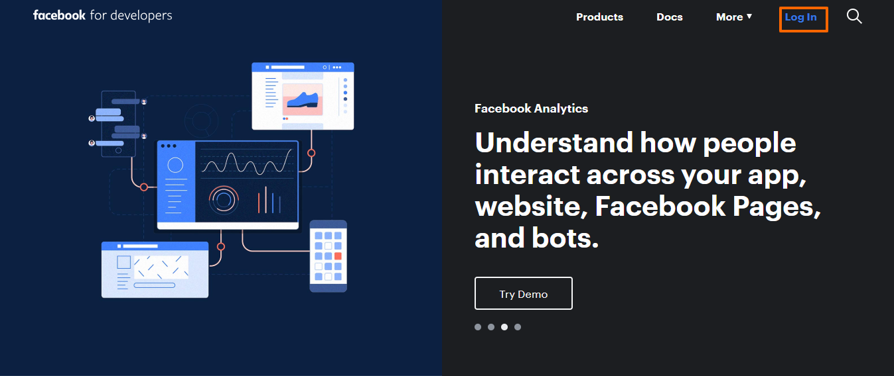
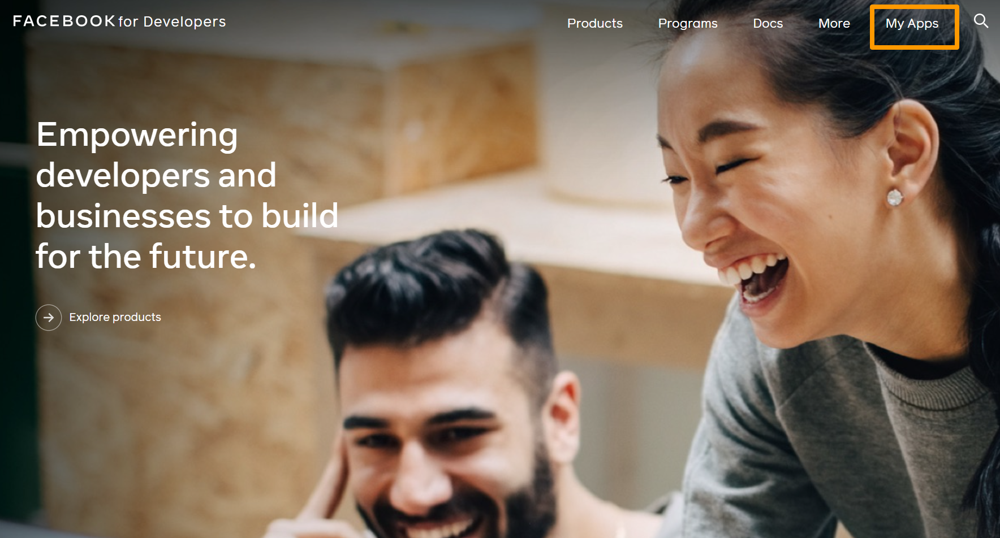
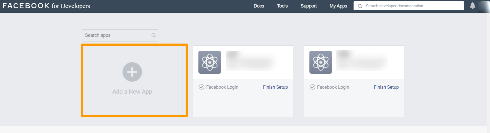
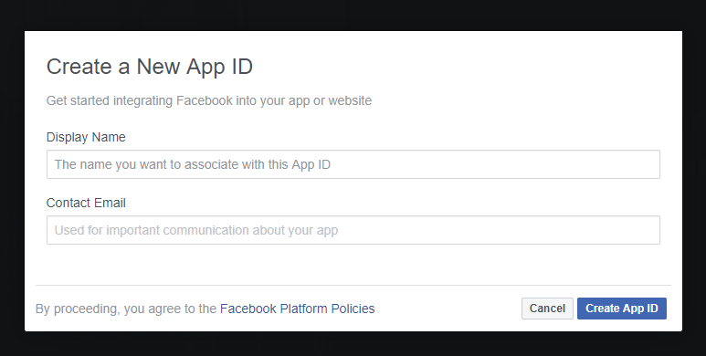
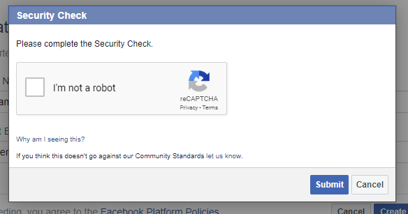
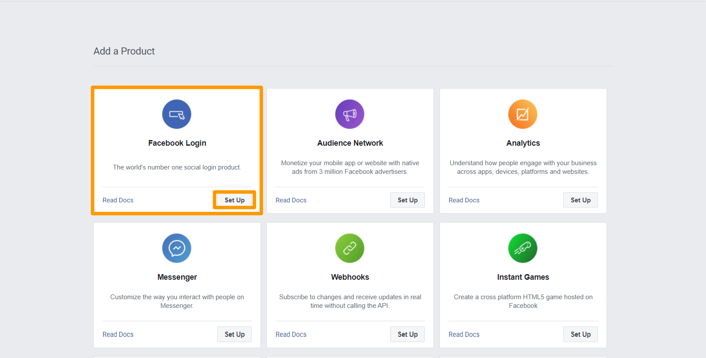
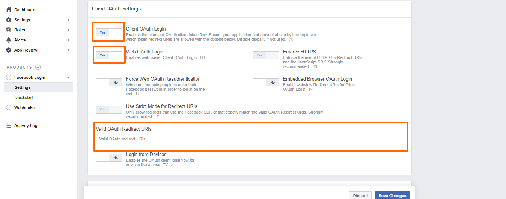
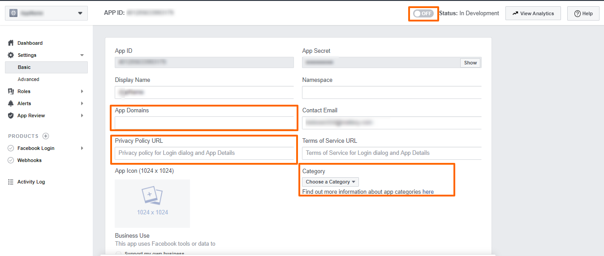

There are more than 1 million websites or apps are using **"SignIn with Facebook"** or **"Login with Facebook"**. Do you know why they are using Facebook login and how it is beneficial in conversion?

According to multiple surveys, there are more than 3 billion users worldwide are using social media and it is around 50% of the world's population. 


The biggest challenge and most important things are to make user registration and login quick and easy while developing our application. The registration forms required a lot of data that need to be filled by users manually and it causes lost, potential users. Additionally, users need to enter their usernames/emails and passwords in the login forms to authenticate themselves and also need to remember more individual IDs and passwords. 

Social Login allows customers to bring their existing social identities and use them to register and log in without creating a new profile explicitly. 

Facebook is the most favorite social media provider in comparison to other social media providers and the number of active Facebook users growing day by day.

In this article, I will explain how you can implement **“Log in with Facebook”**  on your website or mobile app in a very easy manner. 
 
Facebook work on the OAuth 2.0 protocol and most of the social providers like Facebook, Google, Microsoft, Linkedin are supporting OAuth 2.0. Refer to this article [Getting Started with OAuth 2.0](https://www.loginradius.com/engineering/blog/oauth2/) to know about OAuth flow. 

### Create Your Facebook Login App
Here you can find the complete step by step guide to create your Facebook Login App.

#### Step 1
Go to [Facebook Developer](https://developers.facebook.com) and log in using your Facebook credentials.

**NOTE**: Please do not log in using a business account as Facebook will not allow you to create an app if you do so.



#### Step 2
Select the **My Apps** as displayed on the below screen.



#### Step 3
Click on **Add a New App** as displayed in the below screen.



#### Step 4
Input display name and contact email. Once you have done so, click on **Create App ID**




#### Step 5
In the security check, Complete the security steps and click on the **submit** button.



#### Step 6
Once you land on the App dashboard, Select Facebook Login, and click **Set Up**.



#### Step 7
Click on Settings in the sidebar under Facebook Login. Turn on Client OAuth Login. Turn on Web OAuth Login. Put the valid redirect URL on **"Valid OAuth redirect URIs"**. Click on the Save button.




#### Step 8
Click on Basic under settings in the sidebar. Under App, Domains include your website Url. Enter all the required details. Change the status of the app from Development to Live from the top-right corner. Click on the **Save Changes** button.

Now your Facebook app is ready. You can start implementing Facebook login 


 
### Data Selection

When a user logs into your website or app via Facebook Login, you can access the user's data stored on Facebook. Facebook only allows the basic profile data permissions for a new Facebook app.  To get more data according to your business requirement,  you need to enable additional permissions on your Facebook app. Facebook is supporting around [42 permissions](https://developers.facebook.com/docs/permissions/reference). You need to choose user data that you want to collect from Facebook. 

### Submit Your Facebook Login App For Review 
To grab more than basic profile data points or asking for additional permissions from your users, your Facebook apps go through the review process. Sometimes businesses require some additional permissions on the Facebook app and for that, you need to submit your Facebook app for approval before starting to ask for additional information. 

The Facebook app review process is pretty much simple, Please refer to this document [here](https://www.loginradius.com/docs/api/v2/admin-console/social-provider/app-reviews/facebook-app-review/) for the Facebook App Review Process. 

### Add Login with the Facebook button on Your Site 

Implement Facebook login to a web page is very easy using Facebook’s JavaScript SDK. Facebook is providing [documentation and instructions](https://developers.facebook.com/docs/facebook-login/web) along with code examples to implement the login system. 

Let's see how we can add the Facebook login interface. For this, we just need to copy and paste the code provided to us by Facebook. Here I have added some customization to the existing code 

Place this code in the body section of your HTML code. 

```javascript

<!-- The JS SDK Login Button -->

<fb:login-button scope="public_profile,email" onlogin="checkLoginState();">
</fb:login-button>

<!-- The JS SDK Login Button -->
<div id="status">
</div>

```

Now you need to include the JavaScript section. It'll loads the Facebook SDK JavaScript asynchronously.

```javascript
<!-- Load the JS SDK asynchronously -->
<script async defer crossorigin="anonymous" src="https://connect.facebook.net/en_US/sdk.js"></script>

```

Next, we'll add the Facebook init function. We just need to replace the app id placeholder with the app id of your app you created in the beginning. You’ll find the placeholder in this line appId: '{your-app-id}'. 

```javascript
window.fbAsyncInit = function() {
    FB.init({
      appId      : '{your-app-id}',
      cookie     : true,                     // Enable cookies to allow the server to access the session.
      xfbml      : true,                     // Parse social plugins on this webpage.
      version    : 'v7.0'           // Use this Graph API version for this call.
    });
```

Next, we need to add the function that handles the response and alters the page contents based on the type of response. I have added this function at the very top of the scripts section.

```javascript
function checkFacebookLoginStatusCallback(response) {  // Called with the results from FB.getLoginStatus().
    console.log(' Checking Facebook Login Status');
    console.log(response);                   // The current login status of the person.
    if (response.status === 'connected') {   // Logged into your webpage and Facebook.
      getUserProfile();  
    } else {                                 // Not logged into your webpage or we are unable to tell.
      document.getElementById('status').innerHTML = 'Please login with Facebook into this webpage.';
    }
  }
```

As you can see, the above function receives a response variable and checks it's status. If it is connected it fetches the logged in users info and outputs this information in the console of your browser, that area is where you could build more onto this script to handle the data. When the login is not authorized, this function changed the HTML on your page to ask you to log in.

```javascript
function checkLoginState() {               // Called when a person is finished with the Login Button.
    FB.getLoginStatus(function(response) {   // See the onlogin handler
      checkFacebookLoginStatusCallback(response);
    });
  }

    FB.getLoginStatus(function(response) {   // Called after the JS SDK has been initialized.
      checkFacebookLoginStatusCallback(response);        // Returns the login status.
    });

     function getUserProfile() {                      // Get User Profile using Facebook Graph API after login.
    console.log('Welcome!  Fetching your profile information.... ');
    FB.api('/me', function(response) {
      console.log('Successful login for: ' + response.name);
      document.getElementById('status').innerHTML =
        'Thanks for logging in, ' + response.name + '!';
    });
  }
```

Now if you save this page as login.html and open it in a browser you should see the Facebook Login button. You can also download this code from my [GitHub Repo]("https://github.com/VijayShekhawat/login-with-facebook") and I have customized it to make it a bit shorter for an explanation.

Now just Log In and check the console output. You’ll now see some basic info including id, email, first_name, gender, last_name.

This is all there is to it. Of course, there are many more options and features available in Facebook documentation to discover.

### Closing Thoughts 

Social Media platforms are growing day-by-day and simplifying the registration and login process. Consumers can use their existing social identities to register and log in. They don't need to create a separate username/password combination so it is simplifying the Sign in/Signup process.

LoginRadius supports Sign with Facebook with more than 40 other popular social networks google, twitter, Linkedin, etc. You can implement all the popular social media providers on your website or mobile app in less than 60 seconds.

### Source 

[statista](https://www.statista.com/statistics/278414/number-of-worldwide-social-network-users/) 

[netcraft](https://news.netcraft.com/archives/2020/01/21/january-2020-web-server-survey.html)) 

