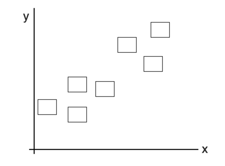
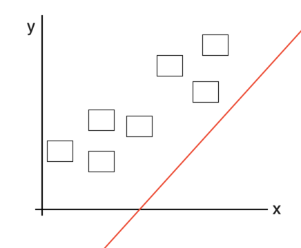
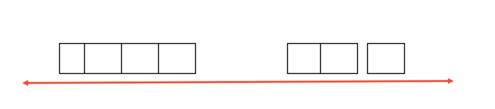
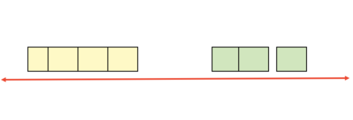

So what's the first step before your code starts forecasting or maybe recoginizing an image or let's say before your code start learning your data? Yep, if you think about collecting a lot of data, yeah that's the answer but what we need is not only a mere data for our machine to learn it, but also the quality of the data itself which becomes the main factor in the learning process. There's a saying that said "Garbage in, Garbage out", to put it simply if you use bad data (which can be called as garbage) as inputs , then I can certainly assure that your code will also output a lot of garbage. You may think that it could also because of your model that is overfitting or underfitting and start changing to the other models, but I could assure you that it could also because of your own data from the beginning. So whithout further explanation, Here are some steps that can be used for preprocessing:

# Handling Missing Value #
As the title said, the first step is to handle the missing values in your data. Why is it needed? well, to make it simple, when your data has some missing values, your code can't handle it well and confused what to do with that, so it is wise if you could either remove it or handle it with some values. There're some ways for you to handle missing values:
1. Drop the whole row
2. Use mean of the column
3. Use median of the column
4. Use some value (0,1,2 ... etc)

Usually, we use mean or drop it, however you can also use some value that you think it suit the best by observe your data.
for example : the features are gender, height and weight. Let's say one of the gender is missing (Nan, 150, 45), then you can observer the other features. From the example we can guess that mostly a person with height 150cm and weight 45kg is a female, even though it doesn't close the possibility that it could also be a male.

# Handling Categorical Data #
If your feature turns out to be a categorigal data, such as gender, day, blood_type, yes or no and etc, then you need to convert or map it into numerical value. You can convert female to the value of 0 and male to 1 or maybe the opposite. This process is needed because your model can only compute numerical things, so you need to conver it first.

# Outlier Handling #
This is where the real thing gets started^^. So outliers could also be one of the reason caused your model to be overfitting and underfitting and the only way to overcome it is by throwing them away out of your data. You can indentify outliers by:
1. Interquartile range 
    - Sort the data
    - Find the percentile 1 and percentile 3
    - Use the formula 
        ```iqr = percentile_3 - percentile_1```
    - Calculate the lower limit and the upper limit
        ```
        lower limit = percentile_1 - (1.5 x iqr)
        upper limit = percentile_3 + (1.5 * iqr)
        ```
    - Eliminate all data that lower than lower limit and bigger than upper limit

2. Z score Method
    - Find the z score of your data
    ```
    z(i) = (data(i)-mean(z))/standard_deviation(z)
    ```
    - Define a threshold, this one is up to you, but mainly is 3
    - Eliminate all the data that has z lower than minus threshold or bigger than threshold (-3 or 3)
    ```
    if absolute(z(i))>3 
    then 
    drop z.index(i)
    ```

Note : There're something that you should know before defining a threshold or eliminating ouliers. In the end the reason of the outliers itself is unknown, so it's wise if you could keep some outliers in your dataset when you have a large dataset^^. 

# Feature Selection & Observation #
Finally we get into this interisting step. So what is feature selection and what does the title mean as feature observation? to put it simply you need to know which feature is important for your machine to learn and which is not. Why don't just we use all the features in our dataset and put it to our model? Well there are some reasons why you shouldn't do that. First, your machine can be too dependent on one feature that actually not too important for the output. Second, the smaller the data, the smaller and the faster the compilation for your machine. Imagine if you need to give some movie recommendation for a user and since your code has too much calculations resulting slow compilation and make the user needs to see the loading symbol in his/her screen while your code process the output ^^. Of course we don't want that to happen right, that's why we need to select what features are important. There're many ways for you to know which feature suit the best for your output that you wanted and some of them are:

1. Find Out the Correlation
    - You can either use Pearson or Spearman Correlation or maybe you can just use ".corr" if you use python dataframes
    - Analyze the correlation score, if it's close to 1 or -1 then that feature is important. But if its close to 0, then that feature doesn't contribute and important too much for the output

2. Principal Component Analysis
    PCA or principal component analysis is actually not one of the way for feature selection. This method's purpose is actually for dimentional reduction. You use this method to reduce the dimentionality of your dataset if you have too many features.
    So what's the relation between feature selection then? well, let's just say it could make you to observe the data better and maybe create new feature based on the current feeature. 
    for example you have two features x1 and x2 and if we plot it, it will look like this <br />
    
    <br />
    So how actually PCA works? So basically PCA creates a line where all the data will be reflected to the line. If it is still hard to understand, let's imagine all the rectangles are actually a building and we don't know what kind of building is that, and let's imagine it as a map where all the building location. So let's say you take a picture from the angle where you can see all the buildings.<br />

    
    <br />

    Let's say you take it from that angle and captured all the buildings inside your picture. Here's the look of your picture <br />

    
    <br />

    From the above picture, we can see that actually there're two kinds of building. <br />

    
    <br />
    Then, let's say that the first group is actually houses and the second one are actually hotels. From this method we can make a new feature that summarize x1 and x2 where we can actually make a new feature with "house" and "hotel" classes. 

3. Make an Observation
    When I said "Observation", what I actually mean is actually knowing all the important characteristics from each important feature. For example, you need to know what is the mean, median and the standard deviation of the feature. You can also find out what is the distribution of each feature you have by calculating the p value, whether it has normal distribution, student t distribution, binomial, chi square, etc. Why do we need to know the distribution of of our own data? Why dont we just apply them to our model when our data are clean already? True, you can do that, However you also need to know that not all the data with normal distribution can be applied to linear regression. So in case you implement linear regression on your non-normal distributed data, then the prediction won't do well. 
    Another reason is also because of anylising purpose. If you want to make a hypothesis of your own dataset, then you need to know what distribution first. Why? Because each distribution has it's own tests.

# Normalization and Standardization #
It could be said that this is the last part and also the optional part. For some cases using normalization and Standardization are worked, but sometimes it doesn't work well too. Well, whether it works well or not for your model, you still need to try using this method first. 

1. Normalization
Normalization is a way to scale individual values between 0 to 1. So the purpose of doing normalization is actually to make your data more robust. For example, there're some example where your data has one outlier (height = 300cm), in this case if we use normalization we can simply convert it into value between 0 to 1 (let's say 1 since 300cm is too high and absolutely outlier).
So if we plot it, your data mainly in the middle of 0 and 1 range. Another reason of doing normalization is also because normalization make your data has smaller value without changing the distance and the important characteristic of the data which can also make your machine run faster.

2. Standardization
Standardization is a way to transform your data to have a mean of zero and a standard deviation of 1. So why we need to do standardization? well more or less it also has the same functions like normalization, but the difference are it usually transform to range that not only 0 to 1, it could also be less than 0 or more than 1, what matter is that it has the mean of 0 and standard deviation of 1. We can do standardization by calculating the z value and the more importantly standardization is a must when you want to cluster, doing PCA, use SVM, Ridge or Lasso regression and etc.


