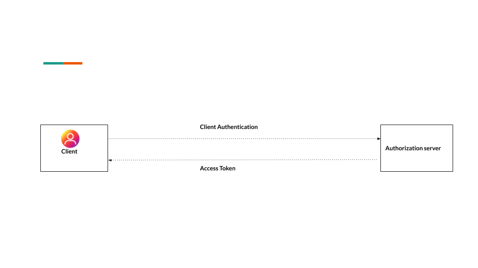

# Getting Started with OAuth 2.0

OAuth has been a jargon for quite some time now and it is difficult for a beginner to learn it, not because OAuth is hard, but because of the confusing facts found about OAuth on the web. So I wrote this article to explain why and how OAuth is used in very simple terms.

Let’s start with the basics: OAuth stands for Open Authorization. It’s a process through which an application or website can access private data from another website.
It provides applications the ability for “secure designated access.” For example, you can tell Google that it’s OK for abc.com to access your google account or contact without having to give abc.com your google password. 

OAuth never share password data but instead uses authorization tokens to prove an identity between consumers and service providers. OAuth is an authentication protocol that allows you to approve one application interacting with another on your behalf without giving away your password.

###  Now Let’s have a look at OAuth 2.0 Terminology.

  - **Resource Owner:** The resource owner is the user who authorizes an application to access their account. The application's access to the user's account is limited to the “scope” of the authorization granted (e.g., read or write access).
  - **Client:** The client is the application that’s trying to access the user's account. It needs to get permission from the user before accessing the account. For example, a client application can present the user with the login page to get an access token for access to a particular resource.
  - **Authorization Server:** The authorization server validates the user credentials and redirects the user back to the client with an authorization code. The client communicates with the authorization server to confirm its identity and exchanges the code for an access token.
  - **Resource Server:** A resource server is a server for access-protected resources. It handles authenticated requests from an app that has an access token. 
  - **Scope:** It specifies the level of access that the application is requesting from the client.
  - **Consent:** The consent screen tells your users who is requesting access to their data and what kind of data you're asking to access. 
 
We have a pretty good understanding of OAuth 2.0 and Terminology, let’s move further and discuss the OAuth grant type that is widely used in this protocol.

In total, there are five different grant type flows defined and described to perform authorizations tasks. Those are

  - Authorization Code Grant
  - Implicit Grant
  - Resource Owner Credentials Grant
  - Client Credentials Grant
  - Refresh Token Grant

### Authorization Code Grant
The Authorization Code Grant Type is the most commonly used grant type.

**The Story:** A user tries to log in on  abc.com  but he can’t remember his password and he discovers an option to sign in with google, by clicking on this, the user will easily get logged using google account.

**Flow**

The client redirects the user to the authorization server having the following parameters in the query string.

**Step 1**
  - **response_type** having the value code
  - **client_id** having the client identifier
  - **redirect_uri** having the client redirect URI. 
  - **scope** a space-delimited list of scopes
  - **state** having a random string 
 
After successful authentication, the user will be redirected to the Consent screen where he needs to provide consent to abc.com to access the account detail.
Authorization code is generated by the authorization server and sent back to the client with redirect Uri.

**Step 2**
The client will now send a POST request to the authorization server with the following parameters:
  - **grant_type** having the value of authorization_code
  - **client_id** having the client identifier
  - **client_secret** having the client secret
  - **redirect_uri** having the same redirect URI the user redirected back.
  - **code** having the authorization code from the query string

In the entire flow, the access token is never exposed to a web browser.

### Implicit Grant
The Implicit flow was a simplified OAuth flow previously recommended for client-side applications like JavaScript apps where the access token was returned immediately without an extra authorization code exchange step.

The Story: In this flow abc.com directly get access token without an extra authorization code exchange steps and able to access resources on a resource server

**Flow**

The client will redirect the user to the authorization server with the following parameters in the query string:

  - **response_type** having the value token
  - **client_id** having the client identifier
  - **redirect_uri** having the client redirect URI. 
  - **scope** a space-delimited list of scopes
  - **state** having the random string

It is not recommended to use the implicit flow (and some servers prohibit this flow entirely) due to the inherent risks of returning access tokens in an HTTP redirect without any confirmation that it has been received by the client.

### Resource Owner Credentials Grant
The resource owner password credentials grant type is suitable in cases where the resource owner has a trust relationship with the client, such as a highly privileged application. The authorization server should take special care when enabling this grant type and only allow it when other flows are not viable.

This grant type is suitable for clients capable of obtaining the resource owner’s credentials (username and password, typically using an interactive form). It is also used to migrate existing clients using direct authentication schemes such as HTTP Basic or Digest authentication to OAuth by converting the stored credentials to an access token.

**Flow**

The client will ask the user for their authorization credentials (usually a username and password).
The client then sends a POST request with following body parameters to the authorization server:
   - **grant_type** having the value password
   - **client_id** having the client’s ID
   - **client_secret** having the client’s secret
   - **scope** having a space-delimited list of requested scope permissions.
   - **username** having  a user’s username
   - **password** having a user’s password

### Client Credentials Grant

Using this flow the client can request an access token using only its client credentials (or other supported means of authentication).

**The Story:** The client application presents its client credentials (client identifier and client secret) to the authorization server requesting approval to access the protected resource (owned by the client application) on the resource server. 
The authorization server authenticates the client credential and issues an access token.

**Flow**

The client sends a POST request with following body parameters to the authorization server:
 - **grant_type** having the value client_credentials
 - **client_id** having the client’s ID
 - **client_secret** having the client’s secret
 - **scope** having a space-delimited list of requested scope permissions.

### Refresh Token Grant
Access tokens eventually expire, however, some grants respond with a refresh token which enables the client to refresh the access token.

**Flow**

The client sends a POST request with following body parameters to the authorization server:
  - **grant_type** having the value refresh_token
  - **refresh_token** having the refresh token
  - **client_id** having the client’s ID
  - **client_secret** having the client’s secret
  - **scope** having a space-delimited list of requested scope permissions. 

## Conclusion
I hope you got an idea of how OAuth works and why it is needed. Now it’s time for you to go explore, find out more about the OAuth flow and implement it into your application. 
Good Luck and have fun! Thank you for following this article and hope it helped you! Please do buzz me if you want any help: indrasen.kumar@loginradius.com

