## Passport.js
Passport is authentication middleware for Node. js. Extremely flexible and modular, Passport can be unobtrusively dropped in to any Express-based web application. A comprehensive set of strategies support authentication using a username and password, Google ,Facebook, Twitter, and more.

## Google Strategy
The Google strategy allows users to sign in to a web application using their Google account. Google used to support OpenID internally, but it now works based on OpenID Connect and supports oAuth 1.0 and oAuth 2.0.

### How to create google oauth credentials
First we have to open google developer console, click on the new project as shown below

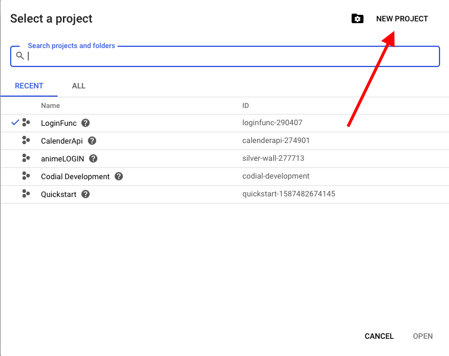

Now we have to name the project ,skip the Location part you don't need this yet.

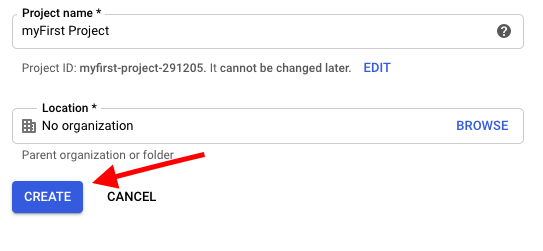

It will take few minutes to create, after it is done open the project that you have created and click Oauth consent screen 

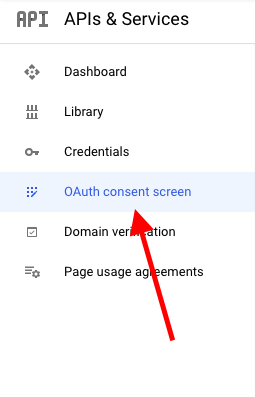

Click on the external button for using this to any available google account

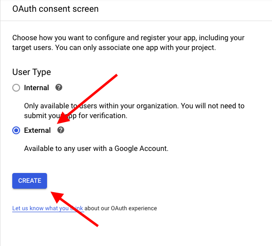

Name your application (Note : this name will be appearing in the consent screen while logging using google) add logo (optional)

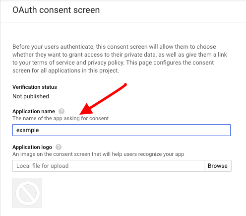

If you are using this on a local server you not need add any domain so you can skip this part, after that click on the save below, 

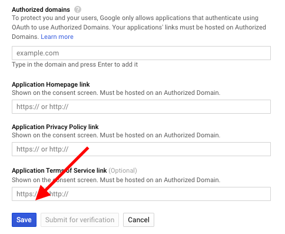

Now click on the credentials as shown below

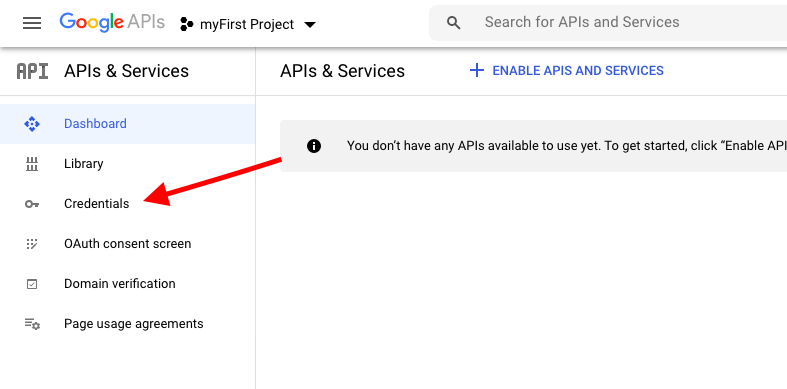

Now click on the create credentials button at the top and select OAuth Client ID

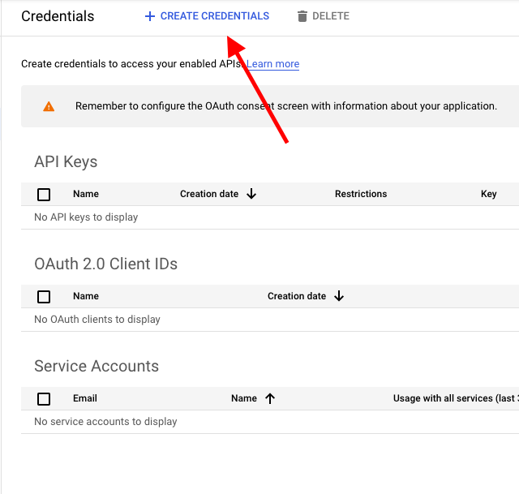
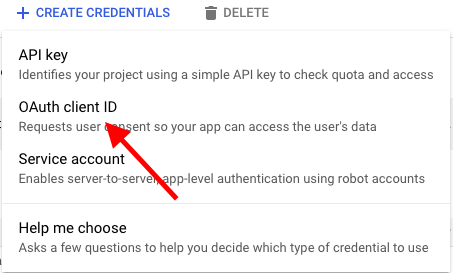

After that select the application type, in this example we will be using web application

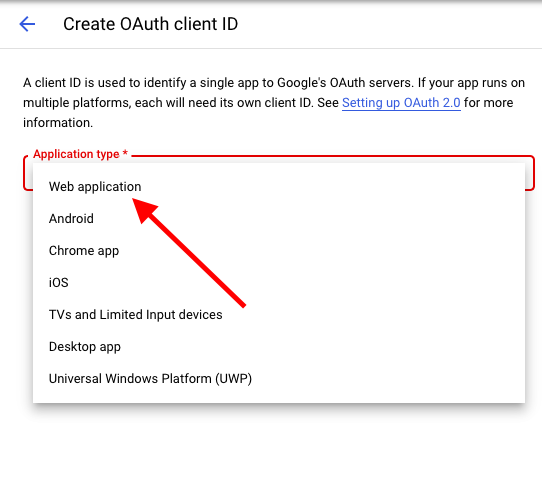

Name your application, add your origin URL for example I am running a local server on port 8080. Add your redirected URL that you will be using to redirect to the google authentication and also add the callback url there.

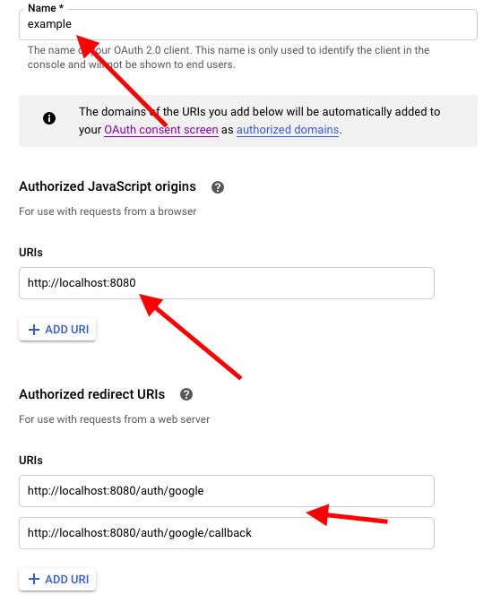

You have now created your credentials, copy the clientID and clientSecret we will be using this later.

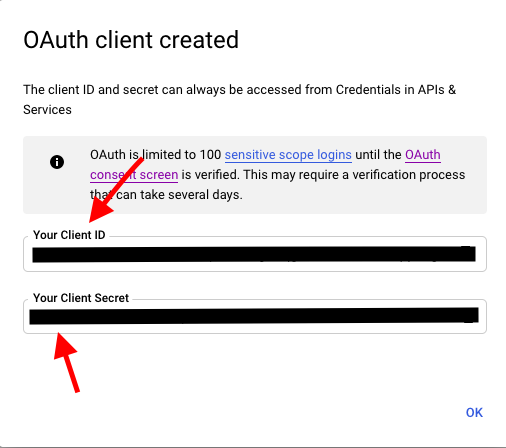

### Configuration
The Google OAuth 2.0 authentication strategy authenticates users using a Google account and OAuth 2.0 tokens. The strategy requires a verify callback, which accepts these credentials and calls done providing a user, as well as options specifying a client ID, client secret, and callback URL.

Now you have to install the passport module and googleOuth strategy in your node.js project folder

```
npm install passport
```
```
npm install passport-google-oauth
```

make a seperate file called config in the root directory and copy the below code,
make sure to export this module you will be requiring this on your index/app.js file

```JavaScript
var passport = require('passport');
var GoogleStrategy = require('passport-google-oauth').OAuth2Strategy;

// Use the GoogleStrategy within Passport.
//   Strategies in Passport require a `verify` function, which accept
//   credentials (in this case, an accessToken, refreshToken, and Google
//   profile), and invoke a callback with a user object.
passport.use(new GoogleStrategy({
    clientID: GOOGLE_CLIENT_ID,
    clientSecret: GOOGLE_CLIENT_SECRET,
    callbackURL: "http://www.example.com/auth/google/callback"
  },
  function(accessToken, refreshToken, profile, done) {
       User.findOrCreate({ googleId: profile.id }, function (err, user) {
         return done(err, user);
       });
  }
));
```
Paste your google client id and client secret that you have copied from google developer console and add your callback URL

#### Routes
Use passport.authenticate(), specifying the 'google' strategy, to authenticate requests. Authentication with Google requires an extra scope parameter.

```JavaScript
// GET /auth/google
//   Use passport.authenticate() as route middleware to authenticate the
//   request.  The first step in Google authentication will involve
//   redirecting the user to google.com.  After authorization, Google
//   will redirect the user back to this application at /auth/google/callback
app.get('/auth/google',
  passport.authenticate('google', { scope: ['https://www.googleapis.com/auth/plus.login'] }));

// GET /auth/google/callback
//   Use passport.authenticate() as route middleware to authenticate the
//   request.  If authentication fails, the user will be redirected back to the
//   login page.  Otherwise, the primary route function function will be called,
//   which, in this example, will redirect the user to the home page.
app.get('/auth/google/callback', 
  passport.authenticate('google', { failureRedirect: '/login' }),
  function(req, res) {
    res.redirect('/');
  });
```

#### Link
A link or button can be placed on a web page, allowing one-click sign in with Google.

```html
<a href="/auth/google">Sign In with Google</a>
```


### Conclusion 
We have succesfully created authentication using passport google-oauth2.0 strategy !!!

[google account](13.png)


