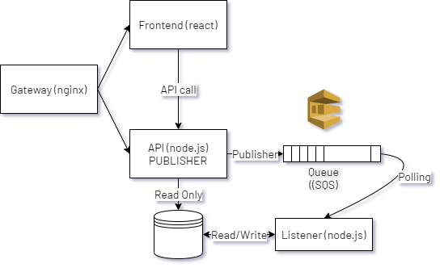

# Production Grade Development using Docker-Compose


> Assuming that reader of this blog has fair idea of docker ecosystem!

Docker has changed the world of software development! Since the last few years docker has helped the community and enterprises and startups create solutions quickly and effectively, while deployment is relatively hassle free (conditions apply), at least the “Works fine on my system” problem.

Well, just not docker, there are many container ecosystems available as an alternative to docker. For example, Mesos by Apache and Vagrant by Terraform. Docker is more loved for what it is **not**, and that is Bulky! Docker is otherwise lightweight, works mostly with linux and eventually was identified by Kubernetes in 2015. But, that story... some other time!!

Straight to the context, Docker Compose! Docker compose is a powerful utility which is bundled with docker installation. Docker-Compose can be used for production and development, to make things virtually seamless.

### Microservices and Docker

Docker is doing a great job, when it comes to describing and developing microservices.

While working on microservices where quite a few ( *being reasonably complicated, in our example 6* ) containers talk to each other to complete a task and since it is an end to end task, the whole thing looks very complicated. To rectify :

* the troubles of developing end to end feature
* how it works in integration
* containerizing the application

the developer has two choices, create a script in a scripting language of choice, or choose docker-compose. Well, docker-compose is an easier option.

Here in this *kind of* practical example, we are going to demonstrate a similar situation, where multiple containers talk to each other. We are going to use docker-compose as our primary tool build and deploy images.




The picture above depicts architecture of a hypothietical portal of flash sale.

*Flash Sale is an e-commerce concept, where an item is made available for sale to public on portal at a specific time and in a limited quantity.*

The components of the application are

* Gateway
* Frontend (react)
* API server ( node.js)
* SQS ( In this example SQS Emulator)
* Listener (node.js)
* DataStore (mongo-db)

The application is otherwise fairly simple. Go to the portal hit the green button which call an API, the API drops a message to the queue, the listener picks the messages, grabs the item from database reduces the quantity and updates the datastore again.

So far so good!


### The use of docker-compose and why?

Exactly! What is the problem? As such there is no problem, but it may arise if we do not program or develop it well in an integrated manner. Programming a component and managing it well reduce the time-to-production by a greater degree.

> *I am not a great programmer; I am just a good programmer with great habits.*
>
> - Matin Fowler

While desiging and developing complicated systems where microservices are involved, integration and debugging becomes cumbersome.

To ease it up docker-compose acts a friend.

For the example above we are going to write a docker-compose. Docker-Compose has got *powers* to

* Building the program and images
* Bring up the whole application ecosystem
* Wipe it up from the memory in one command

First things first, the Dockerfile.

Starting from the API. The API needs a docker image to build. The following is the Dockerfile for the same.

```
FROM node:alpine
WORKDIR '/app'
COPY ./package.json ./
RUN npm install 
COPY . .
CMD ["npm", "run", "start"]
```

Since, the other two components, listener and frontend are also written in JavaScript the Dockerfile does not change at all for them too, for the example.

```
FROM nginx
COPY ./nginx.conf /etc/nginx/conf.d/default.conf
```

The other 2 components :

* Mongodb has its own image we will leverage that while writing the docker-compose.
* SQS is emulated using softwaremill/elasticmq image.

### Action!

First things first, file version. Since it is all yaml out there file version tells docker-compose about the data strucure. The data structure which is expected by docker "compose".

so we start the docker-compose as

```
version: '3'
```

All the components in the docker-compose are known as `services`. Next, we are going to write some services. Yes, the services we have written for our business.

Message Queue :

The message queue shall use `softwaremill/elasticmq` image out of the box and the applications will access that on port 9324. The service description in docker-compose shall look like this.

```
mqserver:
        image: softwaremill/elasticmq
        ports:
            - '9324:9324'
```

That is analogues to `docker run -it -p '9324:9324' softwaremill/elasticmq`.

A bit more complicated service next, mongodb.

```
mongodbdb: 
        depends_on: 
            - mqserver
        image: mongo
        container_name: mongo
        volumes:
            - /data/db:/mongodata
        ports:
            - '27017:27017'
```

There are a couple of things one may notice more here.

`depends_on` shall wait for the container of mqserver service to come up, before mongodbdb service goes on air.

> Docker is only liable to check the containers when we use depends_on, if you want to check whether your service (which you have embedded) is ready to use or not, use `healthcheck `and `link`.

Apart from this, we are mounting a volume and exposing ports for an image mongo which gets pulled directly from the docker container registry. `container_name` will give the service a name, so that it can be *discovered *in the network. *Kind of a domain name in the internal docker-compose network.*

Now the developer's proprietary API service:

```
apiserver:
        restart: always
        depends_on: 
            - mqserver
            - mongodbdb

        build:
            dockerfile: Dockerfile
            context: ../fs-express-api/.
        volumes:
            - /app/node_modules
        environment: 
            - NODE_ENV=production
            - AWS_SQS_URL=http://mqserver:9324/
            - AWS_SQS_FQ_URL=http://mqserver:9324/queue/fsqueue
            - AWS_ACCESS_KEY=na
            - AWS_SECRET_ACCESS_KEY=na
            - AWS_REGION=REGION
            - QUEUE_NAME=fsqueue
            - MONGODB_CONNECTION=mongodb://mongo:27017/fsorder
            - API_APP_PORT=5000
        ports:
            - '5000:5000'
```

The `build `tag will be used by `docker-compose build` command to build an image. Build is defined as Dockerfile and the context is docker context, the directory which you want to use as context. Equivalent to :  `docker build -f filename . `

The more you are seeing here is *environment* and *restart* options. Environment variables are used to set environment variables while running the image. This is another part where docker-compose comes handy. Think about setting all nine environment variables with `docker run`.

`restart` is a bit interesting. One may specify a restart policy if the application crashes, which leads to stop the docker image itself. always specifies to restart the container if it exit. The word exit reminds of exit code. On a non zero exit code, that is  `on-failure` of the application the `on-failure` policy helps much.

In the environment section, one can see mqserver and mongo, instead the regular localhost and loopback address. This is because when we run docker-compose, it creates a DNS recordset of all the `services` mentioned. The services can reffered by their names. A slight deviation here may happen when container is explicitly named. `container_name = mongo` is used at a later point of time in the other container environments as mongo and not mongodbdb.


The polling mod and forntend services are quite same.

```
    pollingmod:
        restart: always
        depends_on: 
            - mqserver
            - mongodbdb
        build:
            dockerfile: Dockerfile
            context: ../polling-mod/
        volumes:
            - /app/node_modules
        environment: 
            - AWS_QUEUE_URL=http://mqserver:9324/queue/fsqueue
            - AWS_ACCESS_KEY=na
            - AWS_SECRET_ACCESS_KEY=na
            - AWS_REGION=REGION
            - MONGODB_CONNECTION=mongodb://mongo:27017/fsorder   

    frontend:
        build:
            dockerfile: Dockerfile
            context: ../fs-frontend
        volumes:
            - /app/node_modules
            - ../fs-frontend:/app
        stdin_open: true
        ports:
            - '3000:3000'
```

Finally, the gateway. So, a gateway is created on the front using nginx to make the development production-grade. If you go through the gateway code you will find that the services are accessed by their name `frontend` and `apiserver`.

```
upstream frontend{
    server frontend:3000;
}

upstream apiserver{
    server apiserver:5000;
}
```

The nginix container opens port 80 to an external port 5500. The nginx container keeps configuration where user can wee just one port 5500 from out of the system, everything else is gray.


And this is, how it happens in the real world as well!


Finally, we have a docker-compose.yml. And following are simple commands which makes life even simpler when we need to build and run & stop the entire ecosystem.

To build

`docker-compose build`

To start

`docker-compose up`

To stop

`docker-compose down`


This scratches the surface of using docker-compose for a production-grade development environment.


