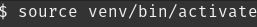

Data Science, Deep Learning, Machine Learning and Artificial Intelligence are the current trending topics in the field of computer technology. Day by day, the progress in these fields are increasing due to which it made our lives easier and more machine-dependent. Now, to master in these fields(Data Science or AI), programming is a must and this is where Python has been doing a great job. Not only these fields, also it has high range of popularity in web development, operating systems, mobile application development, video games etc. For this blog, we move our attention towards using virtual environment in Python for our projects.

## What is a virtual environment?

A virtual environment is simply a tool that separates the dependencies of different projects by creating a separate isolated environment for each project. These are simply the directories, so unlimited virtual environments can be created. This is one of the popular tools used by most of the Python developers.

## Why do we need a virtual environment?

Python has various modules and packages for different applications. During our project, it may require a third-party library which we install it. Another project also uses same directory for retrieval and storage but doesn't require any other third-party packages. So, virtual environment can come into play and make separate isolated environment for both projects and each project can store and retrieve packages from their specific environment.

Also, let us consider another case where we are creating a web application using Django. Suppose, you are working in two projects project1 and project2. If project1 uses Django-2.2 and project2 uses Django-3.2, they would be stored in same directory with same name and the error may occur. Then, in such cases virtual environments can be really helpful for you to maintain the dependencies of both the projects.

## Working with Virtual environment

To create a virtual environment, we need a module named [virtualenv](https://pypi.org/project/virtualenv/). It itself creates a folder with all the necessary executables to run Python projects. Make sure **pip** is installed in your computer. If not, then use the following command:

 

### Install virtualenv:

Open the terminal and paste the following command to install a virtualenv:

 

### Check your version of virtualenv:

If you want to confirm whether it is installed or not, paste the command below in your terminal:

 

### Create virtual environment:

After successful installation of virtualenv, now you can create a virtual environment with your desired name using following command:

 

Here, I created venv as the name for my virtual environment. You can name it whatever you desire. Now, the folder with name venv is created that contains all the necessary executables to run Python project. This is the folder where all your python packages will run.

To specify Python interpreter of your choice, you can do it easily by specifying Python{version-name}.
Eg: To create python2.7 virtual environment, we use following command:

 

After successfully creating the virtual environment, now you need to activate it in order to enter into that particular isolated environment. Always remember to activate the required virtual environment before working in the project. To activate it, we move to the location where the name of your desired virtual environment is located and follow the command below:

 

**Note:** Instead of venv, you write the name of your virtual environment you created. 

#### In Windows,

 

After activating the virtual environment, you can see your name of virtual environment on the left side of the terminal. This confirms your activation of your virtual environment and is currently active. It looks like this:

 

Finally, you successfully created and activated your virtual environment. Now, you can install the dependencies and requirements your project asks for without interfering other projects.
Once you completed your work, then you can return back to system default environment by just using the **deactivate** command as shown below:

