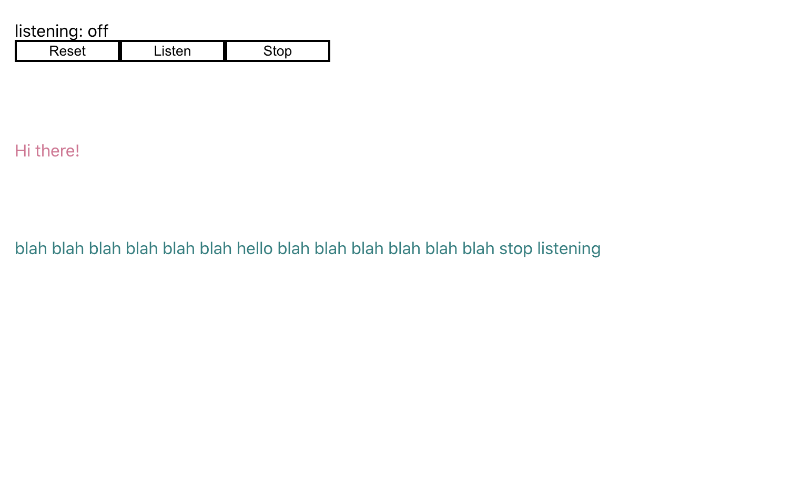

## Overview

React Speech Recognition is a react hook that accesses the Web Speech API to convert speech from the machine’s microphone to the app’s React components.

There are two hooks in this framework:

- ‘useSpeechRecognition’, a React hook that gives a component access to a transcript of speech picked up from the user’s microphone.

- ‘SpeechRecognition’ which manages the global state of the Web Speech API, exposing functions to turn the microphone on and off.

## Prerequisites

This version requires React 16.8 so that React hooks can be used, please see the full framework README [here](https://www.npmjs.com/package/react-speech-recognition) for more information.

Note: This framework uses WebSpeech API. Browser support for this API is currently limited, with Chrome having the best experience. As of June 2020 these browsers support the API:
  * Chrome (desktop): this is by far the smoothest experience
  * Microsoft Edge
  * Chrome (Android): a word of warning about this platform, which is that there can be an annoying beeping sound when turning the microphone on. This is part of the Android OS and cannot be controlled from the browser
  * Android webview
  * Samsung Internet

## What We’ll Make

I will be making a simple voice memo app with basic voice commands that runs in the browser. If you would like to follow this tutorial please be ready to work with the create-react-app boilerplate.



## Let's Get Started

### Step 1: Setting up the workspace

1. Create a new react app with create-react-app.

```js
npx create-react-app dictaphone
```

2. Gut the App.js file and add the dictaphone component like so:

```js
import Dictaphone1 from './dictaphoneSetup.js'

function App() {
  return (
    <div className="App">
      <header className="Dictaphone-Tester">
        <Dictaphone1 />
      </header>
    </div>
  );
}

export default App;
```
NOTE: We haven't built Dictaphone1 yet, we'll jump into that next!

3. In the root directory of your app, install the react hook using:

```js
npm i react-speech-recognition
```

4. Create a file to house the Dictaphone component in your src directory and import the necessary dependencies:

```js
import React, { useEffect, useState } from 'react';
import SpeechRecognition, { useSpeechRecognition } from 'react-speech-recognition';
```

And that's it for our basic setup!

### Step 2: Setting up the dictaphone

1. First, we will build the skeleton of our component:

```js
import React, { useEffect, useState } from 'react';
import SpeechRecognition, { useSpeechRecognition } from 'react-speech-recognition';

const Dictaphone1 = () => {
 return (
   <div></div>
 );
};

export default Dictaphone1;
```
2. Next, we need to fetch certain props out of useSpeechRecognition. The props we will need are transcript, interimTranscript, finalTranscript, resetTranscript, and listening. You can do so like this:
```js
const {
   transcript,
   interimTranscript,
   finalTranscript,
   resetTranscript,
   listening,
 } = useSpeechRecognition();
```
We will also need to enable commands through this hook so add commands to gain access-
```js
} = useSpeechRecognition({ commands });
```
3. Moving swiftly onward, we need to need to add several functions that are built into the hook and React. First we will be using 'useEffect' to print the transcript to the page.
```js
 useEffect(() => {
   if (finalTranscript !== '') {
     console.log('Got final result:', finalTranscript);
   }
 }, [interimTranscript, finalTranscript]);
 ```
4. Then, we will add a listening function to start our dictaphone as well as throw in a quick conditional to alert the user if their browser is not compatible with this API. These functions would look like:

```js
 if (!SpeechRecognition.browserSupportsSpeechRecognition()) {
   return null;
 }

 if (!SpeechRecognition.browserSupportsSpeechRecognition()) {
   console.log('Your browser does not support speech recognition software! Try Chrome desktop, maybe?');
 }
 const listenContinuously = () => {
   SpeechRecognition.startListening({
     continuous: true,
     language: 'en-GB',
   });
 };
```
### Step 3: Building the dictaphone controls and page elements

Now, we will add some page elements to access our dictaphone and print the words to the page. We will need three buttons: stop, listen, and reset - to control the dictaphone and to reset the transcript. We may also want to add an indicator that informs the user if the dictaphone is listening or not. Within Dictaphone1's return div create the following elements:

1. A span that houses a ternary conditional that uses the ‘listening’ prop of useSpeechRecognition to tell if the dictaphone is currently accessing the microphone or not. Add a 'Listening:' label for clarity reasons (Please see below diagram for clearer explanation).
2. A 'reset' button that will use the built-in function resetTranscript to- you guessed it- reset the transcript.
3. A 'listen' and 'stop' button that will use the functions 'listenContinuously' and 'SpeechRecogniton.stopListening' respectively to control the dictaphone.
4. One last span where we are housing our transcript.

Your return statement should look similar to this:

```js
  return (
    <div>
      <div>
        <span>
          listening:
          {' '}
          {listening ? 'on' : 'off'}
        </span>
        <div>
          <button type="button" onClick={resetTranscript}>Reset</button>
          <button type="button" onClick={listenContinuously}>Listen</button>
          <button type="button" onClick={SpeechRecognition.stopListening}>Stop</button>
        </div>
      </div>
      <div>
        <span>{transcript}</span>
      </div>
    </div>
  );
```
If you go to localhost:3000 in your browser, the dictaphone should now be working.

### Step 4: Adding commands

Now that our dictaphone is working, let's add some commands. We won't do anything too complex, but rather access the functions we already have at our disposal.

Within the dictaphone component declare an array called commands. This will be an array of objects containing two properties each:
  * a command (string or regular expression)
  * a callback
A voice command that resets the transcript should look like this:

```js
 const commands = [
   {
     command: 'reset',
     callback: () => resetTranscript()
   },
   {
     command: 'clear',
     callback: () => resetTranscript()
   }
 ]
```
When the dictaphone picks up the words 'reset' or 'clear' from the user's speech, it will execute the callback associated with the command.

Let's add a response feature. If we add a react hook to manipulate the state like this:

```js
const [message, setMessage] = useState('');
```
Then add the 'message' to the output, we can add commands that generate a response. For instance, if I were to say ‘Hello’ the app would print back ‘Hi there!’ or something to that effect. Below, I've incorporated some simple commands and with that our quick dictaphone is complete! Take a look at this code where it all comes together:

```js
import React, { useEffect, useState } from 'react';
import SpeechRecognition, { useSpeechRecognition } from 'react-speech-recognition';

const Dictaphone1 = () => {
 const [message, setMessage] = useState('');
 const commands = [
   {
     command: 'reset',
     callback: () => resetTranscript()
   },
   {
     command: 'shut up',
     callback: () => setMessage('I wasn\'t talking.')
   },
   {
     command: 'Hello',
     callback: () => setMessage('Hi there!')
   },
 ]
 const {
   transcript,
   interimTranscript,
   finalTranscript,
   resetTranscript,
   listening,
 } = useSpeechRecognition({ commands });

 useEffect(() => {
   if (finalTranscript !== '') {
     console.log('Got final result:', finalTranscript);
   }
 }, [interimTranscript, finalTranscript]);
 if (!SpeechRecognition.browserSupportsSpeechRecognition()) {
   return null;
 }

 if (!SpeechRecognition.browserSupportsSpeechRecognition()) {
   console.log('Your browser does not support speech recognition software! Try Chrome desktop, maybe?');
 }
 const listenContinuously = () => {
   SpeechRecognition.startListening({
     continuous: true,
     language: 'en-GB',
   });
 };
 return (
   <div>
     <div>
       <span>
         listening:
         {' '}
         {listening ? 'on' : 'off'}
       </span>
       <div>
         <button type="button" onClick={resetTranscript}>Reset</button>
         <button type="button" onClick={listenContinuously}>Listen</button>
         <button type="button" onClick={SpeechRecognition.stopListening}>Stop</button>
       </div>
     </div>
     <div>
       {message}
     </div>
     <div>
       <span>{transcript}</span>
     </div>
   </div>
 );
};

export default Dictaphone1;
```
