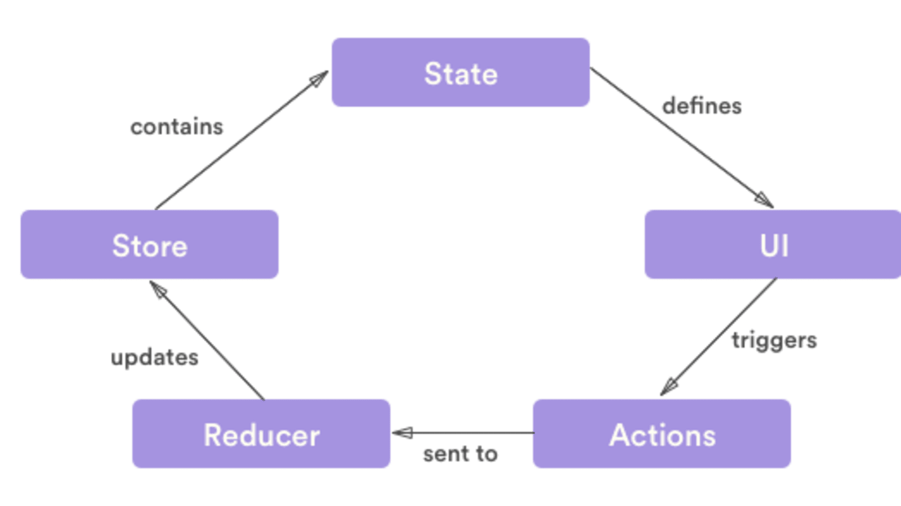

Biggest Challenge in React application is the management of state for frontend developers. In large applications, React alone is not sufficient to handle the complexity which is why some developers use React hooks and others use state management libraries such as Redux.
In this post, We are going to take a closer look at both React hooks and Redux to manage the state.

## What is State?
React components has a built-in state object. 
The state is encapsulated data where you store assets that is persistent between component renderings. The state is just a fancy term for a JavaScript data structure. If a user changes state by interacting with your application, the UI may look completely different afterwards, because it's represented by this new state rather than the old state.

> **Make a state variable responsible for one concern to use efficiently**.

## Why do you need state management?

React applications are built using components and they manage their state internally and it works well for applications with few components, but when the application grows bigger, the complexity of managing states shared across components becomes difficult.

Here is a simple example of an e-commerce application, in which the status of multiple components will change when purchasing a product.
      
 - Add that product to the shopping list
 - Add product to customer history
 - trigger count of purchased products

 If developers do not have scalability in mind then it is really hard to find out what' is happening when something goes wrong. This is why you need state management in your application.

## What is Redux

Redux was created to resolve this particular issue. it provides a central store that holds all states of your application. Each component can access the stored state without sending it from one component to another.  Here is a simple view of how Redux works.

There are three building parts: actions, store, and reducers. Let’s briefly discuss what each of them does.

#### Actions in Redux
Actions are payloads of information that send data from your application to your store. Actions are sent using  [`store.dispatch()`](https://redux.js.org/api/store#dispatchaction). Actions are created via an action creator.
Here is an example action that represents adding a new todo item:

    { 
    type: "ADD_TODO", 
    payload: {text:"Hello Foo"}
     }
Here is an example of its action creator:

    ocnst addTodo = (text) => {
      return {
         type: "ADD_TODO",
         text
      };
    }
#### Reducers in Redux
Reducers specify how the application's state changes in response to actions sent to the store.
An example of how Reducer works in Redux is as follows:

      const TODOReducer= (state = {}, action) => {
      switch (action.type) {
        case "ADD_TODO":
          return {
            ...state,
            ...action.payload
          };
        default:
          return state;
      }
    };
#### Store in Redux
The store holds the application state. You can access stored state, update the state, and register or unregister listeners via helper methods.

Let’s create a store for our TODO app:

    const store = createStore(TODOReducer);

In other words, Redux gives you code organization and debugging superpowers. This makes it easier to build more maintainable code, and much easier to track down the root cause when something goes wrong.

## What is React Hooks?

These are functions that hook you into React state and features from function components. Hooks don't work inside classes  and it allows you to use React features without writing a class. Hooks are backwards-compatible, which means it doesn't keep any breaking changes.
React provides some built-in Hooks like `useState`, `UseEffect` and `useReducer` etc. You can also make custom hooks.
#### Hook's Rules
-   Call hook at the top level only means that you need to call inside a loop, nested function, or conditions.
- React function components are called hooks only.

Please see the following examples of some react hooks as follows:
##### What is useState and its use

`useState` is a Hook that lets you add React state to function components.
Example:
Declaring a State Variable in class and initialize count state with 0 by setting this.state  to {count:0}.

    class Example extends React.Component {
      constructor(props) {
        super(props);
        this.state = {
          count: 0
        };
      }
      
In a function component, we have no this, so we can’t assign or read this.state. Instead, we call the `useState` Hook directly inside our component:

    function Example() {
        const [count, setCount] = useState(0);
    }
We declare a state variable called count and set it to 0. React will remember its current value between re-renders, and provide the most recent one to our function. If we want to update the current count, we can call setCount.

##### what is useReducer and its use
`useReducer` is a hook I use sometimes to manage the state of the application. It is very similar to the _useState_ hook, just more complex. _useReducer_ hook uses the same concept as the reducers in Redux. It is basically a pure function, with no side-effects.

Here is an example of useReducer:

useReducer creates an independent component co-located state container within your component. Whereas Redux creates a global state container that hangs somewhere above your entire application.

     

              +----------------+              +----------------+
              |  Component A   |              |                |
              |                |              |                |
              |                |              |      Redux     |
              +----------------+              |                |
              | connect Redux  |<-------------|                |
              +--------+-------+              +--------+-------+
                       |                               |
             +---------+-----------+                   |
             |                     |                   |
             |                     |                   |
    +--------+-------+    +--------+-------+           |
    |  Component B   |    |  Component C   |           |
    |                |    |                |           |
    |                |    |                |           |
    +----------------+    +----------------+           |
    |    useReducer  |    | connect Redux  |<----------+
    +----------------+    +--------+-------+
                                   |
                          +--------+-------+
                          |  Component D   |
                          |                |
                          |                |
                          +----------------+
Below an example of todo item is completed or not using useReducer react hook.

See the following function which  is a reducer function for managing state transitions for a list of items:

     const todoReducer = (state, action) => {
          switch (action.type) {
            case "ADD_TODO":
              return state.map(todo => {
                if (todo.id === action.id) {
                  return { ...todo, complete: true };
                } else {
                  return todo;
                }
              });
            case "REMOVE_TODO":
              return state.map(todo => {
                if (todo.id === action.id) {
                  return { ...todo, complete: false };
                } else {
                  return todo;
                }
              });
            default:
              return state;
          }
        };
There are two types of actions which is equivalent of two states. they used to toggle complete boolean field and additional payload to identify incoming action.

The state which is managed in this reducer is an array of items:

    const initialTodos = [
          {
            id: "t1",
            task: "Add Task 1",
            complete: false
          },
          {
            id: "t2",
            task: "Add Task 2",
            complete: false
          }
        ];
In code, The useReducer hook is used for complex state and state transitions. It takes a reducer function and an initial state as input and returns the current state and a dispatch function as output

     const [todos, dispatch] = React.useReducer(
        todoReducer,
        initialTodos
      );

Complete file:

    import React from "react";
    
    const initialTodos = [
      {
        id: "t1",
        task: "Add Task 1",
        complete: false
      },
      {
        id: "t2",
        task: "Add Task 2",
        complete: false
      }
    ];
    const todoReducer = (state, action) => {
      switch (action.type) {
        case "ADD_TODO":
          return state.map(todo => {
            if (todo.id === action.id) {
              return { ...todo, complete: true };
            } else {
              return todo;
            }
          });
        case "REMOVE_TODO":
          return state.map(todo => {
            if (todo.id === action.id) {
              return { ...todo, complete: false };
            } else {
              return todo;
            }
          });
        default:
          return state;
      }
    };
    const App = () => {
      const [todos, dispatch] = React.useReducer(todoReducer, initialTodos);
    
      const handleChange = todo => {
        dispatch({
          type: todo.complete ? "REMOVE_TODO" : "ADD_TODO",
          id: todo.id
        });
      };
      return (
        <ul>
          {todos.map(todo => (
            <li key={todo.id}>
              <label>
                <input
                  type="checkbox"
                  checked={todo.complete}
                  onChange={() => handleChange(todo)}
                />
                {todo.task}
              </label>
            </li>
          ))}
        </ul>
      );
    };
    
    export default App;

Let’s do a similar example with Redux.

Store in _App.js_.

    import React from "react";
    import { Provider } from "react-redux";
    import { createStore } from "redux";
    import rootReducer from "./reducers";
    import Todo from "./Components/TODO";
    const store = createStore(rootReducer);
    
    function App() {
      return (
        

          <Provider store={store}>
            <Todo />
          </Provider>
        

      );
    }
    
    export default App;
Actions in _actions/index.js_.

    export const addTodo = id => ({
      type: "ADD_TODO",
      id
    });
    
    export const removeTodo = id => ({
      type: "REMOVE_TODO",
      id
    });
Reducers in _reducers/index.js_.

    const initialTodos = [
      {
        id: "t1",
        task: "Add Task 1",
        complete: false
      },
      {
        id: "t2",
        task: "Add Task 2",
        complete: false
      }
    ];
    const todos = (state = initialTodos, action) => {
      switch (action.type) {
        case "ADD_TODO":
          return state.map(todo => {
            if (todo.id === action.id) {
              return { ...todo, complete: true };
            } else {
              return todo;
            }
          });
        case "REMOVE_TODO":
          return state.map(todo => {
            if (todo.id === action.id) {
              return { ...todo, complete: false };
            } else {
              return todo;
            }
          });
        default:
          return state;
      }
    };
    
    export default todos;
FIle components/Todo.js

    import React from "react";
    import { connect } from "react-redux";
    import { addTodo, removeTodo } from "../../redux/actions/authActions";
    
    const Todo = ({ todos, addTodo, removeTodo }) => {
      const handleChange = todo => {
        if (todo.complete) {
          removeTodo(todo.id);
        } else {
          addTodo(todo.id);
        }
      };
    
      return (
        <ul>
          {todos.map(todo => (
            <li key={todo.id}>
              <label>
                <input
                  type="checkbox"
                  checked={todo.complete}
                  onChange={() => handleChange(todo)}
                />
                {todo.task}
              </label>
            </li>
          ))}
        </ul>
      );
    };
    
    const mapStateToProps = state => ({ todos: state.auth.todos });
    const mapDispatchToProps = dispatch => {
      return {
        addTodo: id => dispatch(addTodo(id)),
        removeTodo: id => dispatch(removeTodo(id))
      };
    };
    
    export default connect(
      mapStateToProps,
      mapDispatchToProps
    )(Todo);
    
React offers react hooks which can be used as an alternative for `connect()`. You can use built-in hooks mainly useState, UseReducer and useContext and because of these you often may not require Redux. But for large applications, you can use both redux and react hooks. it works great!
React Hook is a useful new feature, and the addition of React-Redux with Redux-specific hooks is a great step towards simplifying Redux development.