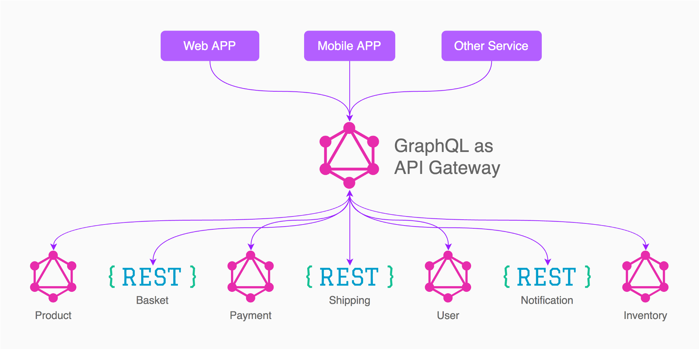

GraphQL's popularity has been skyrocketed since its release in 2015. It is the modern way of developing and querying APIs. As its popularity increased its industry adoption also clearly increased, it is backed by many tech giants such as Facebook, Github, Twitter, and Airbnb.

## Origin of GraphQL

It was developed internally by Facebook in 2012 before being publicly released in 2015. "On 7 November 2018, the GraphQL project was moved from Facebook to the newly-established GraphQL Foundation, hosted by the non-profit Linux Foundation."

## What is GraphQL?

GraphQL is an application-level query language which helps data fetching and serving between client and server runtime, by providing a standard protocol for queries. Its strength lies behind the fact that it offers a modern, simpler and efficient way to query and develop APIs. But, the real deal is its **flexible data fetching** 🔥 -- application only loads relevant data from the server. Also, GraphQL is hierarchical in nature; it structures relationships in a simple hierarchical manner to avoid complex queries while fetching data.

## Why to use GraphQL?

GraphQL **offers much power and flexibility** 🦄 over Traditional APIs. One of the few things GraphQL was designed, was to solve Data Fetching/Loading problems.

Data fetching is one of the most critical factors responsible for the performance of the application. Most of the time, the data provided by the API isn't required to run the application. This problem is termed as **"Over fetching"**, which can be a bigger issue in mobile devices. Since devices with slower network connection are bound to take more load time, it creates a **negative impact on end-users.**

The current scenario where traditional REST APIs offer no clean way to solve this problem, GraphQL comes to the rescue. It allows **clients to define the structure of the data** required, and the same structure of the data is returned from the server. Therefore preventing fetching loads and loads of data, ultimately increasing performance.

API endpoints generally fetch specific data, hence to load a certain data-rich application there has to be **multiple requests to the server.** But, applications should fetch relevant data in one round trip, to avoid **degrading performance.** The flexibility and richness of the GraphQL, allows us to define all the data to fetch, in a single request, avoiding multiple Round trips


_Wrapping REST API in graphQL - Source - Joey Ng'ethe | TwigaTech_

## Fundamentals of GraphQL

| Server -> | GraphQL Server -> | Graphql Client -> | Client |
| --------- | ----------------- | ----------------- | ------ |


---

**Schema**
GraphQL follows type system to define the schema of an API. The syntax for writing schemas is called Schema Definition Language (SDL).

```js
# A simple example to define schema
type Person {
  name: String!
  age: Int!
}
```

**Query**
The data or information that a client needs from a server, can be fetched in a request using queries.

```json
# This query fetches all specifically names of all users
{
  users {
    name
  }
}
# This query fetches all names of all friends of user "Anup".
{
  user(name: "Anup") {
    name
    friend {
	    name
    }
  }
}
```

**Mutation**
Mutations are the way to modify data to the server; these include creating/updating/deleting data. They have similar syntax as queries, with special keyword ahead of it.

```json
# This mutation adds a user with name "Anup" and age 20.
mutation {
  addUser( name : "Anup", age: 20) {
    name
    age
  }
}
```

## Cons

Despite its powers, you might not need graphQL in your applications -

- Since it adds unnecessary overhead and complex architecture for simple applications.
- It makes web caching difficult to implement.

## Conclusion

GraphQL is definitely a step forward in the world of applications by providing a significant boost in performance. Another plus point of GraphQL is that, it is not meant to replace any existing solution, but to enhance and co-exist with solutions like REST APIs. Simply put, the future of GraphQL looks bright 🌞.
